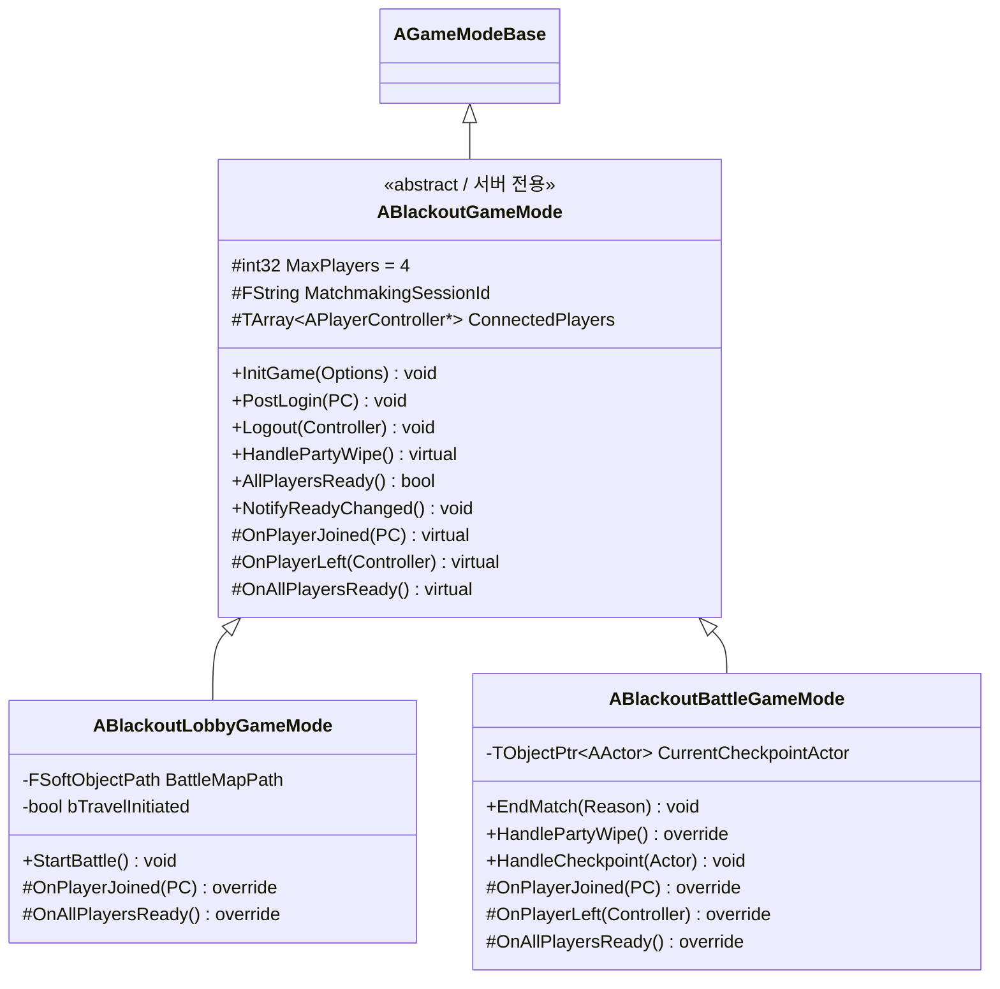

# NET — 03. GameMode 계층

> 3층 상속 구조. 부모는 공통 로직, 자식은 맵별 동작. GameMode 는 서버 전용 — 클라에 복제 안됨.

## 상속 계층



## 부모 책임 — 공통 로직

- **세션 식별자 보관** — `InitGame` 에서 `?SessionId=` URL 옵션 파싱 → `MatchmakingSessionId`
- **접속 집계** — `PostLogin` / `Logout` 에서 `ConnectedPlayers` 유지 + `OnPlayerJoined` / `OnPlayerLeft` 훅 호출
- **Ready 집계** — `AllPlayersReady` (정원 충족 + 전원 `bIsReady`) / `NotifyReadyChanged` → 성립 시 자식 `OnAllPlayersReady` 훅
- **전멸 기본 구현** — `HandlePartyWipe` 는 로그만. 실제 복귀 로직은 `ABlackoutBattleGameMode` 에서 override

## Lobby 책임

| 훅 | 동작 |
|---|---|
| `OnPlayerJoined` | `ABlackoutPlayerController::Client_OpenClassSelectUI` 호출 — 클래스 선택 UI |
| `OnAllPlayersReady` | `StartBattle()` 호출 |
| `StartBattle` | `BattleMapPath.GetLongPackageName()` 으로 `ServerTravel` + `MatchState = Starting` |

`bTravelInitiated` 플래그로 `ServerTravel` 중복 실행 차단.

## Battle 책임

| 훅 | 동작 |
|---|---|
| `OnPlayerJoined` | `ApplyBattleTransitionPolicy(LobbyToBattle)` + 정원 충족 시 `InLobby`/`Starting` → `InCombatReady` |
| `OnPlayerLeft` | 전원 이탈 시 `EndMatch(AllPlayersLeft)` 자동 트리거 |
| `OnAllPlayersReady` | `SetMatchState(InCombat)` + 보스 활성화 훅 (전투팀 연결 예정) |
| `HandleCheckpoint(Actor)` | `CurrentCheckpointActor` 갱신. `ABlackoutCheckpoint::OnInteract` 에서 호출 |
| `HandlePartyWipe` | 체크포인트 텔레포트 + `PartyWipeRestart` 정책 + `bIsReady` 리셋 + `InCombatReady` 복귀 |
| `EndMatch(Reason)` | `SetMatchState(Ended)` + Reason 로깅. 중복 종료 early return |

## Template Method 패턴

Ready 집계는 Lobby / Battle 모두 필요 — 부모에 `AllPlayersReady` / `NotifyReadyChanged` 유지, 자식은 `OnAllPlayersReady` 만 override.

PlayerController 쪽 호출부는 부모 타입으로 캐스트:

```cpp
if (ABlackoutGameMode* Mode = GetWorld()->GetAuthGameMode<ABlackoutGameMode>())
{
    Mode->NotifyReadyChanged();  // Lobby / Battle 공용
}
```

## 서버 전용 경계

- GameMode 필드는 **Replicated 불가** (인스턴스 자체가 클라에 없음)
- 공유 상태는 `ABlackoutGameState` (매치 상태) / `ABlackoutPlayerState` (Ready · 클래스 · 자원)
- 모든 서버 세터는 `HasAuthority()` + 동일 값 체크 2중 가드
