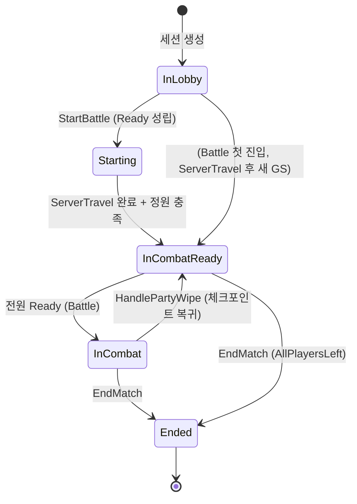

# NET — 04. 매치 상태 머신

> `EBlackoutMatchState` 5단계 통일. `ABlackoutGameState::CurrentMatchState` Replicated 필드로 클라 전파.

## 상태 정의



| 상태 | 맵 | 의미 |
|---|---|---|
| `InLobby` | Lobby | 로비 맵 / 클래스 선택 / Ready Check |
| `Starting` | Lobby | 전원 Ready 직후 / `ServerTravel` 중 |
| `InCombatReady` | Battle | 전투 맵 도착 또는 전멸 후 / 체크포인트 방 Ready 대기 |
| `InCombat` | Battle | 보스 활성 / 전투 진행 |
| `Ended` | Battle | 승리·패배·이탈 종료 |

## Replication

```cpp
UPROPERTY(ReplicatedUsing = OnRep_CurrentMatchState)
EBlackoutMatchState CurrentMatchState = EBlackoutMatchState::InLobby;

void ABlackoutGameState::GetLifetimeReplicatedProps(...)
{
    DOREPLIFETIME(ABlackoutGameState, CurrentMatchState);
}

void ABlackoutGameState::SetMatchState(EBlackoutMatchState NewState)
{
    if (!HasAuthority()) { return; }
    if (CurrentMatchState == NewState) { return; }  // 동일 값 중복 방지
    CurrentMatchState = NewState;
    OnRep_CurrentMatchState();
}
```

서버 세터 `SetMatchState` 2중 가드 — 권한 + 동일 값. 클라는 `OnRep_CurrentMatchState` 에서 로그 / UI 갱신.

## 전이 트리거 소유자

| 전이 | 트리거 |
|---|---|
| `InLobby → Starting` | `ABlackoutLobbyGameMode::StartBattle` |
| `Starting → InCombatReady` | ServerTravel 완료 + Battle 정원 충족 |
| `InLobby → InCombatReady` | Battle 첫 진입 (ServerTravel 직후 새 GameState 는 `InLobby` 기본값) |
| `InCombatReady → InCombat` | `ABlackoutBattleGameMode::OnAllPlayersReady` |
| `InCombat → InCombatReady` | `HandlePartyWipe` |
| `→ Ended` | `ABlackoutBattleGameMode::EndMatch(Reason)` |

## 매치 종료 원인

```cpp
UENUM(BlueprintType)
enum class EBlackoutMatchEndReason : uint8
{
    BossDefeated,    // 보스 사망 감지 (전투팀 훅 연결 예정)
    AllPlayersLeft,  // 전원 이탈 (OnPlayerLeft 에서 자동 트리거)
    Timeout,         // 장기 미진행 (후속 PR)
};
```

`EndMatch` 는 중복 호출 방지 — 이미 `Ended` 상태면 early return.

## 재접속 대응 가드

`OnPlayerJoined` 의 정원 충족 가드는 `InLobby` / `Starting` 에서만 `InCombatReady` 로 전환. 이유: `InCombat` / `Ended` 진행 중 플레이어 재접속으로 `OnPlayerJoined` 재진입 시 상태 역행 방지.

```cpp
if (ConnectedPlayers.Num() == MaxPlayers)
{
    if (GS->CurrentMatchState == EBlackoutMatchState::InLobby ||
        GS->CurrentMatchState == EBlackoutMatchState::Starting)
    {
        GS->SetMatchState(EBlackoutMatchState::InCombatReady);
    }
}
```

## ServerTravel 직후 주의점

ServerTravel 은 새 GameState 인스턴스를 생성 — **이전 맵에서 설정한 상태 값은 승계 안됨**. Lobby 에서 `Starting` 을 set 해도 Battle 도착 시점에 Battle GS 는 `InLobby` 로 재생성. `OnPlayerJoined` 가드 조건이 `InLobby` 도 포함하는 이유.
