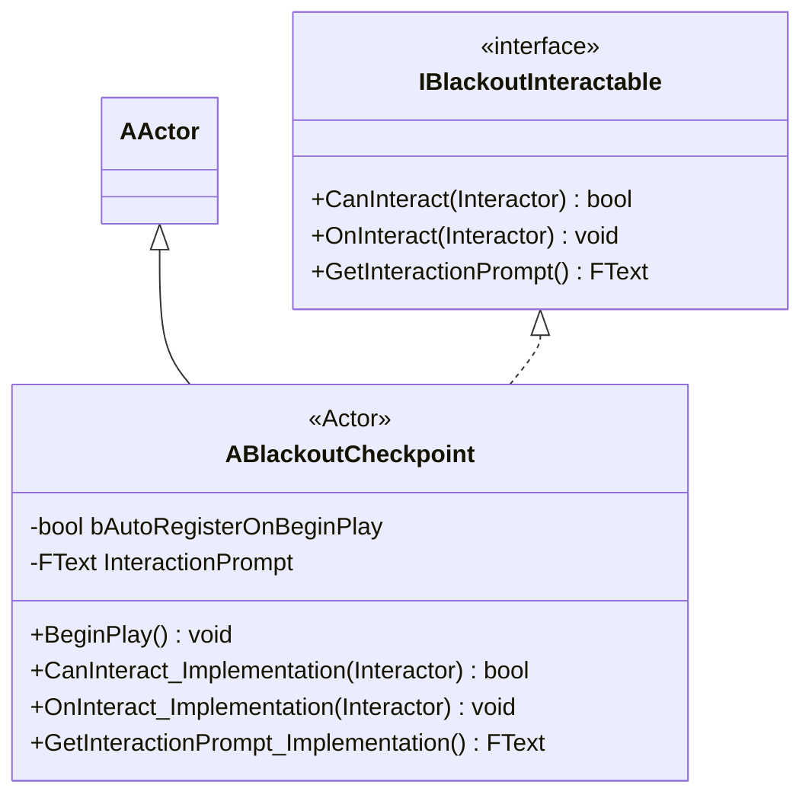
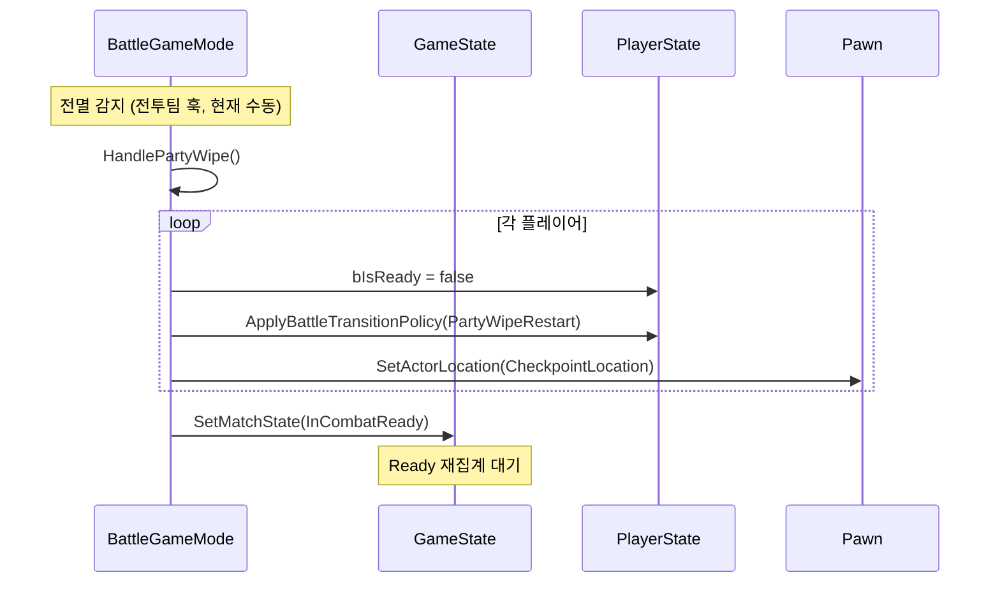

# NET — 05. 체크포인트 + 파티 전멸 복귀

> 매치 내부 세이브포인트. 전멸 시 복귀 지점 제공. 다크소울 식 "실패는 일시 리셋" 모델.

## 체크포인트 액터



## 설계 원칙 — 공용 / 개인 분리

| 자원 | 범위 | 이유 |
|---|---|---|
| 복귀 지점 (`CurrentCheckpointActor`) | **팀 공유** | 4인 coop 에서 개인별 복귀지면 재집결 난이도 급증 |
| 휴식 효과 (`CheckpointRest` 정책 — HP · 자원 회복) | **상호작용 본인만** | 한 명 클릭으로 전원 회복 시 교전 중 동료 강제 회복 → 밸런스 붕괴 |

`OnInteract_Implementation` 에서 `HandleCheckpoint(this)` 는 서버 전역, `ApplyBattleTransitionPolicy(CheckpointRest)` 는 Interactor Pawn 의 PlayerState 에만.

## `bAutoRegisterOnBeginPlay`

- 레벨 로드 시 자동으로 `BattleGameMode::HandleCheckpoint(this)` 호출
- 전투 맵 시작점 체크포인트에 `true` 권장 — 상호작용 없이도 전멸 복귀 지점 확보
- 일반 체크포인트는 `false` 기본값

## 전멸 복귀 흐름



체크포인트 미설정 상태면 텔레포트 스킵 + 경고 로그. respawn 필요 여부는 실서버 검증 후 재논의.

## 전이 정책 enum

```cpp
UENUM(BlueprintType)
enum class EBattleTransitionType : uint8
{
    LobbyToBattle,      // 로비 → 전투 맵 접속 시 (자원 초기화)
    CheckpointRest,     // 체크포인트 휴식 (HP / 자원 회복)
    PartyWipeRestart,   // 전멸 후 재시작 (체크포인트 자원으로 롤백)
};
```

`ABlackoutPlayerState::ApplyBattleTransitionPolicy` 가 정책별 자원 조작 수행.

## 전멸 ≠ 매치 종료

전멸은 일시 실패. `CurrentMatchState` 는 `Ended` 가 아닌 `InCombatReady` 로 복귀. 매치 종료는 `EndMatch(Reason)` 로만 진입. 보스 사망 / 전원 이탈 / 타임아웃 3개 원인.
