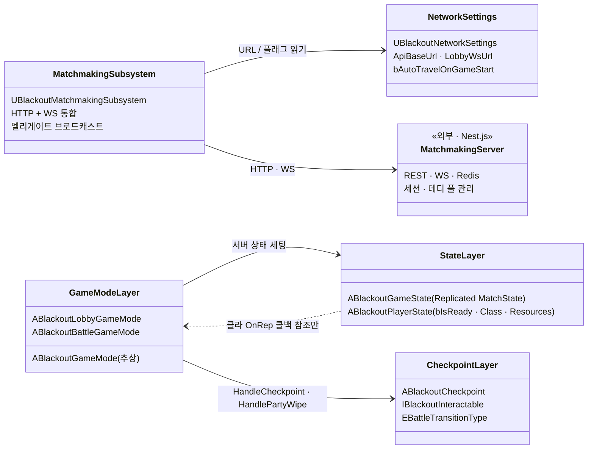

# NET — 07. 의존 관계 및 구현 순서

> NET 레이어 내부 의존 + 다른 에픽과의 경계 요약.

## 레이어 의존 그래프

## 에픽 간 경계

| 경계 | NET 이 제공 | NET 이 의존 |
|---|---|---|
| Foundation | — | `ABlackoutEnemyCharacter` 없음. Pawn 리플리케이션 기반만 활용 |
| Combat | 매치 상태 enum (`InCombat` 동안만 전투 허용 판정) | — |
| AI_Boss | `EndMatch(BossDefeated)` 훅 호출 포인트 제공 | 보스 사망 감지 훅 (전투팀 연결 예정) |
| UI (UMG) | 매칭 델리게이트 5종 · 매치 상태 OnRep | 로그인·대기·결과 위젯 |

## 구현 순서 (진행 완료)

1. **R&D** — Nest 매칭 서버 + NetTest 샌드박스 AWS 루프 검증
2. **GameMode 계층 뼈대** — 부모 · Lobby · Battle
3. **Ready 집계 공통화** — 부모로 승격
4. **매칭 Subsystem 이식** — NetTest → 본체
5. **매치 상태 머신** — `EBlackoutMatchState` + Replicated
6. **체크포인트 + 전멸 복귀** — `ABlackoutCheckpoint` + `HandlePartyWipe`
7. **매치 종료 진입점** — `EndMatch(Reason)`

## 운영 검증 항목

| 항목 | 블로커 / 트리거 |
|---|---|
| `POST /sessions/:id/finish` 엔드포인트 | `EndMatch` 에서 호출해 매칭 서버에 보고 |
| AWS 데디 재배포 + end-to-end 검증 | 위 finish 엔드포인트와 병행 |
| 4-클라 동시 접속 실측 | AWS 재배포 이후 |
| 재접속 로직 | heartbeat 설계 + disconnect 감지 |
| HTTPS / WSS | 도메인 확보 (비용) + Let's Encrypt |
| JWT refresh token | 24h 만료 단일 세션 한계 도달 시 |
| UMG 위젯 | 매칭 대기 · 결과 · 로그인 |

## 팀 작업 진입점

서버 쪽 수정 / 협업 시 참고:

- **매칭 서버 수정** — `BlackOut_Server` 레포 직접 작업. 엔드포인트 추가 시 `01_Matchmaking_Server.md` 동시 갱신
- **UE 매칭 연동** — `UBlackoutMatchmakingSubsystem` + `UBlackoutNetworkSettings` 경유. 직접 `FHttpModule` 호출 지양
- **매치 상태 추가** — `EBlackoutMatchState` + `ABlackoutGameState::SetMatchState` 경유. 클라에서 직접 set 금지
- **체크포인트 / 전멸** — `ABlackoutBattleGameMode::HandleCheckpoint` / `HandlePartyWipe` 경유. 직접 `CurrentCheckpointActor` 할당 금지
