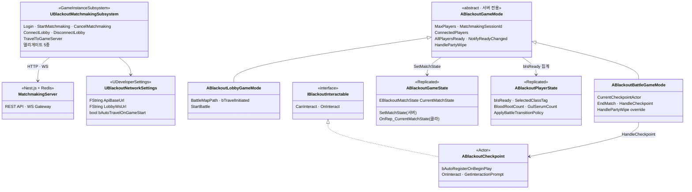

# Project Blackout — NET 에픽 클래스 다이어그램 인덱스

> 각 레이어별 상세는 아래 파일 참조. 이 문서는 전체 조감도.

## 전체 조감

## 문서 인덱스

| # | 문서 | 내용 |
|---|---|---|
| 01 | [Matchmaking Server](01_Matchmaking_Server.md) | Nest API 엔드포인트 · WS 이벤트 · 세션 수명주기 · 보안 레이어 |
| 02 | [UE Matchmaking Subsystem](02_UE_Matchmaking_Subsystem.md) | HTTP+WS 통합 · PendingSessionId 버퍼 · 델리게이트 |
| 03 | [GameMode Hierarchy](03_GameMode_Hierarchy.md) | 3층 상속 · Template Method · 서버 전용 경계 |
| 04 | [Match State Machine](04_Match_State_Machine.md) | `EBlackoutMatchState` · Replication · 전이 규칙 |
| 05 | [Checkpoint / PartyWipe](05_Checkpoint_PartyWipe.md) | 체크포인트 액터 · 공용/개인 분리 · 복귀 흐름 |
| 06 | [Network Settings](06_Network_Settings.md) | `UDeveloperSettings` 외부화 · 환경별 오버라이드 |
| 07 | [Dependency Overview](07_Dependency_Overview.md) | 레이어 의존 · 에픽 경계 · 구현 순서 |
