# Project Blackout — 시퀀스 다이어그램

> Mermaid 문법 기반. GDD vFinal + TDD v5 + 서버 RnD v2 참조.

---

## ⚔️ 전투 플로우

### 1. 데미지 파이프라인 (사격 → 피격 → 사망 → 드롭)

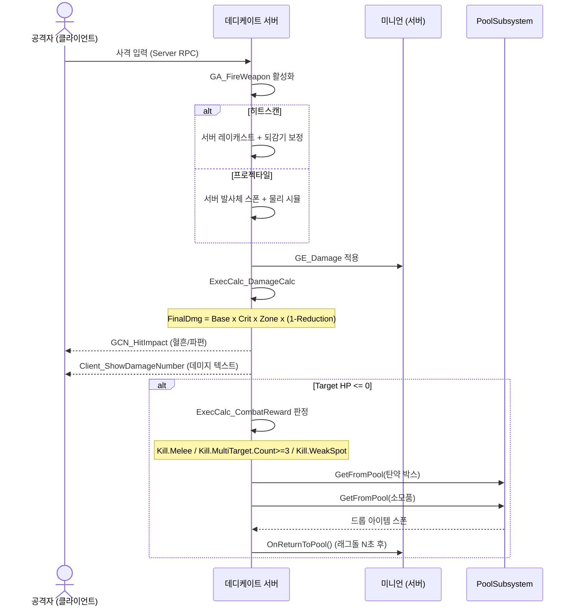

---

### 2. 플레이어 다운 → 부활 / 완전 사망

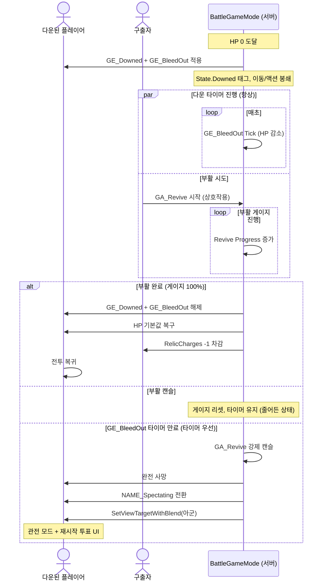

---

### 3. 파티 전멸 → 체크포인트 복귀

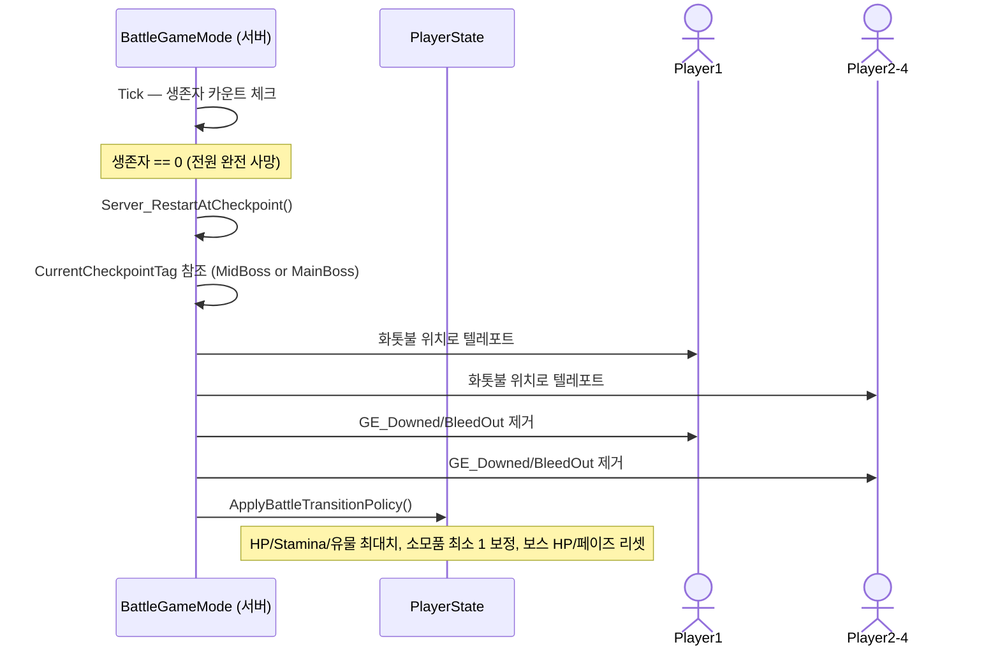

---

### 4. 관전 중 과반수 재시작 투표

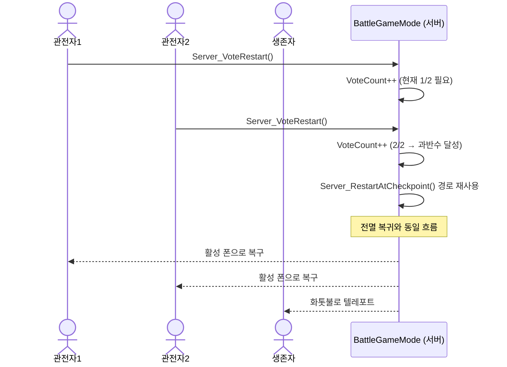

---

## 🧠 전투 서브시스템

### 5. 보스 어그로 시스템 타겟 전환

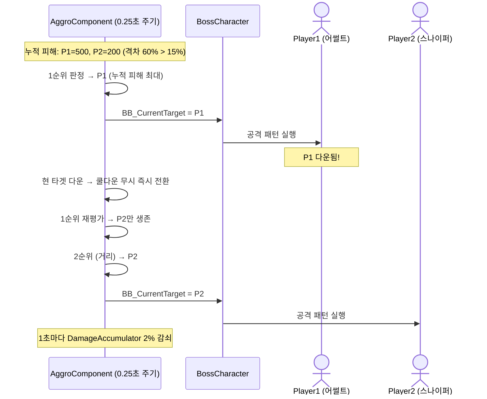

---

### 6. 슈루드 씨앗 기믹 (SeedDrop + 무적)

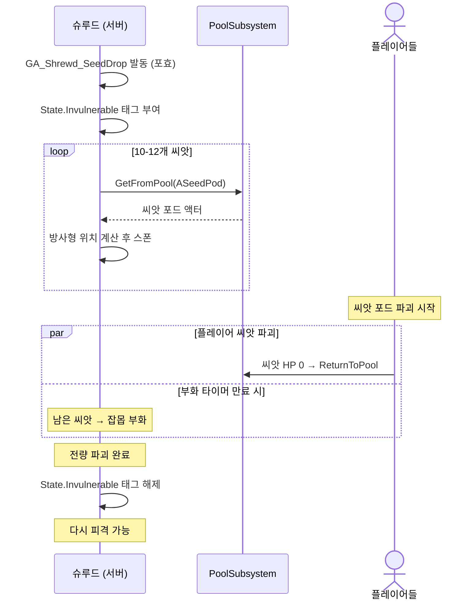

---

### 7. 기둥 파괴 동기화 (Chaos Destruction)

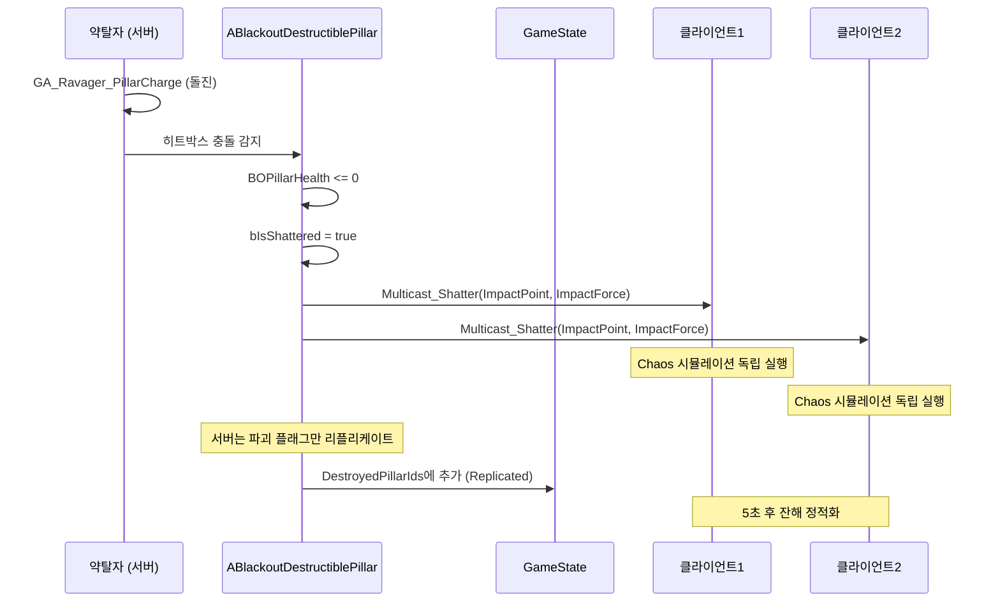

---

## 🗺️ 게임 플로우

### 8. 로비 → 캐릭터 선택 → 전투 맵 진입

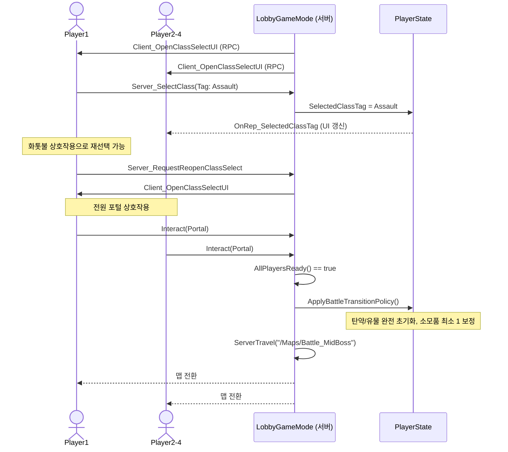

---

### 9. 슈루드 → 메인 보스 전환 (StreamLevel)

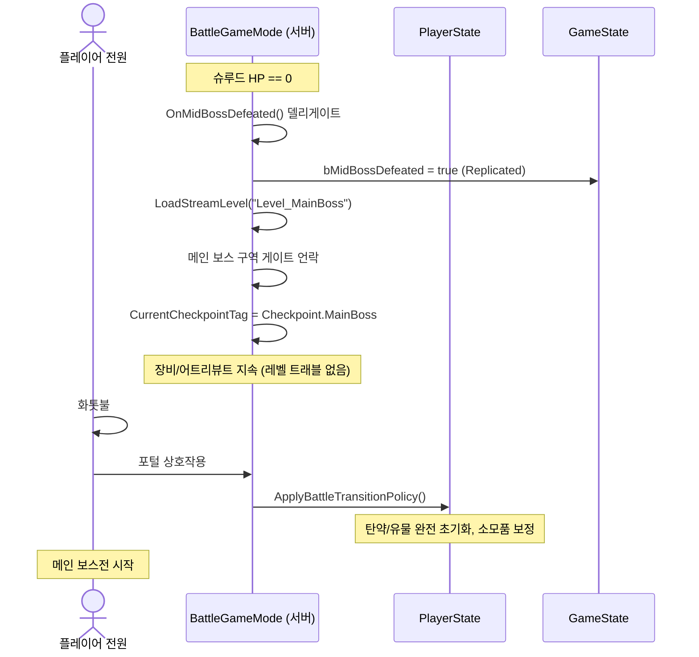

---

### 10. 메인 보스 클리어 → 승리 → 메인 메뉴

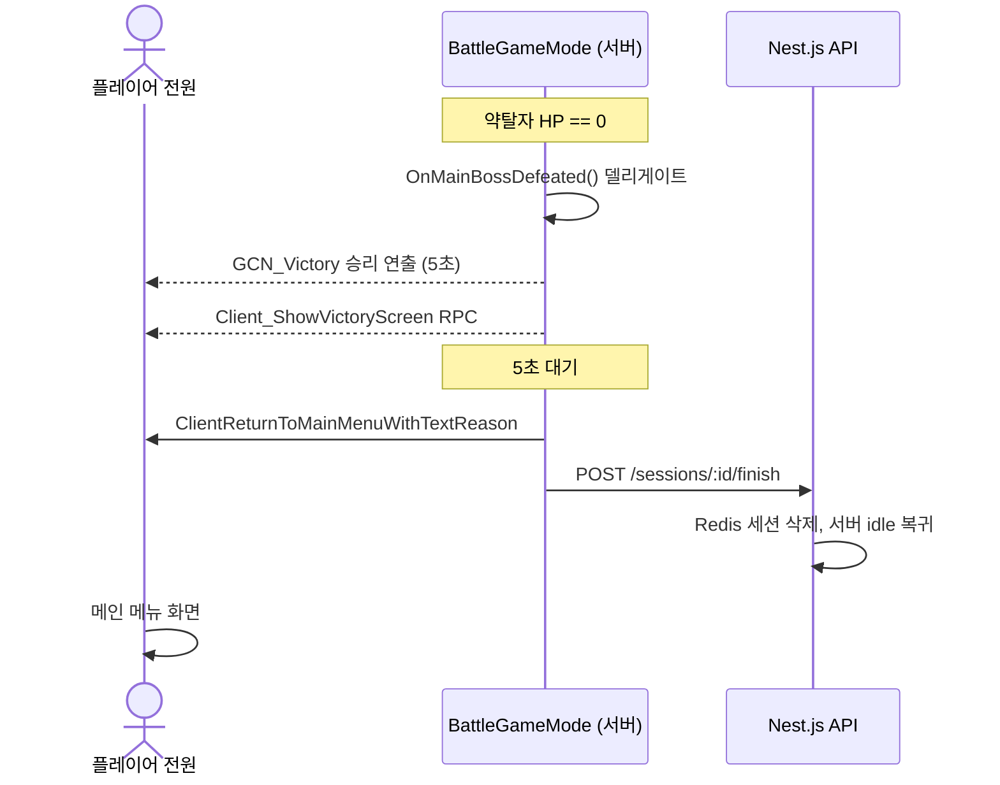

---

## 🌐 매칭/서버 인프라

### 11. 매치메이킹 → 게임 시작 전체 흐름

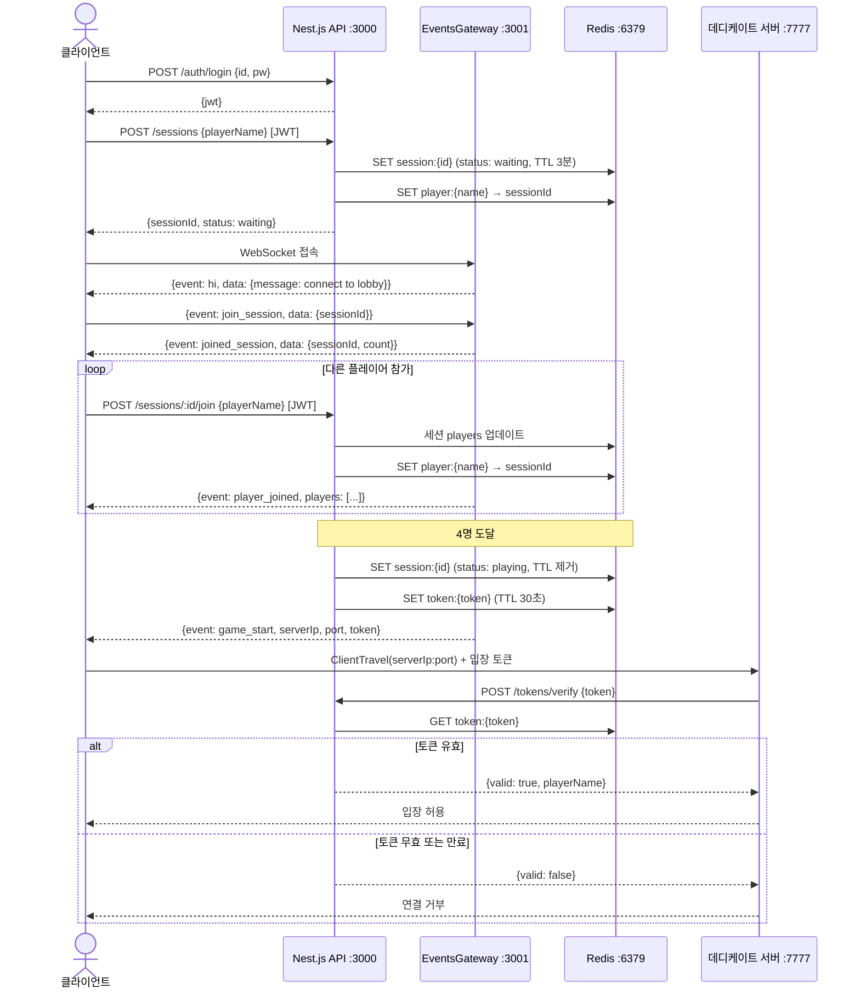

---

### 12. 매치메이킹 타임아웃 + 좀비 키 정리

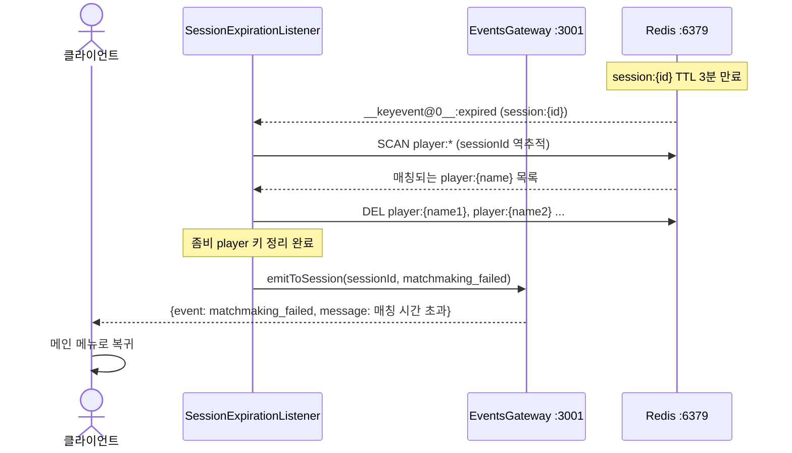

---

### 13. 데디케이트 서버 ↔ API 서버 통신

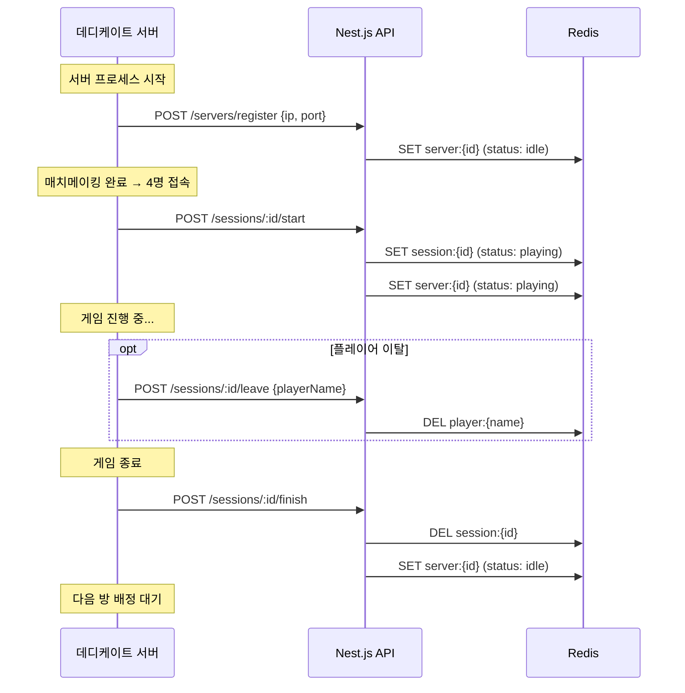
