# Project Blackout — 클래스 다이어그램

> Mermaid 문법 기반. TDD v5 §1~§12 참조.

---

## 🏗️ 핵심 게임플레이 구조

### 1. 캐릭터 상속 계층 (Character Hierarchy)

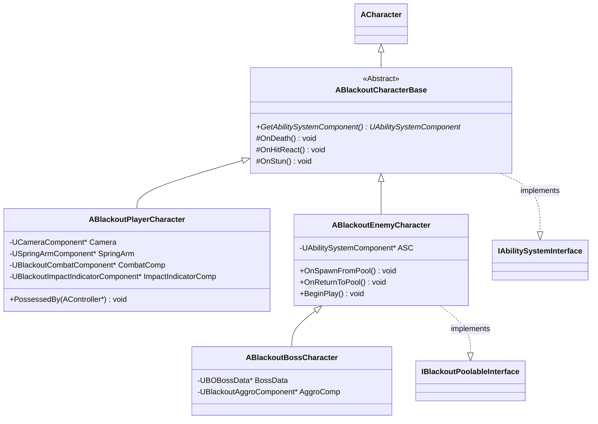

---

### 2. GameMode 계층 (Server Only)

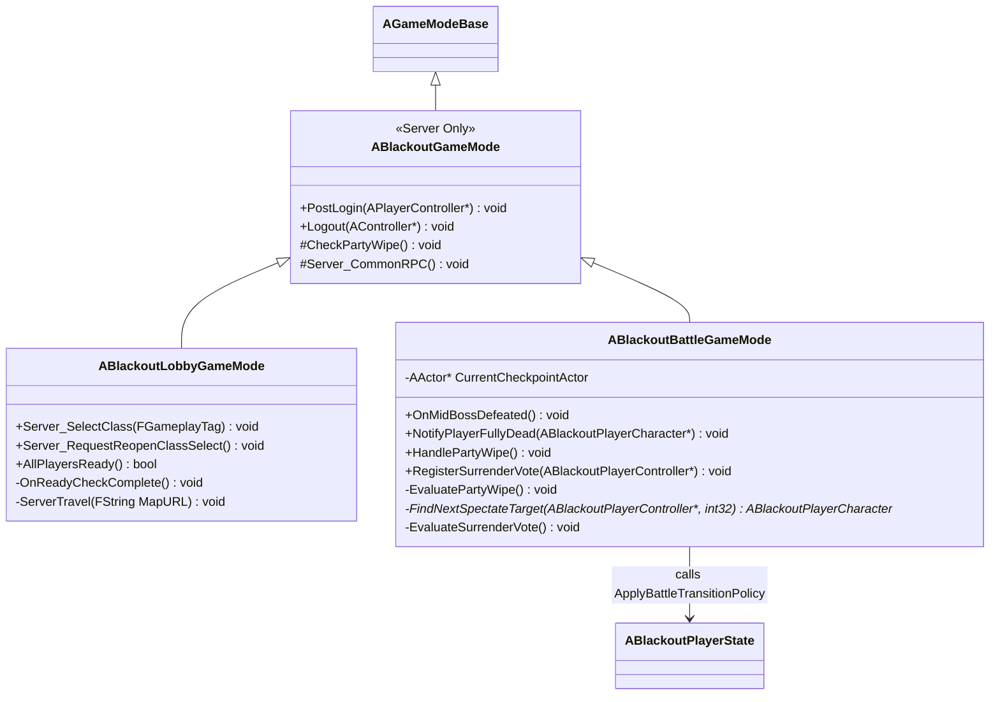

---

### 3. GameState / PlayerState

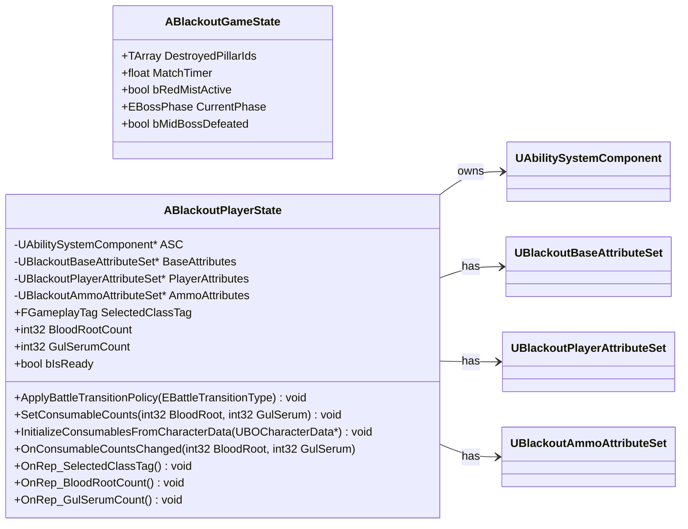

---

### 4. AttributeSet 3종

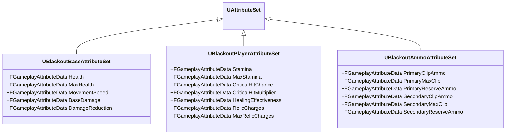

---

### 5. 데이터 에셋 (Data-Driven)

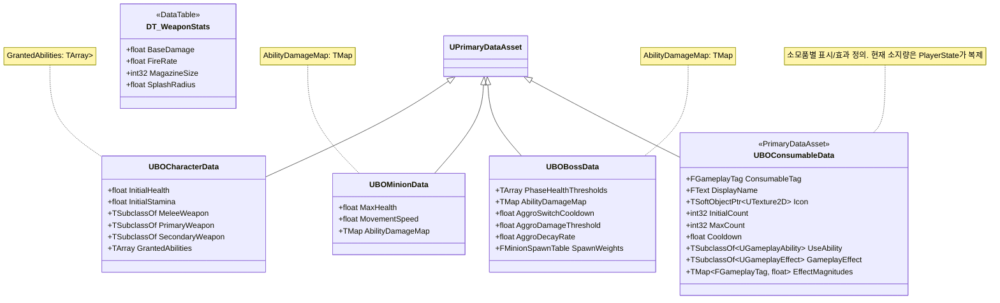

---

## ⚔️ 전투 시스템

### 6. GAS 주요 GA/GE 관계

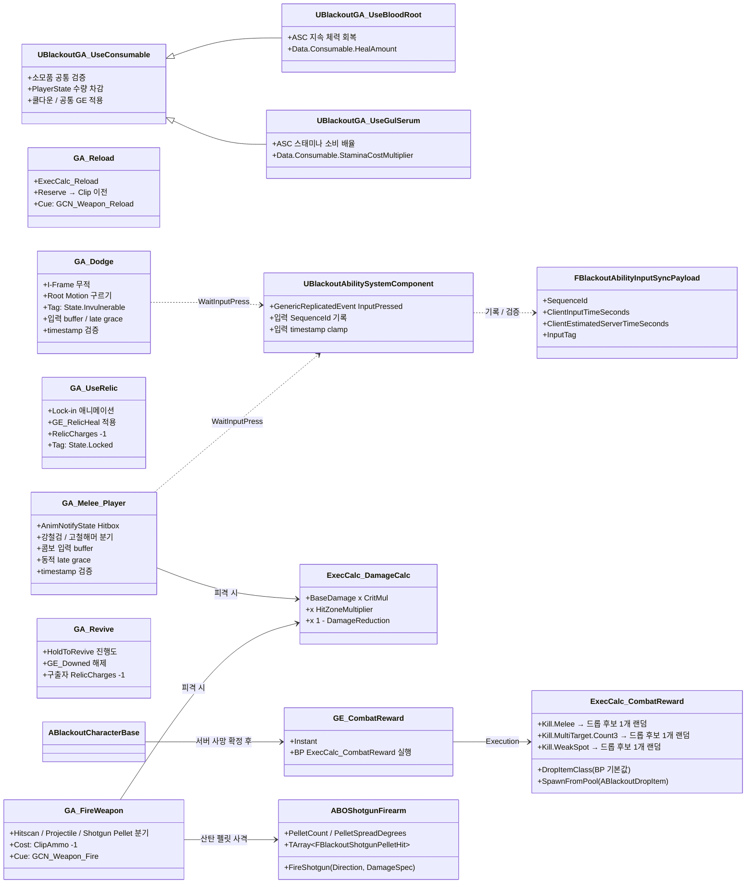

---

### 6.1 플레이어 다운 / 완전 사망

> 상세 설계는 [Foundation/09_Player_Downed_Death.md](Foundation/09_Player_Downed_Death.md)를 기준으로 합니다. 루트 문서는 전체 의존 개요만 유지합니다.

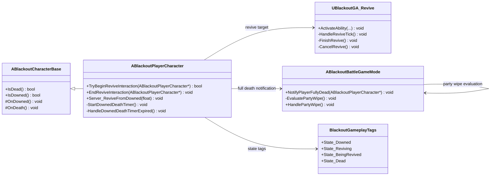

---

### 6.2 플레이어 관전 / 항복 투표

> 상세 설계는 [Foundation/10_Player_Spectator_Surrender.md](Foundation/10_Player_Spectator_Surrender.md)를 기준으로 합니다. 관전 대상에는 완전 사망하지 않은 다운 상태 파티원도 포함합니다.

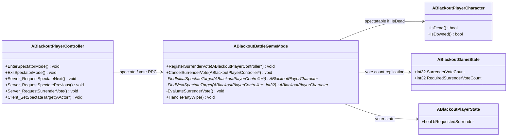

---

### 7. 오브젝트 풀링

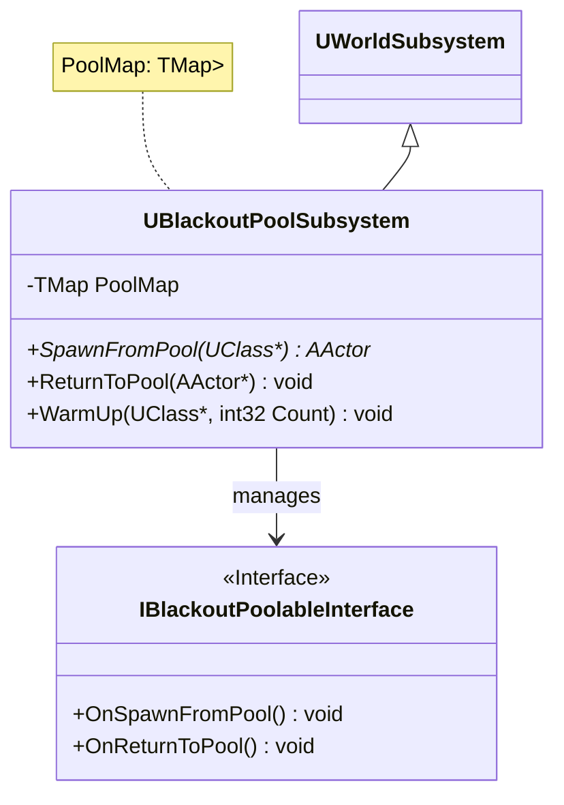

---

### 8. 어그로 시스템

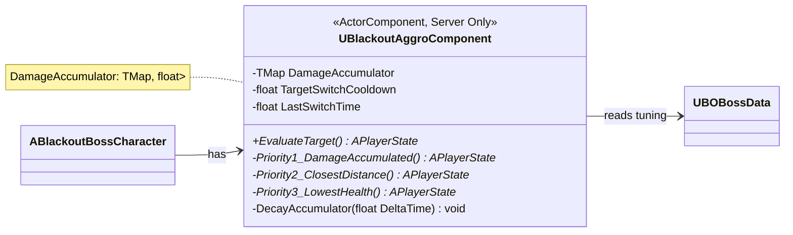

---

### 9. 엄폐물 파괴 (Chaos Destruction)

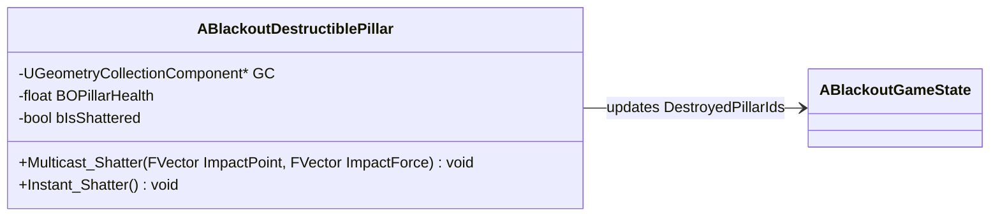

---

### 10. 플레이어 전투 컴포넌트

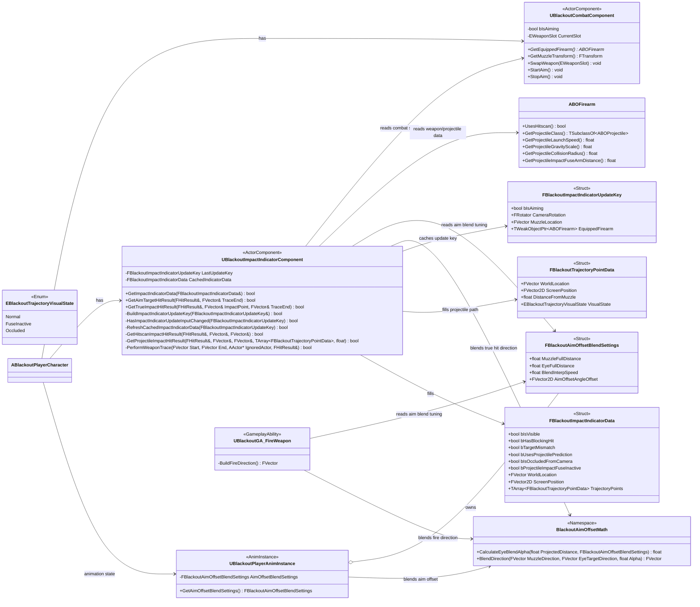

---

## 🌐 서버 인프라

### 11. 화톳불 / 포털 (Interactable)

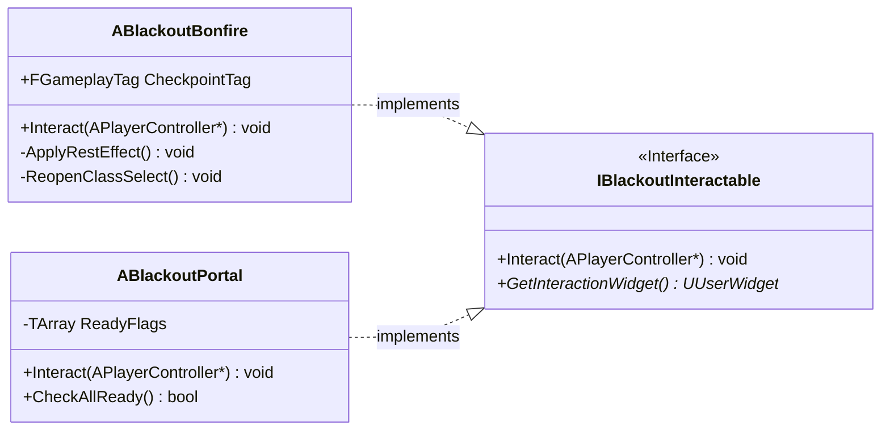

---

### 12. 매치메이킹 API 서버 (Nest.js)

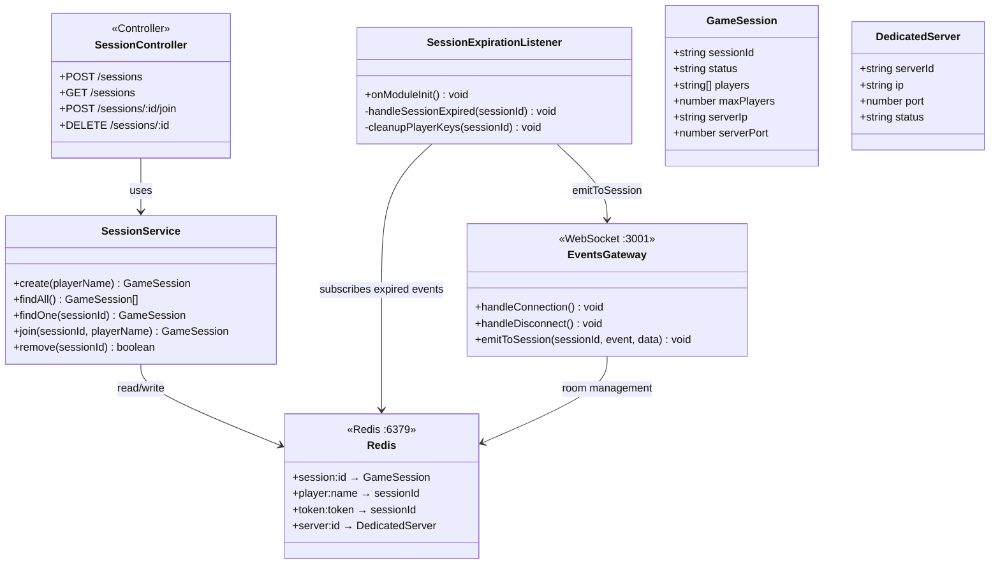
