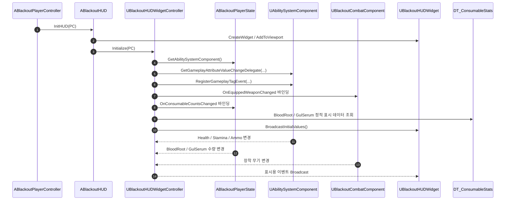

# UI — 01. GAS 기반 인게임 HUD

> TDD v5 §3 어트리뷰트 세트, §4 Gameplay Ability, §9 UI 반응형 바인딩, §10 최적화 및 리플리케이션 참조.
> 체력, 스태미나, 탄약은 Tick이 아닌 GAS Attribute Delegate 기반으로 갱신하고, 현재 장착 무기는 CombatComponent 이벤트를 통해 갱신합니다.

```mermaid
classDiagram
    direction TB

    AHUD <|-- ABlackoutHUD
    UUserWidget <|-- UBlackoutHUDWidget
    UUserWidget <|-- UW_Crosshair
    UUserWidget <|-- UW_HealthBar
    UUserWidget <|-- UW_StaminaBar
    UUserWidget <|-- UW_AmmoDisplay
    UUserWidget <|-- UW_WeaponDisplay
    UUserWidget <|-- UBlackoutConsumableSlotsWidget
    UUserWidget <|-- UBlackoutConsumableSlotWidget
    UObject <|-- UBlackoutHUDWidgetController
    UDataTable ..> FBlackoutConsumableStat : row type

    IAbilitySystemInterface <|.. ABlackoutPlayerState

    class ABlackoutHUD {
        -TSubclassOf~UBlackoutHUDWidget~ HUDWidgetClass
        -UBlackoutHUDWidget* HUDWidget
        -UBlackoutHUDWidgetController* HUDWidgetController
        +BeginPlay() void
        +InitHUD(APlayerController*) void
        -CreateHUDWidget() void
        -CreateWidgetController() void
    }

    class UBlackoutHUDWidget {
        -UW_Crosshair* CrosshairWidget
        -UWidget* ImpactIndicatorWidget
        -UW_HealthBar* HealthBarWidget
        -UW_StaminaBar* StaminaBarWidget
        -UW_AmmoDisplay* AmmoDisplayWidget
        -UW_WeaponDisplay* WeaponDisplayWidget
        -UBlackoutConsumableSlotsWidget* ConsumableSlotsWidget
        +SetWidgetController(UBlackoutHUDWidgetController*) void
        +NativeOnInitialized() void
        +NativeTick(FGeometry, float) void
        #ReceiveAimingChanged(bool bIsAiming, int32 CrosshairType) void
        -UpdateImpactIndicator(FBlackoutImpactIndicatorData) void
    }

    class UBlackoutHUDWidgetController {
        -TWeakObjectPtr~APlayerController~ PlayerController
        -TWeakObjectPtr~ABlackoutPlayerState~ PlayerState
        -TWeakObjectPtr~UAbilitySystemComponent~ AbilitySystemComponent
        -TWeakObjectPtr~UBlackoutBaseAttributeSet~ BaseAttributeSet
        -TWeakObjectPtr~UBlackoutPlayerAttributeSet~ PlayerAttributeSet
        -TWeakObjectPtr~UBlackoutAmmoAttributeSet~ AmmoAttributeSet
        -TWeakObjectPtr~UBlackoutCombatComponent~ CombatComponent
        -TWeakObjectPtr~UBlackoutImpactIndicatorComponent~ ImpactIndicatorComponent
        -UDataTable* ConsumableStatsTable
        +Initialize(APlayerController*) void
        +BindCallbacksToDependencies() void
        +BroadcastInitialValues() void
        +GetImpactIndicatorData(FBlackoutImpactIndicatorData&) bool
        +OnAimingChanged(bool bIsAiming, int32 CrosshairType)
        +OnConsumableSlotsChanged(FBlackoutConsumableSlotData BloodRootData, FBlackoutConsumableSlotData GulSerumData)
        -HandleHealthChanged(FOnAttributeChangeData) void
        -HandleMaxHealthChanged(FOnAttributeChangeData) void
        -HandleStaminaChanged(FOnAttributeChangeData) void
        -HandleMaxStaminaChanged(FOnAttributeChangeData) void
        -HandleAmmoChanged(FOnAttributeChangeData) void
        -HandleConsumablesChanged(int32 BloodRootCount, int32 GulSerumCount) void
        -MakeConsumableSlotData(FGameplayTag, int32) FBlackoutConsumableSlotData
        -HandleEquippedWeaponChanged(ABOWeaponBase*) void
        -HandleGameplayTagChanged(FGameplayTag, int32) void
    }

    class UW_Crosshair {
        -SetSpread(float) void
    }

    class UBlackoutImpactIndicatorComponent {
        <<ActorComponent>>
        +GetImpactIndicatorData(FBlackoutImpactIndicatorData&) bool
    }

    class UW_HealthBar {
        +SetHealth(float Current, float Max) void
    }

    class UW_StaminaBar {
        +SetStamina(float Current, float Max) void
        +SetExhausted(bool bIsExhausted) void
    }

    class UW_AmmoDisplay {
        +SetAmmo(int32 Clip, int32 MaxClip, int32 Reserve) void
        +SetReloading(bool bIsReloading) void
        +SetVisibleForWeapon(bool bHasAmmo) void
    }

    class UW_WeaponDisplay {
        +SetWeapon(ABOWeaponBase* Weapon) void
        +SetWeaponSlot(FGameplayTag WeaponSlotTag) void
    }

    class UBlackoutConsumableSlotsWidget {
        -UBlackoutConsumableSlotWidget* BloodRootSlotWidget
        -UBlackoutConsumableSlotWidget* GulSerumSlotWidget
        +SetConsumableSlots(FBlackoutConsumableSlotData BloodRootData, FBlackoutConsumableSlotData GulSerumData) void
    }

    class UBlackoutConsumableSlotWidget {
        -FBlackoutConsumableSlotData SlotData
        -UImage* IconImage
        -UTextBlock* CountText
        +SetConsumableSlotData(FBlackoutConsumableSlotData) void
    }

    class FBlackoutConsumableSlotData {
        <<Struct>>
        +FGameplayTag ConsumableTag
        +UTexture2D* Icon
        +int32 Count
        +int32 MaxCount
        +float HealAmount
        +float Duration
        +float Cooldown
        +bool bIsAvailable
    }

    class FBlackoutConsumableStat {
        <<Struct — DT_ConsumableStats 행>>
        +FGameplayTag ConsumableTag
        +TSoftObjectPtr~UTexture2D~ Icon
        +int32 InitialCount
        +int32 MaxCount
        +float HealAmount
        +float Duration
        +float Cooldown
    }

    class ABlackoutPlayerController {
        +BeginPlayingState() void
    }

    class ABlackoutPlayerState {
        -UBlackoutAbilitySystemComponent* ASC
        -UBlackoutBaseAttributeSet* BaseAttributeSet
        -UBlackoutPlayerAttributeSet* PlayerAttributeSet
        -UBlackoutAmmoAttributeSet* AmmoAttributeSet
        +int32 BloodRootCount
        +int32 GulSerumCount
        +OnConsumableCountsChanged(int32, int32)
        +GetAbilitySystemComponent() UAbilitySystemComponent*
    }

    class ABlackoutPlayerCharacter {
        -UBlackoutCombatComponent* CombatComponent
        -UBlackoutImpactIndicatorComponent* ImpactIndicatorComponent
        +GetCombatComponent() UBlackoutCombatComponent*
        +GetImpactIndicatorComponent() UBlackoutImpactIndicatorComponent*
    }

    class UBlackoutCombatComponent {
        -ABOWeaponBase* EquippedWeapon
        -FGameplayTag EquippedWeaponSlotTag
        +OnEquippedWeaponChanged
        +GetEquippedWeapon() ABOWeaponBase*
        +GetEquippedWeaponSlotTag() FGameplayTag
    }

    class UBlackoutBaseAttributeSet {
        +FGameplayAttributeData Health
        +FGameplayAttributeData MaxHealth
    }

    class UBlackoutPlayerAttributeSet {
        +FGameplayAttributeData Stamina
        +FGameplayAttributeData MaxStamina
    }

    class UBlackoutAmmoAttributeSet {
        +FGameplayAttributeData PrimaryClipAmmo
        +FGameplayAttributeData PrimaryMaxClip
        +FGameplayAttributeData PrimaryReserveAmmo
        +FGameplayAttributeData SecondaryClipAmmo
        +FGameplayAttributeData SecondaryMaxClip
        +FGameplayAttributeData SecondaryReserveAmmo
    }

    class ABOWeaponBase {
        +FText DisplayName
        +UTexture2D* Icon
        +int32 CrosshairType
        +FGameplayTag WeaponSlotTag
        +bool bUsesAmmo
    }

    ABlackoutPlayerController --> ABlackoutHUD : owns local HUD
    ABlackoutHUD o-- UBlackoutHUDWidget : creates/adds viewport
    ABlackoutHUD o-- UBlackoutHUDWidgetController : creates
    UBlackoutHUDWidget o-- UW_Crosshair
    UBlackoutHUDWidget o-- UW_HealthBar
    UBlackoutHUDWidget o-- UW_StaminaBar
    UBlackoutHUDWidget o-- UW_AmmoDisplay
    UBlackoutHUDWidget o-- UW_WeaponDisplay
    UBlackoutHUDWidget o-- UBlackoutConsumableSlotsWidget
    UBlackoutConsumableSlotsWidget o-- UBlackoutConsumableSlotWidget

    UBlackoutHUDWidget --> UBlackoutHUDWidgetController : receives display events
    UBlackoutHUDWidgetController --> ABlackoutPlayerState : resolves ASC owner
    UBlackoutHUDWidgetController --> ABlackoutPlayerCharacter : resolves pawn
    UBlackoutHUDWidgetController --> UBlackoutCombatComponent : binds weapon events
    UBlackoutHUDWidgetController --> UBlackoutImpactIndicatorComponent : requests impact indicator data
    UBlackoutHUDWidgetController --> UBlackoutBaseAttributeSet : reads Health
    UBlackoutHUDWidgetController --> UBlackoutPlayerAttributeSet : reads Stamina
    UBlackoutHUDWidgetController --> UBlackoutAmmoAttributeSet : reads Ammo
    UBlackoutHUDWidgetController --> ABOWeaponBase : reads display data
    UBlackoutHUDWidgetController --> FBlackoutConsumableStat : reads icon/tuning
    UBlackoutHUDWidgetController --> FBlackoutConsumableSlotData : builds display data
    UBlackoutConsumableSlotWidget --> FBlackoutConsumableSlotData : renders
```

## 바인딩 흐름

## 구현 노트

- **HUD 생성 책임**: `ABlackoutHUD`는 로컬 플레이어용 루트 위젯과 WidgetController 생성만 담당합니다. 체력, 탄약 계산 로직을 직접 넣지 않습니다.
- **GAS 연결 책임**: `UBlackoutHUDWidgetController`가 ASC, AttributeSet, GameplayTag, CombatComponent 이벤트를 UI 표시 이벤트로 변환합니다.
- **위젯 책임**: `UBlackoutHUDWidget`과 하위 위젯은 표시 상태만 갱신합니다. AttributeSet이나 ASC를 직접 조회하지 않습니다.
- **Attribute Delegate 대상**: `Health`, `MaxHealth`, `Stamina`, `MaxStamina`, 주/보조 `ClipAmmo`, `MaxClip`, `ReserveAmmo`.
- **GameplayTag 대상 예시**: `State.Reloading`, `State.Sprinting`, `State.Exhausted`, `Weapon.Primary`, `Weapon.Secondary`.
- **현재 무기 표시**: 장착 무기 이름, 아이콘, 무기 슬롯은 `UBlackoutCombatComponent::OnEquippedWeaponChanged`에서 갱신합니다.
- **크로스헤어 선택**: `DT_WeaponStats`의 `CrosshairType`(0~5)을 `ABOWeaponBase`가 캐시하고, `UBlackoutHUDWidgetController::OnAimingChanged`가 조준 상태와 함께 현재 장착 무기의 타입을 `UBlackoutHUDWidget::ReceiveAimingChanged`로 전달합니다.
- **탄약 표시 전환**: 현재 슬롯이 주무기면 Primary 어트리뷰트, 보조무기면 Secondary 어트리뷰트를 표시합니다. 근접무기처럼 탄약이 없으면 `UW_AmmoDisplay`를 숨기거나 비활성화합니다.
- **소모품 표시**: 현재 소지 수량은 `ABlackoutPlayerState`의 Replicated 프로퍼티가 소유하고, 아이콘·최대 수량·회복량·지속시간·쿨다운은 `DT_ConsumableStats`의 `FBlackoutConsumableStat` 행에서 조회합니다.
- **소모품 슬롯 데이터**: `UBlackoutHUDWidgetController`는 `PlayerState` 수량과 `DT_ConsumableStats` 정적 데이터를 합쳐 `FBlackoutConsumableSlotData`를 만들고, `UBlackoutConsumableSlotsWidget`은 이를 하위 슬롯에 전달합니다. 슬롯 위젯은 ASC/DataTable을 직접 조회하지 않습니다.
- **Tick 예외**: `UBlackoutHUDWidget`은 착탄 인디케이터 위치/색상 갱신을 위해 Tick에서 `UBlackoutImpactIndicatorComponent`의 결과를 조회할 수 있습니다. 실제 라인트레이스/투사체 예측 계산은 전투 전용 컴포넌트가 담당하며, 다른 HUD 요소는 Tick을 사용하지 않습니다.
- **초기값 브로드캐스트**: Delegate 바인딩 직후 현재 Attribute 값을 한 번 브로드캐스트하여 첫 프레임 빈 UI를 방지합니다.
