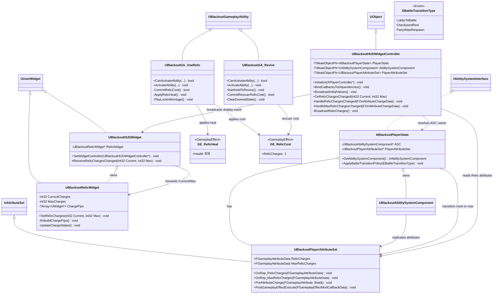
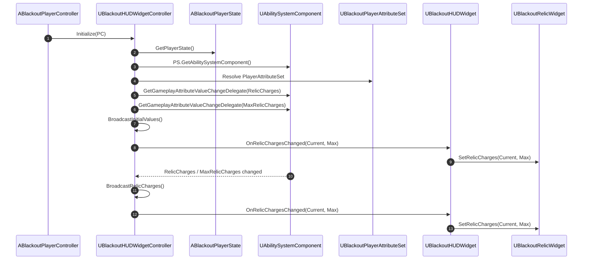
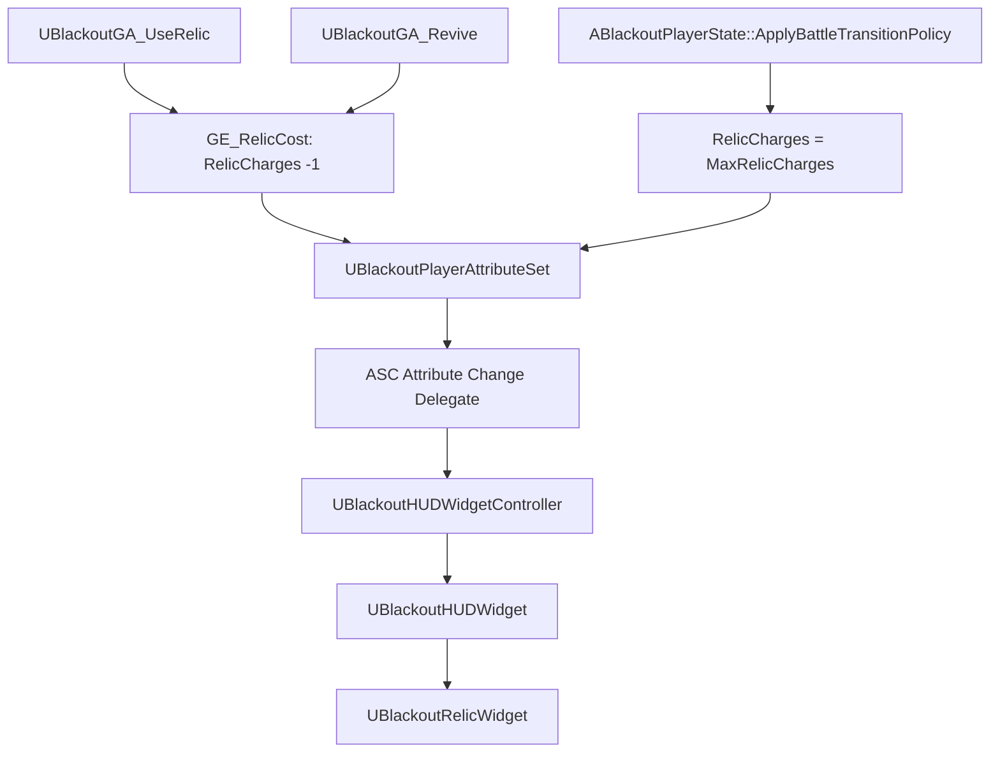

# UI — 02. 유물 HUD 바인딩

> GDD §3 유물 회복 시스템, §8.3 인게임 전투 HUD, 클래스 다이어그램 §3~§6 기반.
> 유물 남은 개수는 `UBlackoutPlayerAttributeSet`의 GAS Attribute로 관리하고, HUD는 Attribute Delegate 이벤트만 받아 표시합니다.

## 바인딩 흐름

## 유물 수량 변경 경로

## 구현 노트

- **수량 소유**: 유물 현재/최대 수량은 `ABlackoutPlayerState`가 보유한 ASC의 `UBlackoutPlayerAttributeSet`에 둡니다. 소모품처럼 별도 Replicated int 프로퍼티를 만들지 않습니다.
- **표시 갱신**: `UBlackoutHUDWidgetController`는 `RelicCharges`, `MaxRelicCharges` Attribute Delegate를 바인딩하고, 변경 시 `int32 Current`, `int32 Max`로 변환해 HUD에 전달합니다.
- **위젯 책임**: `UBlackoutRelicWidget`은 전달받은 수량으로 아이콘 또는 pip 상태만 갱신합니다. ASC, AttributeSet, GA를 직접 조회하지 않습니다.
- **초기 표시**: HUD 생성 직후 `BroadcastInitialValues()`에서 현재 유물 수량을 즉시 전달해 첫 프레임 빈 슬롯을 방지합니다.
- **클램프 정책**: `RelicCharges`는 `0 ~ MaxRelicCharges` 범위로 제한합니다. 기본/최대값은 GDD 기준 `3`입니다.
- **리셋 경로**: 전투 맵 진입, 화톳불 휴식, 전멸 후 체크포인트 복귀 정책에서는 `ABlackoutPlayerState::ApplyBattleTransitionPolicy`가 유물을 최대치로 회복시킵니다.
- **실패 처리**: 유물 사용 또는 부활 시 `RelicCharges <= 0`이면 GA 활성화를 실패시키고 원인 파악 가능한 로그를 남깁니다.
