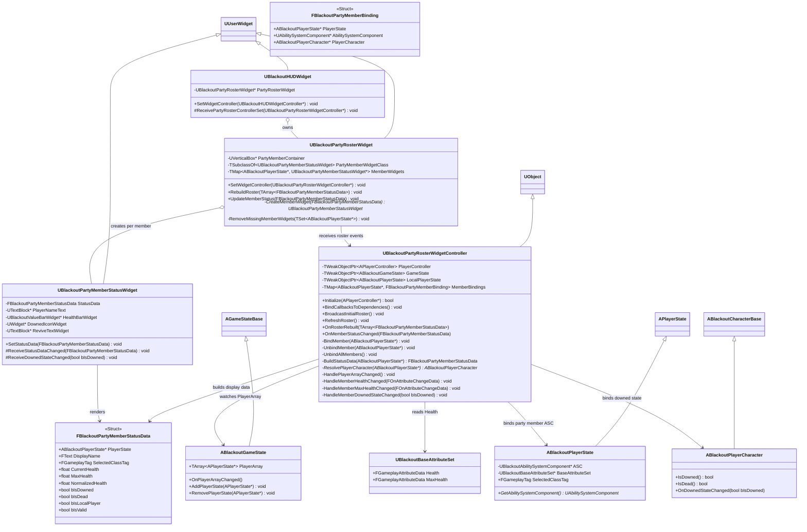
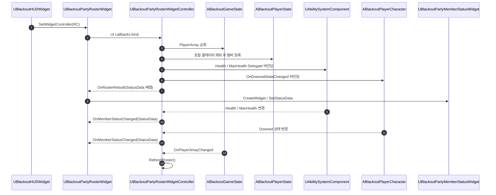
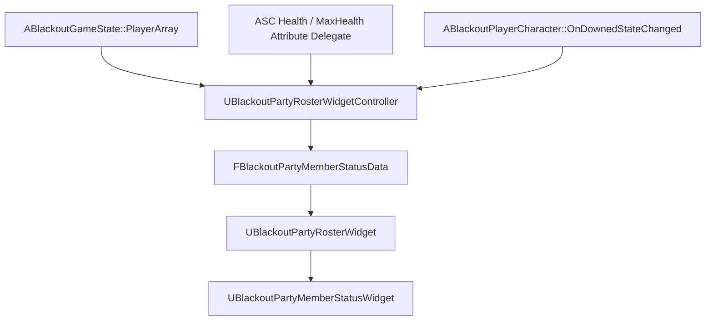

# UI — 03. 파티원 상태 패널 HUD

> GDD §8.3 인게임 전투 HUD, TDD v5 §9 UI 반응형 바인딩 기반.
> 파티원 상태 패널은 로컬 플레이어를 제외한 다른 플레이어의 이름, HP, 다운 상태를 표시합니다.
> 체력은 `ABlackoutPlayerState`가 소유한 ASC Attribute Delegate로 갱신하고, 다운 상태는 `ABlackoutPlayerCharacter`의 다운 상태 변경 델리게이트로 갱신합니다.

## 바인딩 흐름

## 표시 데이터 갱신 경로

## 구현 노트

- **책임 분리**: `UBlackoutHUDWidgetController`는 로컬 플레이어 자신의 HUD만 담당하고, 파티원 목록은 `UBlackoutPartyRosterWidgetController`가 담당합니다.
- **파티 구성 기준**: `ABlackoutGameState::PlayerArray`를 기준으로 삼고, 로컬 플레이어의 `ABlackoutPlayerState`는 기본적으로 표시 대상에서 제외합니다.
- **체력 갱신**: 각 `ABlackoutPlayerState`의 ASC에서 `UBlackoutBaseAttributeSet::Health`, `MaxHealth` Attribute Delegate를 바인딩합니다.
- **다운 상태 갱신**: 현재 다운 상태는 `ABlackoutPlayerCharacter::bIsDowned`에 있으므로, UI가 직접 polling하지 않도록 캐릭터에 `OnDownedStateChanged(bool)` 델리게이트를 추가합니다.
- **초기값 브로드캐스트**: 멤버 바인딩 직후 `BuildStatusData()`로 현재 HP, MaxHP, 다운 상태를 즉시 전달해 첫 프레임 빈 패널을 방지합니다.
- **PlayerArray 변경**: `ABlackoutGameState::AddPlayerState`, `RemovePlayerState`를 override하고 `OnPlayerArrayChanged`를 브로드캐스트하면 중도 접속/이탈에도 로스터를 재구성할 수 있습니다.
- **위젯 책임**: `UBlackoutPartyMemberStatusWidget`은 전달받은 `FBlackoutPartyMemberStatusData`만 렌더링합니다. ASC, AttributeSet, Character를 직접 조회하지 않습니다.
- **다운 표시**: `bIsDowned == true`일 때 HP 바는 0으로 표시하고, 붉은 해골 아이콘과 `REVIVE` 경고 애니메이션을 활성화합니다.
- **소멸 처리**: 컨트롤러는 `NativeDestruct` 또는 HUD 해제 시 모든 Attribute Delegate와 다운 상태 델리게이트에서 `RemoveAll(this)`로 바인딩을 해제합니다.
