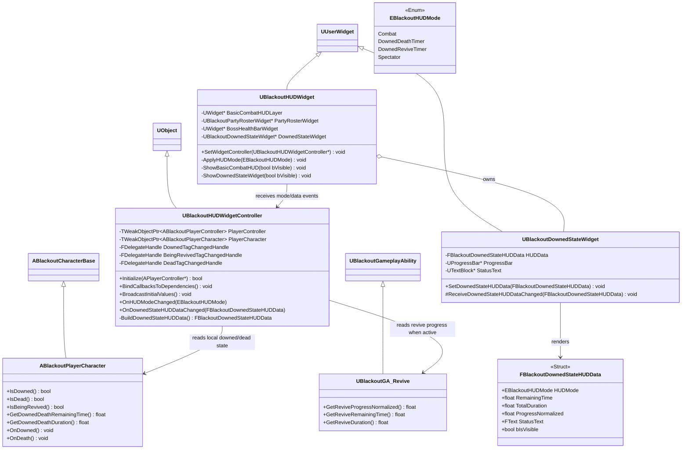
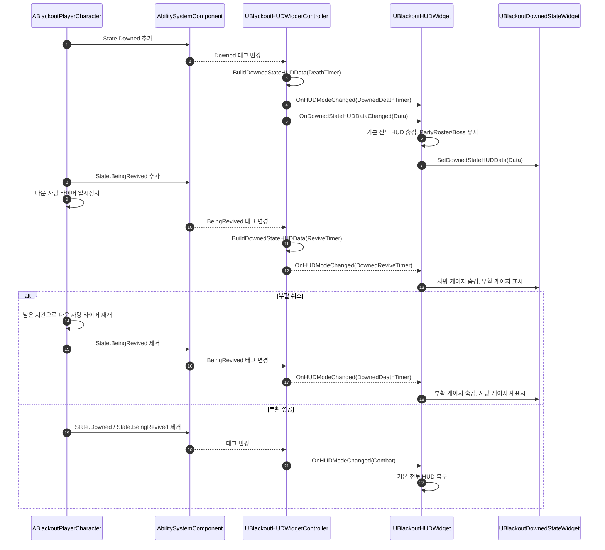

# UI — 04. 다운 상태 HUD

> GDD §3 "사망 및 팀원 부활", GDD §8.3 "인게임 전투 HUD", TDD v5 §5.1 및 §9 기반.
> 로컬 플레이어가 다운되었을 때 기본 전투 HUD를 줄이고, 완전 사망 또는 부활까지 남은 시간을 명확하게 표시하는 책임 구조입니다.

## 클래스 다이어그램

## HUD 모드 규칙

| HUD 모드 | 진입 조건 | 유지 UI | 숨김 UI | 표시 UI | 이탈 조건 |
|---|---|---|---|---|---|
| `Combat` | 일반 생존 상태 또는 부활 성공 | 기본 전투 HUD, 팀원 상태창, 보스 체력바 | 다운/관전 HUD | 없음 | `State.Downed` 또는 `State.Dead` |
| `DownedDeathTimer` | 로컬 플레이어 `State.Downed == true`, `State.BeingRevived == false` | 팀원 상태창, 보스 체력바 | 크로스헤어, 착탄 인디케이터, HP/SP, 무기/탄약, 유물, 소모품, 데미지 플로팅 텍스트 | 완전 사망까지 남은 시간 프로그래스 바 | 부활 시도, 부활 성공, 완전 사망 |
| `DownedReviveTimer` | 로컬 플레이어 `State.Downed == true`, `State.BeingRevived == true` | 팀원 상태창, 보스 체력바 | 기본 전투 HUD, 일시정지된 사망 타이머 프로그래스 바 | 부활 완료까지 남은 시간 프로그래스 바 | 부활 성공, 부활 취소, 완전 사망 |
| `Spectator` | 로컬 플레이어 `State.Dead == true` | 관전 HUD | 기본 전투 HUD, 다운/부활 프로그래스 바 | 관전 대상/항복 투표 UI | 전멸 복귀 / 체크포인트 복귀 |

## 데이터 흐름

## 구현 노트

- **레이어 분리**: `UBlackoutHUDWidget`은 기본 전투 HUD 레이어, 파티 상태창, 보스 체력바, 다운 상태 위젯을 별도 참조로 관리합니다. 다운 중에는 파티 상태창과 보스 체력바만 예외적으로 유지합니다.
- **사망 타이머 표시**: `ABlackoutPlayerCharacter`의 서버 권위 다운 타이머에서 UI용 시작/종료 시각 또는 남은 시간을 소유 클라이언트로 전달합니다. HUD는 총 지속 시간 대비 남은 시간 비율로 프로그래스 바를 갱신합니다.
- **부활 타이머 표시**: `State.BeingRevived`가 적용되면 서버는 다운 사망 타이머를 일시정지하고, `UBlackoutGA_Revive`의 진행률 또는 부활 종료 시각을 사용해 부활 프로그래스 바를 표시합니다. 부활이 취소되면 정지 시점에 보관한 남은 시간으로 사망 타이머를 재개하고 사망 게이지를 다시 표시합니다.
- **복구 조건**: 부활 성공으로 `State.Downed`와 `State.BeingRevived`가 해제되면 `Combat` 모드로 복귀합니다. 완전 사망으로 `State.Dead`가 적용되면 `Spectator` 모드로 전환합니다.
- **Tick 사용 범위**: 남은 시간 텍스트/프로그레스 보간은 로컬 위젯 Tick 또는 타이머로 갱신할 수 있습니다. 상태 전환 자체는 GameplayTag 이벤트와 서버 권위 시간 데이터로만 결정합니다.
