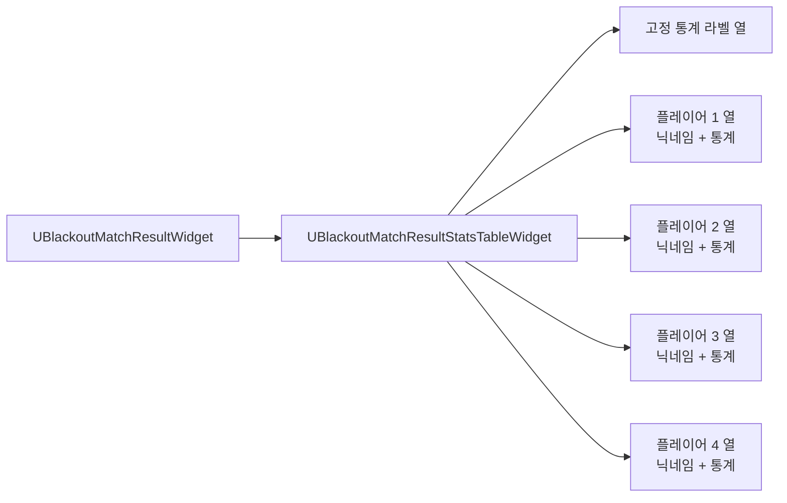
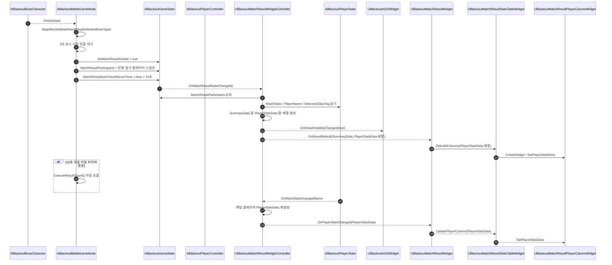
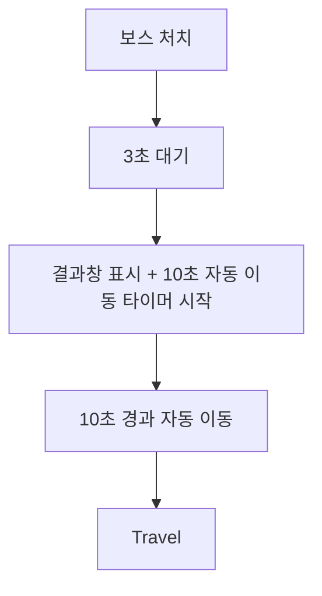

# UI — 05. 게임 클리어 결과 및 통계 창

> TDD v5 §7.4 보스 클리어 및 세션 종료, §9 UI 반응형 바인딩, `FBlackoutMatchStats` 기반.
> 중간/메인 보스 처치 후 3초간 보스 사망 연출을 유지한 뒤 전투 HUD 위에 결과창을 표시하고, 각 `ABlackoutPlayerState`에 복제된 매치 통계를 플레이어별로 렌더링합니다. 결과창 이동은 플레이어 확인 버튼, 전체 확인, 10초 자동 이동 규칙으로 결정합니다.

## 클래스 다이어그램

```mermaid
classDiagram
    direction TB

    UUserWidget <|-- UBlackoutHUDWidget
    UUserWidget <|-- UBlackoutMatchResultWidget
    UUserWidget <|-- UBlackoutMatchResultStatsTableWidget
    UUserWidget <|-- UBlackoutMatchResultPlayerColumnWidget
    UObject <|-- UBlackoutMatchResultWidgetController
    AGameModeBase <|-- ABlackoutBattleGameMode
    AGameStateBase <|-- ABlackoutGameState
    APlayerState <|-- ABlackoutPlayerState

    class UBlackoutHUDWidget {
        -UWidget* BasicCombatHUDLayer
        -UBlackoutMatchResultWidget* MatchResultWidget
        +SetMatchResultWidgetController(UBlackoutMatchResultWidgetController*) void
        -ShowMatchResultWidget(bool bVisible) void
    }

    class UBlackoutMatchResultWidget {
        -UButton* ConfirmButton
        -UBlackoutMatchResultStatsTableWidget* StatsTableWidget
        -FBlackoutMatchResultSummaryData SummaryData
        +SetWidgetController(UBlackoutMatchResultWidgetController*) void
        +RebuildResult(const FBlackoutMatchResultSummaryData&, TArray~FBlackoutMatchResultPlayerStatsData~) void
        +UpdatePlayerStats(FBlackoutMatchResultPlayerStatsData) void
        +SetConfirmButtonEnabled(bool bEnabled) void
        -HandleConfirmClicked() void
        #ReceiveResultVisibilityChanged(bool bIsVisible) void
        #ReceiveResultRebuilt(FBlackoutMatchResultSummaryData, TArray~FBlackoutMatchResultPlayerStatsData~) void
        #ReceiveConfirmStateChanged(bool bHasConfirmed) void
    }

    class UBlackoutMatchResultStatsTableWidget {
        -UHorizontalBox* PlayerColumnContainer
        -TSubclassOf~UBlackoutMatchResultPlayerColumnWidget~ PlayerColumnWidgetClass
        -TMap~ABlackoutPlayerState*, UBlackoutMatchResultPlayerColumnWidget*~ PlayerColumnWidgets
        -TArray~FBlackoutMatchResultStatRowDefinition~ StatRows
        +RebuildColumns(TArray~FBlackoutMatchResultPlayerStatsData~) void
        +UpdatePlayerColumn(FBlackoutMatchResultPlayerStatsData) void
        -CreatePlayerColumn(FBlackoutMatchResultPlayerStatsData) UBlackoutMatchResultPlayerColumnWidget*
        -RemoveMissingColumns(TSet~ABlackoutPlayerState*~) void
    }

    class UBlackoutMatchResultPlayerColumnWidget {
        -FBlackoutMatchResultPlayerStatsData PlayerStatsData
        -UTextBlock* PlayerNameText
        -UTextBlock* DamageDealtText
        -UTextBlock* KillsText
        -UTextBlock* MeleeKillsText
        -UTextBlock* AccuracyText
        -UTextBlock* ShotsFiredText
        -UTextBlock* ShotsHitText
        -UTextBlock* ConsumablesUsedText
        -UTextBlock* RevivesText
        -UWidget* ConfirmedIconWidget
        +SetPlayerStatsData(FBlackoutMatchResultPlayerStatsData) void
        #ReceivePlayerStatsDataChanged(FBlackoutMatchResultPlayerStatsData) void
    }

    class UBlackoutMatchResultWidgetController {
        -TWeakObjectPtr~APlayerController~ PlayerController
        -TWeakObjectPtr~ABlackoutGameState~ GameState
        -TWeakObjectPtr~ABlackoutPlayerState~ LocalPlayerState
        -TMap~ABlackoutPlayerState*, FBlackoutMatchResultPlayerBinding~ PlayerBindings
        +Initialize(APlayerController*) bool
        +BindCallbacksToDependencies() void
        +BroadcastInitialResult() void
        +RefreshResult() void
        +OnResultVisibilityChanged(bool bIsVisible)
        +OnResultRebuilt(FBlackoutMatchResultSummaryData, TArray~FBlackoutMatchResultPlayerStatsData~)
        +OnPlayerStatsChanged(FBlackoutMatchResultPlayerStatsData)
        +OnLocalConfirmStateChanged(bool bHasConfirmed)
        +RequestConfirmResult() void
        -HandleMatchStateChanged(EBlackoutMatchState) void
        -HandleResultStateChanged() void
        -HandlePlayerArrayChanged() void
        -BindPlayer(ABlackoutPlayerState*) void
        -UnbindPlayer(ABlackoutPlayerState*) void
        -BuildSummaryData() FBlackoutMatchResultSummaryData
        -BuildPlayerStatsData(ABlackoutPlayerState*) FBlackoutMatchResultPlayerStatsData
    }

    class ABlackoutBattleGameMode {
        -float MatchResultDisplayDelay
        -float MatchResultAutoTravelDelay
        -FTimerHandle ResultDisplayTimerHandle
        -FTimerHandle ResultAutoTravelTimerHandle
        +RegisterBoss(ABlackoutBossCharacter*) void
        -BeginBossDefeatResultFlow(EBossType) void
        -ShowMatchResultAfterDelay() void
        -AutoTravelAfterMatchResult() void
        -ExecuteMatchResultTravel() void
        -SnapshotMatchResultParticipants(...) void
    }

    class ABlackoutGameState {
        +TArray~APlayerState*~ PlayerArray
        +EBlackoutMatchState CurrentMatchState
        +EBossType DefeatedBossType
        +bool bIsMatchResultVisible
        +float MatchResultVisibleServerTime
        +float MatchResultAutoTravelServerTime
        +TArray~ABlackoutPlayerState*~ MatchResultParticipants
        +OnMatchStateChanged(EBlackoutMatchState)
        +OnPlayerArrayChanged()
        +OnMatchResultStateChanged()
    }

    class ABlackoutPlayerState {
        +FGameplayTag SelectedClassTag
        +FBlackoutMatchStats MatchStats
        +OnMatchStatsChangedNative()
        +OnPlayerNameChangedNative()
    }

    class FBlackoutMatchStats {
        <<Struct>>
        +int32 DamageDealt
        +int32 Kills
        +int32 MeleeKills
        +int32 ShotsFired
        +int32 ShotsHit
        +int32 ConsumablesUsed
        +int32 Revives
    }

    class FBlackoutMatchResultSummaryData {
        <<Struct>>
        +bool bIsVictory
        +EBossType DefeatedBossType
        +FText ResultTitle
        +FText ResultSubtitle
        +int32 TotalDamageDealt
        +int32 TotalKills
        +int32 TotalRevives
        +float TeamAccuracyPercent
        +float AutoTravelRemainingTime
    }

    class FBlackoutMatchResultPlayerStatsData {
        <<Struct>>
        +ABlackoutPlayerState* PlayerState
        +FText DisplayName
        +FGameplayTag SelectedClassTag
        +int32 DisplayOrder
        +int32 DamageDealt
        +int32 Kills
        +int32 MeleeKills
        +int32 ShotsFired
        +int32 ShotsHit
        +float AccuracyPercent
        +int32 ConsumablesUsed
        +int32 Revives
        +bool bIsLocalPlayer
        +bool bIsValid
    }

    class FBlackoutMatchResultStatRowDefinition {
        <<Struct>>
        +FName StatId
        +FText DisplayLabel
        +EBlackoutMatchResultStatFormat DisplayFormat
    }

    class FBlackoutMatchResultPlayerBinding {
        <<Struct>>
        +ABlackoutPlayerState* PlayerState
        +FDelegateHandle MatchStatsChangedHandle
        +FDelegateHandle NameChangedHandle
    }

    UBlackoutHUDWidget o-- UBlackoutMatchResultWidget : owns
    UBlackoutMatchResultWidget --> UBlackoutMatchResultWidgetController : receives result events
    UBlackoutMatchResultWidget o-- UBlackoutMatchResultStatsTableWidget : owns
    UBlackoutMatchResultStatsTableWidget o-- UBlackoutMatchResultPlayerColumnWidget : creates per player
    ABlackoutBattleGameMode --> ABlackoutGameState : publishes result visibility and timer state
    UBlackoutMatchResultWidgetController --> ABlackoutGameState : watches match result participant snapshot
    UBlackoutMatchResultWidgetController --> ABlackoutPlayerState : reads replicated stats
    UBlackoutMatchResultWidgetController --> FBlackoutMatchResultSummaryData : builds team summary
    UBlackoutMatchResultWidgetController --> FBlackoutMatchResultPlayerStatsData : builds player columns
    UBlackoutMatchResultStatsTableWidget --> FBlackoutMatchResultStatRowDefinition : defines stat row order
    UBlackoutMatchResultPlayerColumnWidget --> FBlackoutMatchResultPlayerStatsData : renders nickname and stats
```

## 표시 항목

결과창은 헬다이버즈 2의 게임 결과 통계 화면처럼 **통계 항목을 세로 축**, **참가 플레이어를 가로 축**으로 배치합니다. 각 플레이어 열의 상단에는 닉네임을 고정 표시하고, 아래에는 동일한 순서의 통계 값을 나란히 표시해 파티 전체 성과를 한눈에 비교할 수 있게 합니다.

| 표시명 | 데이터 원천 | 계산 규칙 |
|---|---|---|
| 닉네임 | `ABlackoutPlayerState::GetPlayerName()` | 결과창 표시 시점의 참가 플레이어 스냅샷 순서대로 플레이어 열 상단에 표시 |
| 입힌 데미지 | `FBlackoutMatchStats::DamageDealt` | 서버 데미지 적용 결과를 정수 합산 |
| 처치한 적의 수 | `FBlackoutMatchStats::Kills` | 서버 처치 확정 시 1 증가 |
| 근접 공격 처치 횟수 | `FBlackoutMatchStats::MeleeKills` | `RecordKill(bWasMeleeKill)`에서 근접 처치일 때만 1 증가 |
| 명중률 | `ShotsHit`, `ShotsFired` | `ShotsFired > 0 ? ShotsHit / ShotsFired * 100 : 0` |
| 발포한 횟수 | `FBlackoutMatchStats::ShotsFired` | 사격/펠릿 발사 서버 처리 결과 합산 |
| 명중한 횟수 | `FBlackoutMatchStats::ShotsHit` | 사격/투사체 명중 서버 처리 결과 합산 |
| 사용한 소모품 개수 | `FBlackoutMatchStats::ConsumablesUsed` | 소모품 사용 GA 서버 확정 시 1 증가 |
| 아군 부활 횟수 | `FBlackoutMatchStats::Revives` | 부활 성공 서버 확정 시 1 증가 |

## 통계 테이블 레이아웃

| 열 | 내용 |
|---|---|
| 고정 통계 라벨 열 | 입힌 데미지, 처치 수, 근접 처치, 명중률, 발포 수, 명중 수, 소모품 사용, 부활 수 |
| 플레이어 열 | 닉네임, 병과 표시, 해당 플레이어의 `FBlackoutMatchStats` 값 |

## 데이터 흐름

## 표시 규칙

| 상태 | 결과창 표시 | 이동 예약 | 입력 |
|---|---|---|---|
| 보스 처치 직후 3초 | 숨김 | 없음 | 기존 전투 입력 차단 또는 보스 사망 연출 입력 유지 |
| 결과창 표시 직후 | 표시 | 10초 자동 이동 타이머 시작 | 결과 통계 확인 |
| 10초 경과 | 표시 유지 또는 페이드 아웃 | 자동 이동 즉시 실행 | 입력 잠금 가능 |

## 이동 규칙

## 구현 노트

- **표시 트리거**: 중간/메인 보스 모두 처치 직후 바로 이동하지 않고, 서버가 3초 지연 후 `ABlackoutGameState::bIsMatchResultVisible`을 복제해 결과창 표시를 시작합니다. 기존 `CurrentMatchState == Ended`만으로 표시 여부를 결정하면 중간 보스 결과창과 구분하기 어려우므로 결과창 전용 복제 상태를 둡니다.
- **자동 이동**: 결과창 표시 10초 후 자동 이동합니다. 자동 이동 목적지는 처치한 보스 타입에 따라 중간 보스는 로비, 메인 보스는 타이틀입니다.
- **컨트롤러 책임**: `UBlackoutMatchResultWidgetController`는 `ABlackoutGameState::MatchResultParticipants`를 기준으로 게임에 참가한 모든 플레이어의 닉네임과 통계를 표시합니다. 로컬 플레이어만 강조하기 위해 `bIsLocalPlayer`를 별도 전달합니다.
- **참가자 스냅샷**: 결과창 표시 시점에 서버가 참가 플레이어 목록을 고정합니다. 단순히 현재 `PlayerArray`만 매 프레임 순회하면 결과창 표시 중 이탈/복제 지연으로 열 순서가 흔들릴 수 있으므로, `DisplayOrder`를 포함한 스냅샷을 기준으로 컬럼을 구성합니다.
- **헬다이버즈 2 스타일 테이블**: `UBlackoutMatchResultStatsTableWidget`은 고정 통계 라벨 열과 플레이어별 컬럼들을 같은 행 높이로 맞춥니다. 각 `UBlackoutMatchResultPlayerColumnWidget`은 상단 닉네임, 병과, 통계 값을 세로로 렌더링합니다.
- **갱신 방식**: `ABlackoutPlayerState::OnMatchStatsChangedNative`와 `OnPlayerNameChangedNative`를 바인딩해 늦게 도착한 복제 값도 결과창에 반영합니다. 결과창 표시 시점에는 `RefreshResult()`로 전체 스냅샷을 한 번 재구성합니다.
- **명중률 처리**: 발포 횟수가 0이면 0%로 표시해 0 나누기를 방지합니다. UI 표기는 정수 또는 소수점 한 자리 등 블루프린트 위젯에서 결정합니다.
- **팀 요약**: 팀 명중률은 플레이어별 명중률 평균이 아니라 `전체 ShotsHit / 전체 ShotsFired`로 계산합니다.
- **서버 집계 확인**: 근접 처치(`MeleeKills`)와 소모품 사용(`ConsumablesUsed`)은 서버 집계 값을 기준으로 표시합니다. UI는 임의 계산을 수행하지 않습니다.
- **결과창 상태 전환**: `ABlackoutBattleGameMode`는 `MatchResultDisplayDelay` 후 결과창 상태를 복제하고, `MatchResultAutoTravelDelay` 후 `ExecuteMatchResultTravel()`을 호출합니다.
- **소멸 처리**: 컨트롤러는 `BeginDestroy` 또는 HUD 해제 시 `GameState::OnMatchStateChanged`, `OnPlayerArrayChanged`, 각 `PlayerState`의 통계/이름 델리게이트에서 `RemoveAll(this)` 또는 저장한 `FDelegateHandle`로 바인딩을 해제합니다.
