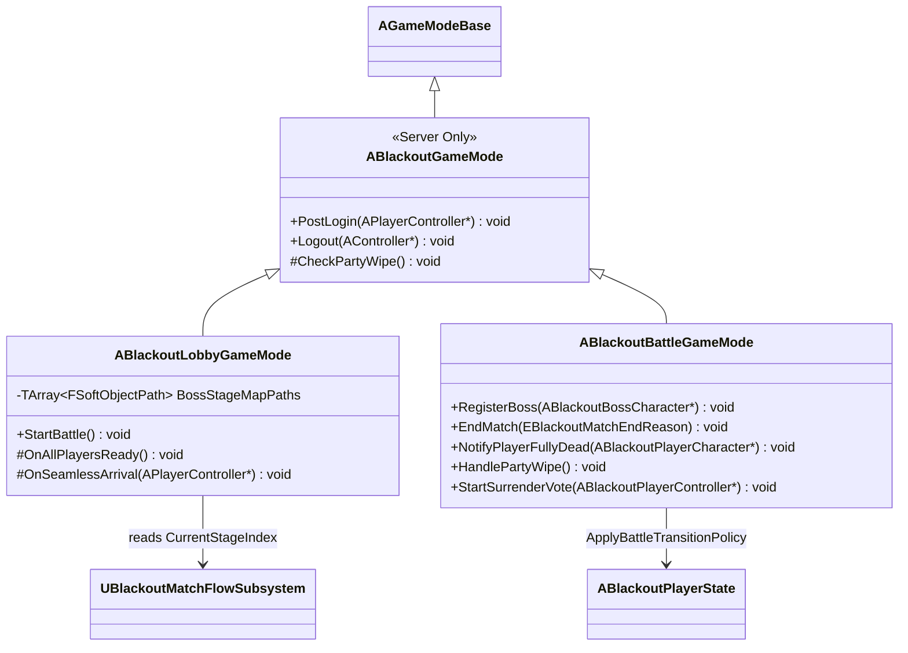
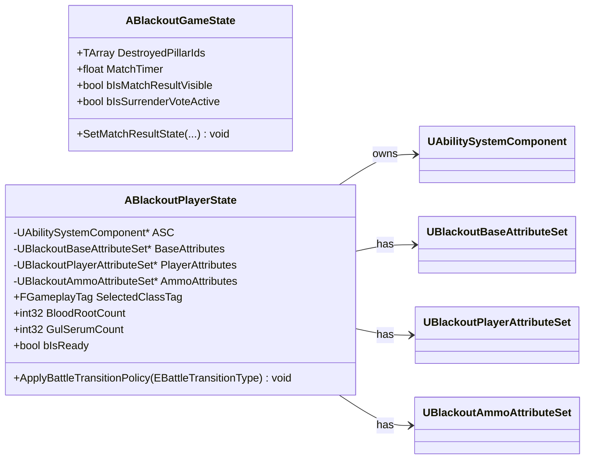
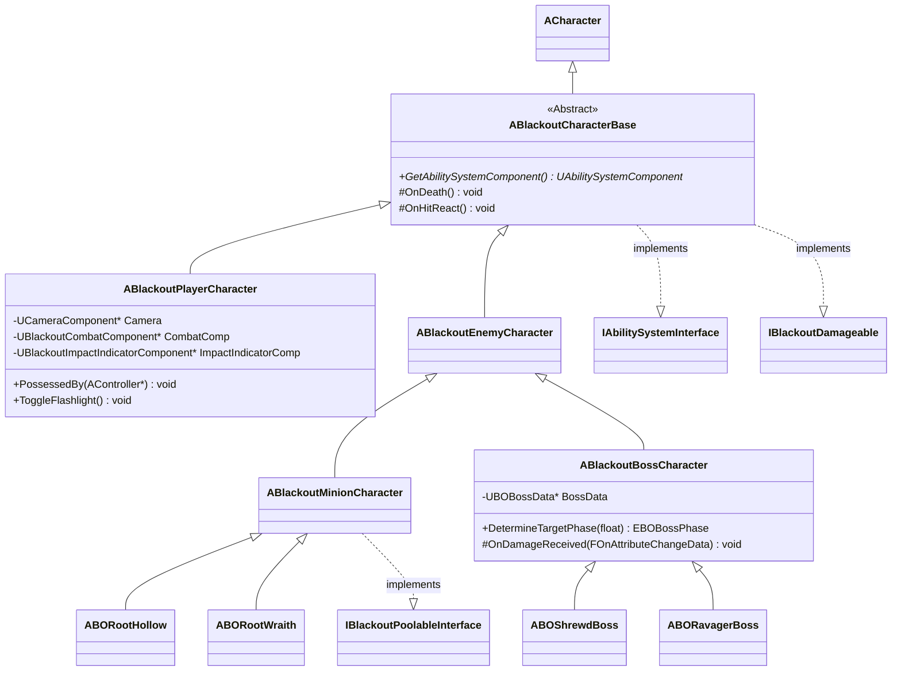
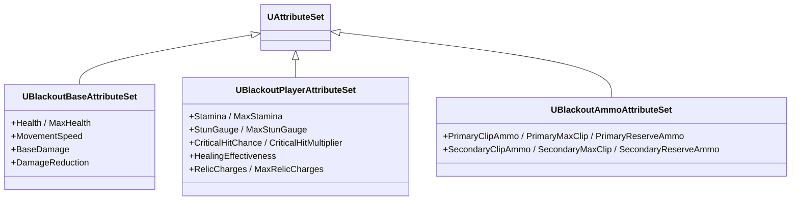
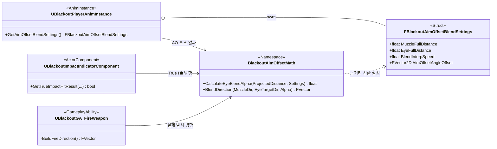
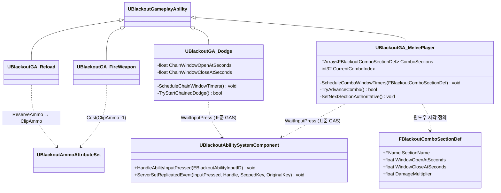
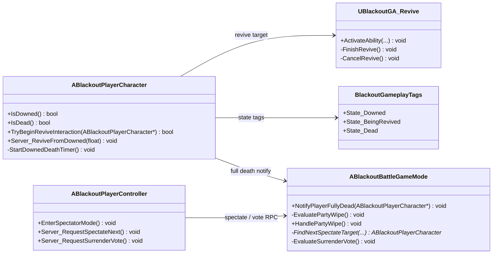
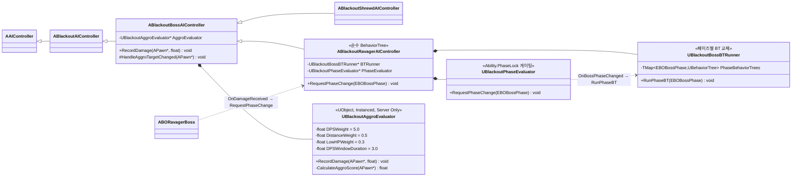
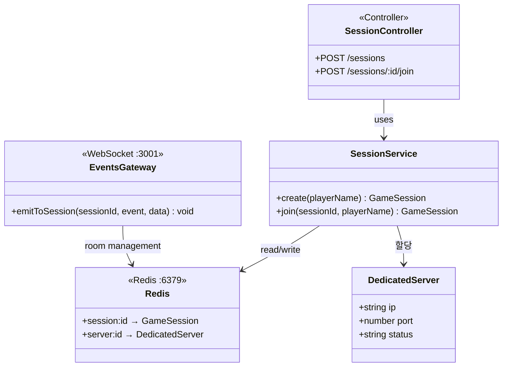
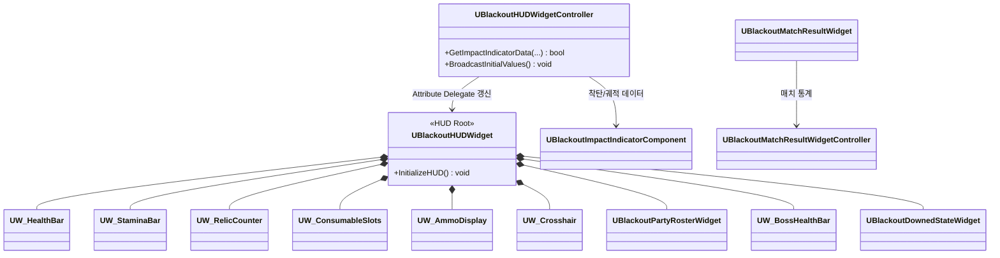

# 결과보고서 발표자료 초안 — Project Blackout (2팀)

> **용도**: Claude Design으로 PPT를 생성하기 위한 **내용 초안(마크다운)**. 이 문서로 직접 PPT를 만들지 않습니다.
> **제출 파일명(최종 PPT)**: `결과보고서_2팀(언리얼 엔진을 활용한 멀티플레이 게임 구현)`
> **목표 분량**: 20분 내 발표 가능 (≈ 28~32매)
> **구성**: 발표자료 구성 가이드라인의 필수 5개 목차 항목을 모두 포함
> **디자인 톤(Claude Design 전달)**: **레드/블랙** 컬러 강조(블랙아웃 세계관). 레이아웃은 Claude Design에 위임.
>
> **이미지/미디어 표기 규칙** (Claude Design은 프로젝트 `Docs/` 파일에 접근 불가 → 다이어그램은 본문에 **mermaid 코드로 직접 포함**):
> - 🖼️ **다이어그램** — 바로 아래 **mermaid 코드 블록**을 렌더링해 슬라이드에 표시 (외부 파일 참조 아님)
> - 🟥 **[이미지 공간 확보 — 수동 삽입]** — 스크린샷/컨셉 이미지를 **나중에 수동 삽입**할 빈 영역(자리만 확보, 캡션/크기 가이드 포함)
> - 🎬 **[영상 공간 확보 — 수동 삽입]** — 데모 영상 임베드용 빈 영역(마지막 페이지)

---

## [Slide 1] 표지

- **프로젝트명**: Project Blackout (프로젝트 블랙아웃)
- **부제**: 언리얼 엔진을 활용한 멀티플레이 게임 구현 — 3인칭 소울라이크 PvE 협동 보스 러시 게임
- **2팀** / 기업협약 프로젝트 (협약 기업: 하이퍼센트)
- 팀원: 김민영(팀장)·최승현·조성원·허혁
- **과정명**: [기업연계] 언리얼 엔진을 활용한 게임 개발자 부트캠프 **8기**
- **발표일**: 2026. 06. 22.
- 🟥 **[이미지 공간 확보 — 수동 삽입]**: 디벨로켓, 하이퍼센트 **로고**. 로고 배치용 빈 영역만 확보

---

# 1. 프로젝트 개요

## [Slide 2] 섹션 — 01. 프로젝트 개요

## [Slide 3] 프로젝트 주제 및 선정 배경

- **기업 협약 미션 가이드**를 4대 핵심 요구사항으로 해석:
  1. **보스 & 페이즈 설계** — 다단계 페이즈와 고유 공격 패턴을 가진 보스
  2. **멀티플레이어 Replication** — 언리얼 빌트인 데디케이티드 서버 기반 실시간 동기화
  3. **캐릭터별 특성 무기** — 기관단총/유탄발사기/저격소총 등 병과별 고유 무기
  4. **OOP 기반 설계** — 인터페이스·상속·단일책임원칙, **클래스 다이어그램 선행 설계**
- **레퍼런스 게임 분석**: Borderlands 2(4인 협동 클래스 구조) · Dark Souls(I-Frame·스태미나·패턴 학습) · **Remnant 2(직접 레퍼런스)**
- 결론: **TPS 슈팅의 타격감 + 소울라이크의 긴장감을 결합한 협동 PvE**
- 🟥 **[이미지 공간 확보 — 수동 삽입]**: 레퍼런스 게임 3종 썸네일(가로 3분할 영역)

## [Slide 4] 기획 의도 및 컨셉

- **컨셉**: "블랙아웃"(대규모 정전·문명 붕괴) 세계관. 4인이 협동해 다단계 보스를 사냥하는 **Boss Rush**
- **설계 철학 2가지**:
  - 잡몹 필드 구간을 **제거**하고 보스전 구현 자체에 역량 집중
  - 전멸 페널티를 **체크포인트 즉시 부활**로 완화 → "죽어도 곧바로 다시 붙는" 템포
- **핵심 차별점**: 3병과의 고유 처치 조건이 곧 파티 전체 전투 자원(탄약·회복)의 순환 조건
  → **"시키지 않아도 협동하게 되는" 유기적 상호 의존성**
- 🟥 **[이미지 공간 확보 — 수동 삽입]**: 게임 스크린샷(우측 절반 영역)

## [Slide 5] 훈련 내용과의 연관성

- **언리얼 엔진 C++ / 게임플레이 프레임워크**: GameMode·GameState·PlayerState·Controller 계층 설계
- **GAS(Gameplay Ability System)**: 어빌리티·어트리뷰트·이펙트·큐 기반 데이터 주도 전투
- **멀티플레이어 네트워킹**: 데디케이티드 서버, Replication, RPC, 예측·서버 권위 모델
- **OOP / 설계 역량**: 인터페이스·상속·단일책임원칙, 클래스 다이어그램 선행 설계
- **AI**: Behavior Tree / StateTree / EQS / NavMesh
- → 훈련에서 학습한 핵심 주제를 **하나의 완성형 멀티플레이 게임**으로 통합 실습

## [Slide 6] 개발 환경

| 구분 | 내용 |
|------|------|
| 게임 엔진 | **Unreal Engine 5.7.4** (바이너리 빌드 버전 고정) |
| IDE | **Rider** |
| 형상 관리 | 코드: **GitHub** / `.uasset`·`.umap` 등 바이너리: **Google Drive 공유 폴더** |
| 네트워크 | **데디케이티드 서버 전용** (프로토타입: 고정 IP / 정식: AWS) |
| 매치메이킹 서버 | **Nest.js + Redis + WebSocket** (별도 API 서버) |
| 협업 | **Discord**(소통) · **Notion**(일정·문서·Epic/Task 관리) |
| 설계 방법론 | 클래스 다이어그램 선행 설계 + GAS + 데이터 기반 설계 |
| AI 에이전트 | 개발 컨벤션을 **AI 에이전트 지침서**로 활용해 코드 생성 가속 |

## [Slide 7] 프로젝트 목적 · 구조 · 기대 효과

- **목적**: 미션 가이드 4대 요구사항을 충족하는 **완성형 멀티플레이 보스러시 게임** 구현
- **구조 한 줄 요약**: 메인 메뉴 → 단일 로비(병과 선택) → 중간 보스 → 메인 보스(3페이즈) → 결과/복귀
- 🟥 **[이미지 공간 확보 — 수동 삽입]**: 게임 플로우 5단계 가로 흐름도(아이콘/스크린샷 띠 형태)
- **기대 효과**:
  - 언리얼 엔진 **활용 역량 강화**(GAS·네트워크·AI·UI 전 영역 실습)
  - 기획→구현→테스트→폴리싱의 **게임 개발 전 과정 경험**
  - 데이터 기반·모듈화 설계로 **확장성·유지보수성** 확보

---

# 2. 프로젝트 팀 구성 및 역할

## [Slide 8] 섹션 — 02. 팀 구성 및 역할

## [Slide 9] 팀 구성 및 담당 업무

> 담당 업무는 GitHub `ThunderVolt45/ProjectBlackout` **PR 기여 내역**(총 약 350개 머지 PR) 기반으로 첨삭. 괄호 안은 개인 머지 PR 수.

| 이름 | 역할 | 담당 업무 (PR 기여 기반 첨삭) |
|------|------|------------------------------|
| **김민영** | 팀장 (≈139 PR) | **Core / GAS / UI** — GAS 기초 인프라·공통 기반(Foundation)·Combat 골격, 플레이어 전투 GA(사격·재장전·근접 콤보·구르기·조준·무기교체), 무기/발사체/산탄/유탄, **True Impact Indicator**·탄퍼짐·반동, 소모품·유물 시스템, 인게임 HUD·파티원 패널·다운/부활/관전 HUD, 처치 보상 드롭, **항복·Fast-Retry**, 무기/소모품/유물 GameplayCue, 약점 치명타 히트박스, 매치 결과·통계 UI, 사운드 설정·믹스, 보스 아레나 레벨, 네트워크 동기화·CI 자동화 |
| **최승현** | 팀원 (≈89 PR) | **Server / Game Flow** — GameMode(Lobby/Battle)·GameState 복제 필드·Ready 집계, 데디케이티드 서버 라이프사이클·Heartbeat·**재접속/크래시 복구**, 매치 플로우(체크포인트·파티 전멸 복귀·seamless travel 보스맵 분기)·로딩 게이트, 쉘터 존, **매치 통계 시스템**·보스 HP 정원 스케일링, 캐릭터 선택 UI+**3D 프리뷰**·매칭 UI, Wraith/Shrewd StateTree, 외곽선(스텐실)·싱글(1인) 모드, **3인칭 카메라 폴리시**, 텔레메트리 샘플러·**히트맵 에디터 툴** |
| **조성원** | 팀원 (≈67 PR) | **AI / Animation** — AI 프레임워크(BehaviorTree/StateTree 구조·AIController 파사드·BT Helper), **어그로 시스템**, 추적·회피 Service/Decorator, 보스 패턴 어빌리티(Shockwave·EnergyBurst·**Gorenado**·미니언 소환·회전), **보스 페이즈 구성/전환**·보스 체력바, Shrewd 화살·텔레포트, 미니언/중간 보스 **사망 애니메이션**, Ravager AI 고도화, **레벨 시퀀스 컷신·자막** 연출, 보스 사운드 |
| **허혁** | 팀원 (≈55 PR) | **Player / Animation** — 플레이어 컨트롤러·AttributeSet·입력·베이스 BP·이동, 무기 스왑·근접 콤보 입력 윈도우, 블렌드스페이스·AimOffset·재장전 몽타주, 근접 NotifyState 판정, 다운/피격 처리·데미지 숫자 UI, **파괴 기둥** 액터·물리·VFX·최적화, **피격 리액션 분기·스턴 게이지** 시스템, 백스텝·디버그 치트, **DLSS/Frame Generation·ESC 메뉴**, BGM 시스템·Outro, 오브젝트 풀 프리로드 |

- 협업 방식: 멘토링(하이퍼센트) · Notion Epic/Task 관리 · Main–Develop–Feature 브랜치 전략
- 🟥 **[이미지 공간 확보 — 수동 삽입]**: 팀원별 기여 비중/영역 인포그래픽 또는 PR 기여 그래프(선택)

---

# 3. 프로젝트 수행 절차 및 방법

## [Slide 10] 섹션 — 03. 수행 절차 및 방법

## [Slide 11] 수행 절차 — 전체 흐름 (도식화)

- 가이드라인 §3: **사전 기획 → 수행 및 완료 과정**을 도식으로 제시
- 제안 도식 (Claude Design에서 가로 플로우 다이어그램으로 시각화):

```
[사전 기획]
 미션 가이드 분석 → 레퍼런스 분석 → 게임 컨셉/플로우 확정
 → 클래스 다이어그램 선행 설계 → 개발 컨벤션·일정(Epic/Task) 수립
        │
        ▼
[수행 및 완료]
 환경/기반 구축 → 플레이어 시스템 → 3병과·미니언 → 게임 플로우 연결
 → 중간 보스 → 메인 보스(3페이즈) → 폴리싱/QA
        │
        ▼
[검증]  1차 중간보고 → 2차 중간보고 → 최종 결과보고
```

## [Slide 12] 사전 기획 단계

- 기업 협약 미션 가이드 요구사항 정의 및 레퍼런스(Remnant 2 등) 분석
- 게임 컨셉·핵심 루프(Boss Rush)·병과 시너지 설계 → **GDD 작성**
- **클래스 다이어그램 선행 설계** + 기술 설계서(TDD) 작성 (GAS·데이터 기반·네트워크 아키텍처)
- 개발 컨벤션 수립(네이밍·코딩표준·폴더구조·브랜치/커밋/PR 규칙) → **AI 에이전트 지침서로 활용**

## [Slide 13] 프로젝트 수행 일정

- **작업 기간**: 2026. 04. 24. ~ 2026. 06. 19. (8주)
- 주요 마일스톤: **1차 중간보고·시연 05/14** · **2차 중간보고 06/05** · **최종 발표 06/22**

| 기간 | 단계 | 주요 활동 (실제 PR 기반) |
|------|------|--------------------------|
| 04/15~04/23 | 사전 준비 | **탐색 개발 단계**, 킥오프 발표, 설계 문서·클래스 다이어그램 초안 작성 |
| 04/24~04/30 | 1주차 | 공통 기반(Foundation)·Combat·AI/Boss 스켈레톤, GAS 기초 인프라, GameMode·매치메이킹 기초, 무기(시카고 타자기·유탄·산탄)·무기 교체, 에임 오프셋, 착탄 인디케이터, 탄퍼짐/반동, 인게임 HUD 기반, Wraith StateTree |
| 05/01~05/07 | 2주차 | 소모품 시스템+HUD, GA Cancel/Block, 3병과 캐릭터·재장전 애니, Wraith 사격 패턴 |
| 05/08~05/14 | 3주차 | 유물 GA+HUD, 정조준 분리, 콤보·연속 구르기 네트워크 동기화, 로그인/매칭 UI, 데디 라이프사이클·로딩 스크린 → **1차 중간보고·시연(05/14)** |
| 05/15~05/21 | 4주차 | Physics Asset 피격, 무기 GCN, 다운/부활/관전 HUD·파티원 패널, 처치 보상 드롭, 약점 치명타, **게임 플로우 단일맵 수렴**, 쉘터/체크포인트, Ravager 패턴(Shockwave·EnergyBurst·Gorenado·소환) |
| 05/22~05/28 | 5주차 | 항복 시스템, 캐릭터 선택 UI+3D 프리뷰, 파괴 기둥 액터, 정예 미니언 스폰, 보스 페이즈 구성, 피격 리액션 분기 |
| 05/29~06/04 | 6주차 | 보스 아레나(중간/메인) 레벨, **seamless travel 보스맵 분기 재도입**, 중간 보스 Shrewd 구현(비행 StateTree·화살·텔레포트), DLSS/Frame Generation·ESC 메뉴, 외곽선(스텐실), 싱글(1인) 모드, 플래시라이트 |
| 06/05~06/11 | 7주차 | **2차 중간보고·시연(06/05)**, 보스 HP 정원 스케일링, 3인칭 카메라 폴리시, Ravager AI 고도화, 사망 애니, 백스텝, 데디 재접속/크래시 복구, UI 폴리싱 |
| 06/12~06/17 | 8주차 | 폴리싱·QA — 사운드/BGM·믹스, 스턴 게이지, 매치 결과·통계 UI, 로딩 게이트, 컷신/자막, 텔레메트리 히트맵 툴, 오브젝트 풀 프리로드, NavMesh 리빌드, 최종 빌드 |

- 일정 관리: Notion에 **Epic–Task**로 분해. 전반(1~3주)=플레이어·전투 기반, 중반(4~5주)=보스 패턴·게임 플로우, 후반(6~8주)=보스 AI 완성·폴리싱

---

# 4. 프로젝트 수행 경과 (실제 구현 내역)

## [Slide 14] 섹션 — 04. 수행 경과

## [Slide 15] 시스템 아키텍처 개요

- **3대 설계 축**: ① 데디케이티드 서버 전용 네트워크 ② **GAS** 기반 전투 ③ **데이터 기반 설계**(에디터에서 수치 조정)
- **프레임워크 계층**:
  - GameMode: `ABlackoutGameMode`(부모) → `ABlackoutLobbyGameMode` / `ABlackoutBattleGameMode`
  - `ABlackoutPlayerState`가 ASC·어트리뷰트·소모품·Ready 상태를 소유하고 서버와 완전 동기화

> 🖼️ **다이어그램 — GameMode 계층 (Server Only)** *(아래 GameState/PlayerState와 한 슬라이드 2분할 또는 2슬라이드로 배치)*





## [Slide 16] 캐릭터 계층 & GAS 구조

- `ACharacter` → `ABlackoutCharacterBase` → Player / Enemy(→ Minion → Hollow·Wraith / → Boss → Shrewd·Ravager)
- **AttributeSet 3종 분리**: Base(공통) / Player(스태미나·치명타·유물) / Ammo(주·보조 탄약) — 메모리 최적화 + 순환 참조 방지
- 플레이어 GA: 사격·재장전·근접콤보·구르기·전력질주·조준·무기교체·유물·소모품(블러드루트/굴혈청)·부활

> 🖼️ **다이어그램 — 캐릭터 상속 계층** *(아래 AttributeSet 3종과 한 슬라이드 2분할 또는 2슬라이드로 배치)*





## [Slide 17] 플레이어 전투 — 무기·사격 & Aim Offset

- **무기 계층**: `ABOWeaponBase` → `ABOFirearm` / `ABOShotgunFirearm` / `ABOMeleeWeapon`, 발사체 `ABOProjectile` 계열(유탄·화살)
- **사격 GA**(`UBlackoutGA_FireWeapon`, LocalPredicted): Cost `ClipAmmo −1`, **히트스캔/투사체/산탄 펠릿** 분기, 약점 배율은 `SetByCaller` → `ExecCalc_DamageCalc`, 탄퍼짐·반동, 무기별 GameplayCue(총구화염)
- **True Impact Indicator**: TPS 시차 보정 — 카메라 조준 트레이스와 총구 트레이스를 각각 수행해 **실제 탄착 위치**를 별도 표기, 대상 불일치(`bTargetMismatch`)·유탄 궤적 예측(`PredictProjectilePath`)·신관/오클루전 경고
- **Aim Offset — "에임 타겟 ↔ 카메라 타겟" 방향 블렌드** (핵심):
  - TPS는 카메라가 총구와 떨어져 있어 **시차(Parallax)** 발생 → 화면 조준점과 실제 탄착이 어긋남
  - `BlackoutAimOffsetMath::CalculateEyeBlendAlpha(ProjectedDistance, Settings)`: 대상까지 **투영 거리**로 블렌드 알파 산출 — 근거리(`MuzzleFullDistance`)=**총구 방향 우선**, 원거리(`EyeFullDistance`)=**카메라(눈) 타겟 방향 우선**
  - `BlendDirection(MuzzleDirection, EyeTargetDirection, Alpha)`로 최종 방향 보간 (`BlendInterpSpeed`로 부드럽게)
  - **단일 설정(`FBlackoutAimOffsetBlendSettings`)을 3곳이 공유** → ① AnimInstance 상반신 **에임 오프셋 포즈** ② Impact Indicator **True Hit 방향** ③ FireWeapon **실제 발사 방향** ⇒ *보이는 조준·크로스헤어·실제 탄착이 항상 일치*
- **플래시라이트**: 총기 부착·T키 토글·`bIsFlashlightOn` 복제·무기 스왑 시 가시성 동기화

> 🖼️ **다이어그램 — Aim Offset 공유 구조 (눈/총구 방향 블렌드)**



- 🟥 **[이미지 공간 확보 — 수동 삽입]**: True Impact Indicator/크로스헤어 인게임 캡처(다이어그램 옆)

## [Slide 17b] 플레이어 전투 — 구르기 & 근접 콤보 (몽타주·동기화)

- **공통 정책**: 두 GA 모두 `UBlackoutGameplayAbility` 상속, **LocalPredicted**. 몽타주는 `UAbilityTask_PlayMontageAndWait`로 재생, 서버 ASC가 `PlayMontage` → `RepAnimMontageInfo`가 시뮬레이트 프록시에 자동 복제
- **권위 경계**: 입력=클라 예측 / 콤보·체인 윈도우 상태=**서버 World Time 타이머**(`GetServerWorldTimeSeconds`) / 히트·I-Frame·스태미나·데미지=**서버 권위** / AnimNotify=히트박스·시각 effect 보조(권위 X)
- **근접 콤보**(`UBlackoutGA_MeleePlayer`):
  - `ComboSections : TArray<FBlackoutComboSectionDef>`(SectionName·`WindowOpen/CloseAtSeconds`·`DamageMultiplier`) — 섹션 진입 시 서버가 `ScheduleComboWindowTimers`로 윈도우 open/close·grace 타이머 설정
  - 입력은 표준 `WaitInputPress` + `ServerSetReplicatedEvent(InputPressed, ...)`로 전파, 매칭 시 `Montage_SetNextSectionName`을 **서버에서만** 호출 → 클라는 OnRep로 따라잡음
  - 입력 미매칭 시 `EndAbility` 호출 없이 `RecoveryEnd`까지 자연 재생(강제 종료 체감 제거), `ABOMeleeWeapon::PerformSweep` 결과에 `GE_Damage`
- **구르기**(`UBlackoutGA_Dodge`):
  - I-Frame(`State.Invulnerable`) + 루트 모션, 스태미나는 **GE Cost**(직접 ApplyMod 금지), 서버 검증 후에만 무적·루트모션·`LaunchCharacter` 트리거
  - 체인 윈도우(`ChainWindowOpen/CloseAtSeconds`) 서버 타이머로 **연속 구르기** 재시작 판정
- **입력 핑 보정 공통**: `SequenceId` 단조 증가, 클라 ring buffer 250ms / 서버 receive 150ms / late grace `BaseGrace + RTT*0.5 + Jitter`(상한 150ms). 타임스탬프는 **입력 수락 여부 판정에만** 사용(데미지·무적은 소급 승인 안 함)
- **조기 캔슬**: 몽타주 후반 복귀 구간의 `AN_AbilityCancelable` → `Event_Montage_AbilityCancelable` → `WaitGameplayEvent`가 즉시 `EndAbility`로 차단 태그 해제(다음 행동 빠른 연계)

> 🖼️ **다이어그램 — 전투 GA(사격·재장전·근접·구르기) & 입력 동기화**



## [Slide 18] 생존 시스템 — 회피·유물·다운/부활/관전

- **회피(I-Frame)**·전력질주: 스태미나 자원 관리, 콤보·체인 입력 **서버 권위 + 클라 예측** 동기화
- **유물(Dragon Heart)**: 기본 3회, Lock-in 회복. 부활 시 **구출자 유물 1회 차감**
- **소모품**: 블러드 루트(지속 회복) / 굴 혈청(스태미나 소비 50%↓) — PlayerState 복제 관리
- **다운 → 출혈 타이머 → 완전 사망 → 관전 → 항복 투표 / 파티 전멸 시 체크포인트 부활**
- 다운/부활 타이머는 **서버 권위 시각** 기준으로 HUD 표시

> 🖼️ **다이어그램 — 다운 / 부활 / 관전·항복**



- 🟥 **[이미지 공간 확보 — 수동 삽입]**: 다운/부활 HUD·관전 화면 인게임 캡처

## [Slide 19] 보스 AI

- **미니언·중간 보스(Shrewd) = 순수 StateTree** / **메인 보스(Ravager) = 순수 BehaviorTree + C++ 페이즈 모듈**
- Ravager 페이즈 운용:
  - `ABORavagerBoss`가 체력 비율로 목표 페이즈 계산 → `UBlackoutPhaseEvaluator`(단조 증가·PhaseLock 게이팅) → `UBlackoutBossBTRunner`가 **페이즈별 BT 통째 교체**
  - 패턴 선택/실행: `UBTT_PickNextPattern` → `SelectAbility` → `ActivateAbility` + Service/Decorator
- **부위별 히트박스 피해 배율**: 약점(등 종양/머리) 1.5배, 장갑 부위 0.5배 (`SetByCaller` + `ExecCalc_DamageCalc`)

## [Slide 20] 보스 AI — 어그로 시스템

- **공통 어그로 = 가중치 점수제**(`UBlackoutAggroEvaluator`, 서버 전용):
  - 최근 3초 윈도우 **누적 피해(DPS, 가중 5.0)** + 거리(0.5) + 저체력(0.3) 합산 점수
  - 전환 잠금 태그로 핑퐁 방지, 타겟 다운/사망 시 즉시 재선정
- **디자인 의도**: Assault가 지속 화력으로 자연스럽게 어그로 유지 → Demolition·Sniper가 등 약점/미니언 처리하는 **협동 구도 자동 형성**

> 🖼️ **다이어그램 — 보스 AI (어그로 평가기 + 페이즈 모듈)**



- 🟥 **[이미지 공간 확보 — 수동 삽입]**: 어그로 점수/페이즈 전환 개념도 또는 보스전 캡처(선택)

## [Slide 21] 보스 패턴 — 중간 보스 & 3페이즈 메인 보스

- **중간 보스 약삭빠름(Shrewd)**: 비행 단일 페이즈, 폭발/직선 화살·텔레포트(지정점/EQS). 협동 튜토리얼 관문
- **메인 보스 타락한 약탈자(Ravager)** — 3페이즈:
  - **Phase A(100~60%)**: 근접 압박(2연속 할퀴기·돌진 콤보·쇼크웨이브)·일반 미니언 소환
  - **Phase B(60~30%)**: `GE_Enrage`로 속도 증가 + **블러드 토네이도(Gorenado)** 패턴 추가 + 엘리트 미니언(Root Wraith) 혼합 소환
  - **Phase C(30%↓)**: 광폭화(PlayRate↑) + 궁극기 **광역 에너지 폭발** 패턴 추가 + 기둥 대부분 파괴
- 미니언: Root Hollow(물량 박치기) / Root Wraith(2연발 화살+텔레포트, C 저격 대상)
- 🟥 **[이미지 공간 확보 — 수동 삽입]**: 중간 보스/메인 보스 페이즈별 보스전 스크린샷(3페이즈 가로 분할 또는 컷신 스틸)

## [Slide 22] 기믹·최적화 — 기둥 파괴 & 오브젝트 풀링

- **파괴 기둥**(`ABOBreakablePillarActor`): 보스 돌진/근접 히트가 기둥에 적중 시 영구 파괴, `bIsBroken`·`DestroyedPillarIds` 복제로 신규 접속/관전자도 동일 상태 재구성
- **오브젝트 풀링**(`UBlackoutPoolSubsystem`): 미니언·발사체·드롭 아이템 재사용, 전투 시작 전 **Pre-warm(프리로드)**, `IBlackoutPoolableInterface`로 ASC/상태 리셋
- **조건부 자원 드랍**(`ExecCalc_CombatReward`): 병과별 처치 조건(근접/다중/약점 치명) 충족 시 탄약·회복약 드롭
- 🟥 **[이미지 공간 확보 — 수동 삽입]**: 기둥 파괴 연출 Before/After 캡처

## [Slide 23] 멀티플레이어 동기화

- **데디케이티드 서버 전용** + Nest.js 매치메이킹 서버(Redis/WebSocket): "게임 시작" → 자동 큐 → 4인 단일 로비
- 동기화: 이동·피격·체력·탄약, 발사체 궤적·유탄 도탄, 보스 타겟팅·페이즈·미니언 상태, 로비 병과 선택, 유물·탄약·소모품(PlayerState)
- **권위 모델**: 입력은 클라 예측, 히트/데미지/스태미나/페이즈는 **서버 권위 확정**, RepAnimMontage로 reconcile
- 운영 안정성: 데디 서버 **재접속·크래시 복구**, 로비↔보스 전환 **로딩 게이트**(전원 로딩 완료 후 시작)

> 🖼️ **다이어그램 — 매치메이킹 API 서버 (Nest.js)**



## [Slide 24] UI / UX — 미니멀리즘 전투 HUD

- 동적 크로스헤어 + True Impact Indicator, 데미지 플로팅 텍스트(치명타 색/크기)
- 플레이어 상태(HP/SP/유물/소모품) · 무기·탄약 · **파티원 패널(다운 시 REVIVE 경고)** · 보스 체력바
- 월드 스페이스 플로팅 위젯(드랍/상호작용), 다운/부활 프로그래스, **매치 결과·통계 UI**
- Attribute Delegate 기반 갱신(Tick 미사용) → 네트워크/성능 최적화
> 🖼️ **다이어그램 — 전투 HUD 위젯 구성 (GAS 바인딩)**



- 🟥 **[이미지 공간 확보 — 수동 삽입]**: 전투 HUD 전체 인게임 캡처(요소별 콜아웃 주석용 큰 영역)

## [Slide 25] 추가 구현 내역 (설계 문서 외)

> 기본 설계를 넘어, 완성도·몰입을 위해 추가로 구현한 시스템

- **스턴 게이지 / 피격 단계 시스템** — 소울라이크 피격감 강화 (허혁)
- **보스 소개 컷신**(Level Sequence + 자막 + 인트로/아웃로 BGM 동기화) (조성원)
- **빠른 재시작 & 항복 투표** — 좌절 없는 재도전 보장 (김민영)
- **보스 HP 정원 스케일링**(1인 1.0× ~ 4인 3.5×) (최승현)
- **플레이어 텔레메트리 히트맵 에디터 툴** — 동선·체류 시간 분석 (최승현)
- **DLSS / Frame Generation 옵션** — 시네마틱 퀄리티 에셋 사용으로 인한 성능 패널티 완화
- **외곽선(Highlight)** — 플레이어 및 적 강조
- 🟥 **[이미지 공간 확보 — 수동 삽입]**: 텔레메트리 히트맵 툴·컷신·외곽선 등 추가 기능 캡처(2~3분할 그리드)

---

# 5. 자체 평가 의견

## [Slide 26] 섹션 — 05. 자체 평가

## [Slide 27] 완성도 평가 & 잘한 점 / 아쉬운 점

- **사전 기획 대비 결과물 완성도**: **7 / 10**
- **잘한 점**
  - AI 에이전트를 개발 프로세스에 성공적으로 통합 → 빠르고 정확한 결과물 산출
  - 제한된 에셋·시간 안에서 주요 기능을 양호한 수준으로 구현
- **아쉬운 점**
  - 부족한 에셋으로 일부 기획이 잘려나감
  - 프로젝트 일정 관리 실패로 결과물 퀄리티 보장에 한계

## [Slide 28] 개선점 & 느낀 점

- **추후 개선·보완할 점**
  - 프로젝트 **일정 관리 방법론**의 학습·적용
  - 프로젝트 **문서화 방법론**의 학습·적용
  - 미사용 코드 정리·가독성·유지보수성 등 **전반적 리팩토링**
- **느낀 점 / 성과**
  - 기획→구현→테스트→폴리싱 등 **게임 개발 전 과정 경험** → 클라이언트 개발 직무 전반 이해
  - 협약 기업 멘토링으로 **현업자 시각과 업계 방향성** 체득

## [Slide 30] 마무리 (Closing)

- Project Blackout은 **소울라이크 TPS** 조합 위에서 **"시키지 않아도 협동하게 되는" 유기적 협동의 재미**를 목표로 함
- 언리얼 엔진 GAS·네트워크·AI·UI 전 영역을 아우른 **완성형 멀티플레이 게임** 구현 경험
- 감사합니다.

## [Slide 31] 데모 영상 (마지막 페이지)

- **인게임 플레이 데모 영상** (발표 마지막에 재생)
- 🎬 **[영상 공간 확보 — 수동 삽입]**: 슬라이드 전체를 채우는 16:9 영상 임베드 영역만 확보. 영상 파일/링크는 발표 직전 수동 연결

---

## ✅ 반영 현황

**모두 반영 완료:**
- 실제 기간·일정 (PR 기반, Slide 13·13b) / 발표일·과정명·기수 (Slide 1)
- 팀원별 담당 업무 **PR 기여 기반 첨삭** + 개인 PR 수 (Slide 9)
- **데모 영상**: 마지막 페이지에 **레이아웃 공간만 확보**(수동 삽입 유도, Slide 31)
- **표지 로고**: 레이아웃 공간만 확보(수동 삽입 유도, Slide 1)
- **클래스 다이어그램**: Claude Design이 Docs 접근 불가 → 모든 다이어그램을 본문에 **mermaid 코드로 직접 포함**(🖼️) — Slide 15·16·17·17b·18·19·23·24
- **이미지**: 시각 보충 필요 페이지에 **수동 삽입용 빈 영역 확보**(🟥) — Slide 1·3·4·7·9·17·18·19·21·22·24·25
- **Slide 17 확장**: 무기·사격·**Aim Offset(눈/총구 방향 블렌드)** + 신설 **17b**(구르기·근접 콤보 몽타주/입력 동기화)
- 레드/블랙 디자인 톤 + 표기 규칙(🖼️/🟥/🎬)

**남은 선택 항목:** 실제 로고/스크린샷/영상 에셋 준비(발표 측에서 수동 삽입)
