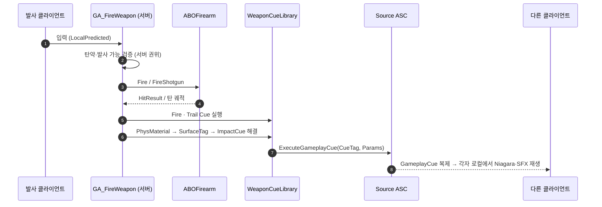
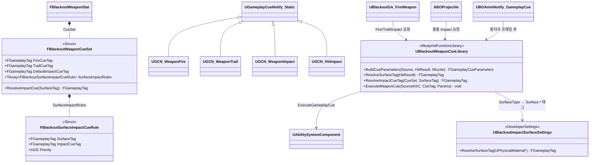

# 슬라이드 — GameplayCue(GCN) 실행 로직 (Claude Design 전달용)

> **용도**: 결과보고서 PPT의 "수행 경과" 섹션에 추가할 **GCN 실행 로직 페이지** 초안. Claude Design 입력용.
> **권장 배치**: §4 수행 경과 — 전투/무기 슬라이드(17b) 또는 기믹·최적화(22) 뒤. (총 2매)
> **디자인 톤**: 본 PPT와 동일하게 **레드/블랙** 강조.
>
> **표기 규칙** (Claude Design은 Docs 파일 접근 불가):
> - 🖼️ **다이어그램** — 바로 아래 **mermaid 코드 블록**을 렌더링해 슬라이드에 표시
> - 🟥 **[이미지 공간 확보 — 수동 삽입]** — 스크린샷을 나중에 수동 삽입할 빈 영역(자리만 확보)

---

## [Slide A] GameplayCue(GCN) 실행 로직 — 서버 방송 · 로컬 연출

- **핵심 원칙**: 서버는 **GameplayTag만 방송**하고, 각 클라이언트가 **로컬에서 Niagara·사운드를 실행** → 이펙트 에셋을 직접 복제하지 않아 **네트워크 부하 최소화**
- **GCN 타입 2종**
  - **Static** — 일회성(총구 화염·탄창 탈착음·혈흔). 객체 인스턴스 없음 (대부분의 전투 큐)
  - **Actor** — 지속 루프(치유 오라 등). 켜고 끄는 동안 인스턴스 유지
- **서버 권위 실행**: 다른 클라이언트가 반드시 봐야 하는 큐는 서버에서 **`SourceASC->ExecuteGameplayCue(Tag, Params)`** 로 실행 → ASC가 전 클라이언트에 복제. (로컬 즉시 반응이 필요하면 예측 전용 로컬 큐를 별도로, 중복 방지 키와 함께)
- **GCN을 트리거하는 4가지 경로**
  1. **GE 내장** — `GE_Damage`의 GameplayCues `GameplayCue.Character.Hit` → `GCN_HitImpact [Static]`
  2. **GA 직접 실행** — `UBlackoutGA_FireWeapon`이 발사·궤적·피격 큐 실행. 소모품/유물 GA는 `GameplayCue.Consumable.Use` / `Relic.Use` 를 실행하며, 큐 파라미터의 **EffectCauser(캐릭터) 오른손 `WeaponSocket`** 에 Burst 연출 부착
  3. **AnimNotify** — `UBOAnimNotify_GameplayCue`가 몽타주의 정확한 프레임(탄창 탈거/삽입·노리쇠, 투사체 스폰 타이밍)에 GCN 태그를 지정해 실행
  4. **투사체** — `ABOProjectile`이 충돌 시 `ExecuteProjectileGameplayCue` (플레이어 멀티캐스트 → ASC `ExecuteGameplayCue` → GameplayCueManager fallback 순)

> 🖼️ **다이어그램 — 사격 GCN 실행 흐름 (서버 → 전 클라이언트 복제)**

- 🟥 **[이미지 공간 확보 — 수동 삽입]**: 총구 화염 / 피격 연출 인게임 캡처

---

## [Slide B] 무기별 Cue 세트 & 표면 재질 분기

- **무기별 Cue 세트(`FBlackoutWeaponCueSet`)** — 무기 데이터(`FBlackoutWeaponStat`)가 보유
  - `FireCueTag` / `TrailCueTag` / `DefaultImpactCueTag` / `SurfaceImpactRules[]`
- **실행 허브(`UBlackoutWeaponCueLibrary`)** — 파라미터 구성·표면 해석·큐 실행을 한곳에서 담당 (`BuildCueParameters` / `ResolveSurfaceTag` / `ResolveImpactCueTag` / `ExecuteWeaponCue`)
- **표면 재질 분기**: `HitResult.PhysMaterial` → `SurfaceType` → `UBlackoutImpactSurfaceSettings` 로 **`Surface.*` 태그** 변환 → `SurfaceImpactRules` 매칭 시 해당 ImpactCue, 없으면 `DefaultImpactCueTag`, 그것도 없으면 **실행 생략 + 누락 로그**
- **태그 규칙**: `GameplayCue.Weapon.<무기>.<Fire | Trail | Impact.<표면>>`
  - 예: `...ChicagoTypewriter.Fire` · `...ChicagoTypewriter.Impact.Flesh / .Metal / .Stone`
- **적용 범위**: 히트스캔(라인트레이스 `bReturnPhysicalMaterial`)·투사체·**근접 무기**(Swing=FireCue, Impact=표면별, 벽/지형 타격 시에도 동일) 모두 동일 Resolver 사용. 투사체는 풀에서 꺼낼 때 CueSet을 복사받음

> 🖼️ **다이어그램 — 무기 Cue 세트 / 실행 라이브러리 구조**

- 🟥 **[이미지 공간 확보 — 수동 삽입]**: 표면 재질별 피격 VFX 비교(살점/금속/돌) 캡처
