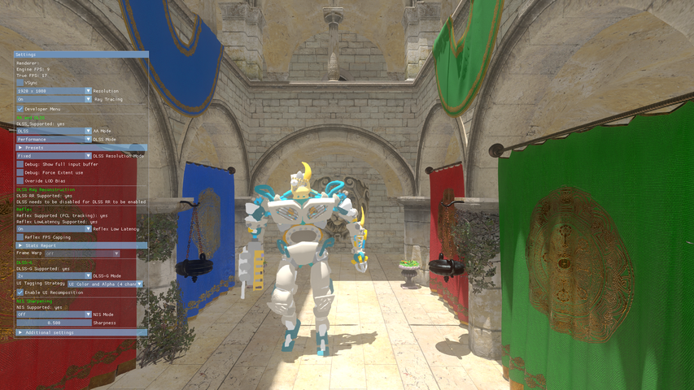
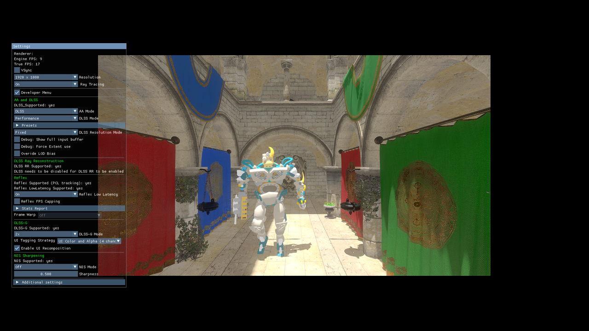
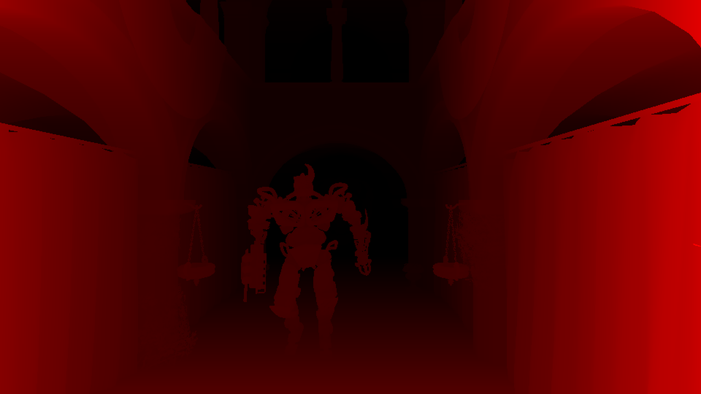
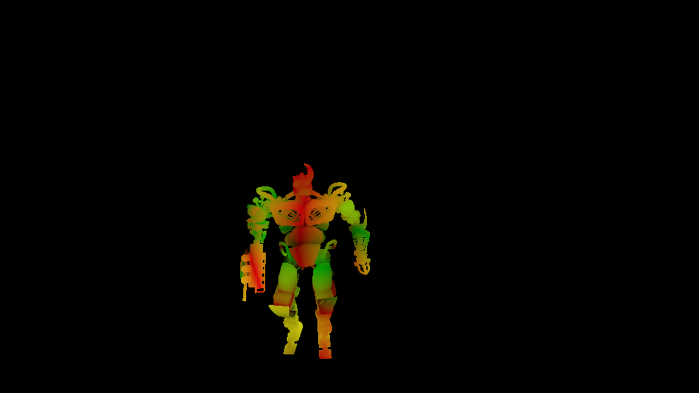
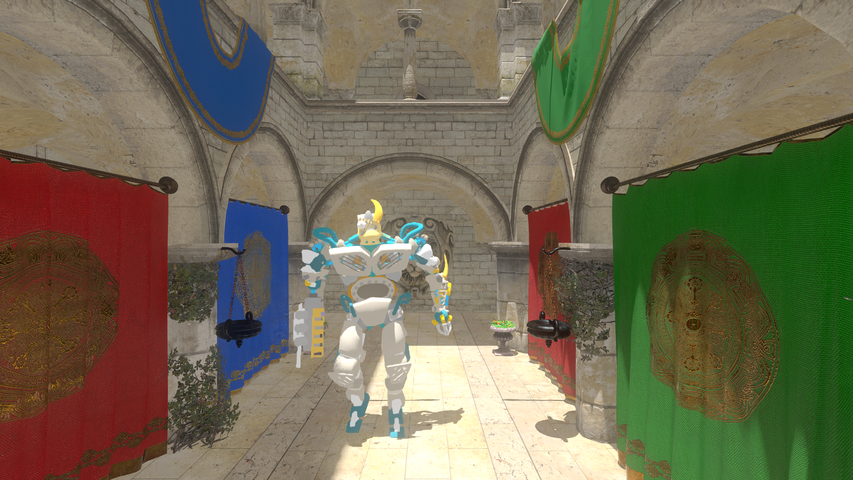
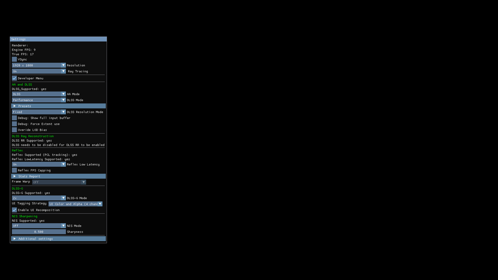
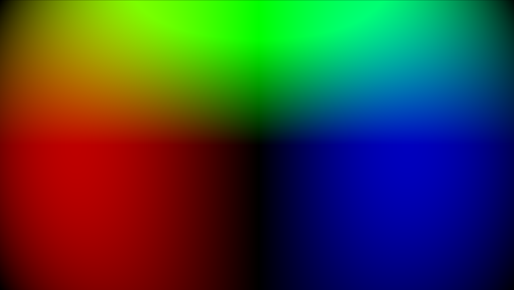
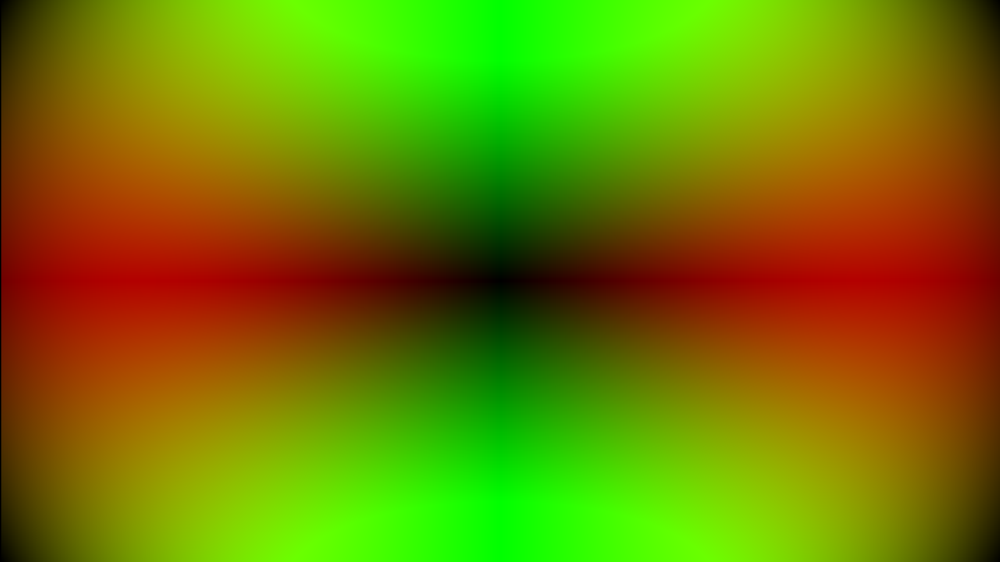

Streamline - DLSS-G
=======================

NVIDIA DLSS Frame Generation (“DLSS-FG” or “DLSS-G”) is an AI based technology that infers frames based on rendered frames coming from a game engine or rendering pipeline. This document explains how to integrate DLSS-G into a renderer.

Version 2.11.1
=======

### 0.0 Integration checklist

See Section 15.0 for further details on some of these items, in addition to the Sections noted in the table below.

Item | Reference | Confirmed
---|---|---
All the required inputs are passed to Streamline: depth buffers, motion vectors, HUD-less color buffers  | [Section 5.0](#50-tag-all-required-resources) |
Common constants and frame index are provided for **each frame** using slSetConstants and slSetFeatureConstants methods   |  [Section 7.0](#70-provide-common-constants) |
All tagged buffers are valid at frame present time, and they are not re-used for other purposes | [Section 5.0](#50-tag-all-required-resources) |
Buffers to be tagged with unique id 0 | [Section 5.0](#50-tag-all-required-resources) |
Make sure that frame index provided with the common constants is matching the presented frame | [Section 8.0](#80-integrate-sl-reflex) |
Inputs are passed into Streamline look correct, as well as camera matrices and dynamic objects | [SL ImGUI guide](<Debugging - SL ImGUI (Realtime Data Inspection).md>) |
Application checks the signature of sl.interposer.dll to make sure it is a genuine NVIDIA library | [Streamline programming guide, section 2.1.1](./ProgrammingGuide.md#211-security) |
Requirements for Dynamic Resolution are met (if the game supports Dynamic Resolution)  | [Section 10.0](#100-dlss-g-and-dynamic-resolution) |
DLSS-G is turned off (by setting `sl::DLSSGOptions::mode` to `sl::DLSSGMode::eOff`) when the game is paused, loading, in menu and in general NOT rendering game frames and also when modifying resolution & full-screen vs windowed mode | [Section 12.0](#120-dlss-g-and-dxgi) |
Swap chain is recreated every time DLSS-G is turned on or off (by changing `sl::DLSSGOptions::mode`) to avoid unnecessary performance overhead when DLSS-G is switched off | [Section 18.0](#180-how-to-avoid-unnecessary-overhead-when-dlss-g-is-turned-off) |
Reduce the amount of motion blur; when DLSS-G enabled, halve the distance/magnitude of motion blur | N/A |
Reflex is properly integrated (see checklist in Reflex Programming Guide) | [Section 8.0](#80-integrate-sl-reflex) |
In-game UI for enabling/disabling DLSS-G is implemented | [RTX UI Guidelines](<RTX UI Developer Guidelines.pdf>) |
Only full production non-watermarked libraries are packaged in the release build | N/A |
No errors or unexpected warnings in Streamline and DLSS-G log files while running the feature | N/A |
Ensure extent resolution or resource size, whichever is in use, for `Hudless` and `UI Color and Alpha` buffers exactly match that of backbuffer. | N/A |
Execute the DLSS-G In-Game Enhanced Debug Visualization Tests | [Section 21.0](#210-enhanced-in-game-debug-visualization) | |
Check `bIsVsyncSupportAvailable` before exposing VSync toggle in UI | [Section 22.0](#220-vsync-with-frame-generation) | |

### 1.0 REQUIREMENTS

**NOTE - DLSS-G requires the following Windows versions/settings to run.  The DLSS-G feature will fail to be available if these are not met.  Failing any of these will cause DLSS-G to be unavailable, and Streamline will log an error:**

* Minimum Windows OS version of Win10 20H1 (version 2004, build 19041 or higher)
* Display Hardware-accelerated GPU Scheduling (HWS) must be enabled via Settings : System : Display : Graphics : Change default graphics settings.

#### 1.1 Run-time Performance

DLSS-G's execution time and memory footprint vary across different engines and
integrations. To provide a general guideline, NVIDIA has profiled DLSS-G in-game
on various NVIDIA GeForce RTX GPUs. These results serve as a rough estimate of
run-time execution and can help developers estimate the potential savings
offered by DLSS.

**Execution Cost**

| GeForce SKU | Resolution | 2x Cost (ms) | 4x Cost (ms) |
|-------------|------------|--------------|--------------|
| RTX 4090    | 1080p      | 1.35         | -            |
| RTX 4090    | 1440p      | 1.78         | -            |
| RTX 4090    | 4k         | 2.77         | -            |
| RTX 5080    | 1080p      | 1.45         | 2.43         |
| RTX 5080    | 1440p      | 2.04         | 3.61         |
| RTX 5080    | 4k         | 2.84         | 5.25         |
| RTX 5090    | 1080p      | 1.07         | 1.78         |
| RTX 5090    | 1440p      | 1.46         | 2.48         |
| RTX 5090    | 4k         | 1.72         | 3.32         |

**Memory Cost**

The DLSS-G memory footprint does not change significantly between single-frame
generation and multi-frame generation modes.

| Resolution | VRAM Estimate (MB) |
|------------|--------------------|
| 1080p      | 272                |
| 1440p      | 489                |
| 4k         | 725                |

### 2.0 INITIALIZATION AND SHUTDOWN

Call `slInit` as early as possible (before any d3d12/vk APIs are invoked)

```cpp
#include <sl.h>
#include <sl_consts.h>
#include <sl_dlss_g.h>

sl::Preferences pref;
pref.showConsole = true; // for debugging, set to false in production
pref.logLevel = sl::eLogLevelDefault;
pref.pathsToPlugins = {}; // change this if Streamline plugins are not located next to the executable
pref.numPathsToPlugins = 0; // change this if Streamline plugins are not located next to the executable
pref.pathToLogsAndData = {}; // change this to enable logging to a file
pref.logMessageCallback = myLogMessageCallback; // highly recommended to track warning/error messages in your callback
pref.applicationId = myId; // Provided by NVDA, required if using NGX components (DLSS 2/3)
pref.engineType = myEngine; // If using UE or Unity
pref.engineVersion = myEngineVersion; // Optional version
pref.projectId = myProjectId; // Optional project id
if(SL_FAILED(res, slInit(pref)))
{
    // Handle error, check the logs
    if(res == sl::Result::eErrorDriverOutOfDate) { /* inform user */}
    // and so on ...
}
```

For more details please see [preferences](ProgrammingGuide.md#222-preferences)

Call `slShutdown()` before destroying dxgi/d3d12/vk instances, devices and other components in your engine.

```cpp
if(SL_FAILED(res, slShutdown()))
{
    // Handle error, check the logs
}
```

#### 2.1 SET THE CORRECT DEVICE

Once the main device is created call `slSetD3DDevice` or `slSetVulkanInfo`:

```cpp
if(SL_FAILED(res, slSetD3DDevice(nativeD3DDevice)))
{
    // Handle error, check the logs
}
```

### 3.0 CHECK IF DLSS-G IS SUPPORTED

As soon as SL is initialized, you can check if DLSS-G is available for the specific adapter you want to use:

```cpp
Microsoft::WRL::ComPtr<IDXGIFactory> factory;
if (SUCCEEDED(CreateDXGIFactory(__uuidof(IDXGIFactory), (void**)&factory)))
{
    Microsoft::WRL::ComPtr<IDXGIAdapter> adapter{};
    uint32_t i = 0;
    while (factory->EnumAdapters(i, &adapter) != DXGI_ERROR_NOT_FOUND)
    {
        DXGI_ADAPTER_DESC desc{};
        if (SUCCEEDED(adapter->GetDesc(&desc)))
        {
            sl::AdapterInfo adapterInfo{};
            adapterInfo.deviceLUID = (uint8_t*)&desc.AdapterLuid;
            adapterInfo.deviceLUIDSizeInBytes = sizeof(LUID);
            if (SL_FAILED(result, slIsFeatureSupported(sl::kFeatureDLSS_G, adapterInfo)))
            {
                // Requested feature is not supported on the system, fallback to the default method
                switch (result)
                {
                    case sl::Result::eErrorOSOutOfDate:             // inform user to update OS
                    case sl::Result::eErrorDriverOutOfDate:         // inform user to update driver
                    case sl::Result::eErrorNoSupportedAdapterFound: // cannot use this adapter (older or non-NVDA
                                                                    // GPU etc)
                        break;
                        // and so on ...
                };
            }
            else
            {
                // Feature is supported on this adapter!
            }
        }
        i++;
    }
}
```

#### 3.1 CHECKING DLSS-G'S CONFIGURATION AND SPECIAL REQUIREMENTS

In order for DLSS-G to work correctly certain requirements regarding the OS, driver and other settings on user's machine must be met. To obtain DLSS-G configuration and check if all requirements are met you can use the following code snippet:

```cpp
sl::FeatureRequirements requirements{};
if (SL_FAILED(result, slGetFeatureRequirements(sl::kFeatureDLSS_G, requirements)))
{
    // Feature is not requested on slInit or failed to load, check logs, handle error
}
else
{
    // Feature is loaded, we can check the requirements    
    requirements.flags & FeatureRequirementFlags::eD3D12Supported
    requirements.flags & FeatureRequirementFlags::eVulkanSupported
    requirements.maxNumViewports
    // and so on ...
}
```
> **NOTE:**
> DLSS-G runs optical flow in interop mode in Vulkan by default. In order to leverage potential performance benefit of running optical flow natively in Vulkan, client must meet the minimum requirements of Nvidia driver version being 527.64 on Windows and 525.72 on Linux and VK_API_VERSION_1_1 (recommended version - VK_API_VERSION_1_3).
> In manual hooking mode, it must meet additional requirements as described in section 5.2.1 of ProgrammingGuideManualHooking.md.

### 4.0 HANDLE MULTIPLE SWAP-CHAINS

DLSS-G will automatically attach to any swap-chain created by the application **unless manual hooking is used**. In the editor mode there could be multiple swap-chains but DLSS-G should attach only to the main one where frame interpolation is used.
Here is how DLSS-G could be enabled only on a single swap-chain:

```cpp
// This is just one example, swap-chains can be created at any point in time and in any order.
// SL features also can be loaded/unloaded at any point in time and in any order.

// Unload DLSS-G (this can be done at any point in time and as many times as needed)
slSetFeatureLoaded(sl::kFeatureDLSS_G, false);

// Create swap chains for which DLSS-G is NOT required
IDXGISwapChain1* swapChain{};
factory->CreateSwapChainForHwnd(device, hWnd, desc, nullptr, nullptr, &swapChain);
// and so on

// Load DLSS-G (this can be done at any point in time and as many times as needed)
slSetFeatureLoaded(sl::kFeatureDLSS_G, true);

// Create main swap chains for which DLSS-G is required
IDXGISwapChain1* mainSwapChain{};
factory->CreateSwapChainForHwnd(device, hWnd, desc, nullptr, nullptr, &mainSwapChain);

// From this point onward DLSS-G will automatically manage only mainSwapChain, other swap-chains use standard DXGI implementation

```

### 5.0 TAG ALL REQUIRED RESOURCES

#### 5.1 REQUIRED AND OPTIONAL RESOURCES

DLSS-G requires the following buffers for frame generation:
- **Backbuffer** (automatically intercepted via the Streamline swap chain)
- **Depth**
- **Motion Vectors**

**Backbuffer Subrect Support**

If DLSS-G is intended to run only on a specified subrectangle of the final color
buffer, you must also tag the backbuffer:
- Use the backbuffer tag to pass the subrect coordinates to Streamline.
- The actual backbuffer resource pointer is optional.
- See [Section 5.2](#52-tagging-recommendations) for additional
  details.

**UI Handling**

For the best image quality, it is **critical** to provide a Hudless (pre-UI)
buffer and a UI buffer. The frame generation algorithm can use these resources
to reduce distortion of HUD elements during interpolation.

- **Hudless** - The scene color _before_ any UI/HUD elements are drawn.
- **UI Buffer** - Choose one of:
  - **UI Alpha** (Preferred): A single-channel image containing only the opacity
    (alpha) of the UI. This is the most performant option.
  - **UI Color and Alpha**: A full-color 4-channel image containing the color
    and alpha of the UI.
  - _Note: If both buffers are tagged, Streamline will use the UI Alpha buffer._

If both Hudless and UI alpha are tagged, you can also enable user interface
recomposition for a further improvement to UI interpolation quality. See
[Section 6.6](#66-enabling-user-interface-recomposition).

For best results, the size of the Hudless and UI buffers should match the size
of the backbuffer.

Input | Requirements/Recommendations | Reference Image
---|---|---
Final Color | - *No requirements, this is intercepted automatically via SL's SwapChain API* | 
Final Color Subrect | - Subregion of the final color buffer to run frame-generation on. <br> - Subrect-external backbuffer region is copied as is to the generated frame. <br> - Tag backbuffer optionally, only to pass in backbuffer subrect info. <br> - Extent resolution or resource size, whichever is in use, for `Hudless`, `UI Color and Alpha`, and `UI Alpha` buffers should exactly match that of backbuffer. <br> - Refer to [Section 5.2](#52-tagging-recommendations) below for details. | 
Depth | - Same depth data used to generate motion vector data <br> - `sl::Constants` depth-related data (e.g. `depthInverted`) should be set accordingly<br>  - *Note: this is the same set of requirements as DLSS-SR, and the same depth can be used for both* | 
Motion Vectors | - Dense motion vector field (i.e. includes camera motion, and motion of dynamic objects) <br> - *Note: this is the same set of requirements as DLSS-SR, and the same motion vectors can be used for both* | 
Hudless | - Should contain the full viewable scene, **without any HUD/UI elements in it**. If some HUD/UI elements are unavoidably included, expect some image quality degradation on those elements <br> - Same color space and post-processing effects (e.g tonemapping, blur etc.) as color backbuffer <br> - When appropriate buffer extents are *not* provided, needs to have the same dimensions as the color backbuffer <br> | 
UI Alpha OR UI Color and Alpha | - `UI Alpha` is a single channel containing only the alpha values (0.0 to 1.0) of the UI <br> - `UI Color and Alpha` also contains the RGB color of the UI <br> - Prefer `UI Alpha` (single channel) for performance when available. If both are tagged, only `UI Alpha` will be used. <br> - Must be 0.0 for pixels with no UI elements <br> - Alpha must be non-zero for pixels with UI <br> - Values provided must respect the standard blending formula: `Final_Color.RGB = UI.RGB + (1 - UI.Alpha) x Hudless.RGB` <br> - When UI color is provided, the RGB channels must be pre-multiplied by alpha. <br> - When appropriate buffer extents are *not* provided, needs to have the same dimensions as the color backbuffer | **Alpha Channel** <br><br>**RGB Channels** (UI Color and Alpha only) 
Bidirectional Distortion Field | - Optional buffer, **only needed when strong distortion effects are applied as post-processing filters** <br> - Refer to [Section 5.4](#54-bidirectional-distortion-field-buffer-generation-code-sample) for an example on how to generate this optional buffer <br> - When this buffer is tagged, Mvec and Depth need to be **undistorted** <br> - When this buffer is tagged, the FinalColor is should be **distorted** <br> - When this buffer is tagged, Hudless and UIColorAndAlpha need to be such that `Blend(Hudless, UIColorAndAlpha) = FinalColor`. This may mean that Hudless needs to be equally distorted, and in rare cases that UIColorAndAlpha is also equally distorted <br> - **Resolution**: we recommend using half of the FinalColor's resolution's width and height <br> - **Channel count**: 4 channels <br> - **RG channels**: UV coordinates of the corresponding **undistorted** pixel, as an offset relative to the source UV coordinate <br> - **BA channels**: UV coordinates of the corresponding **distorted** pixel, as an offset relative to the source UV coordinate <br> - **Units**: the buffer values should be in normalized pixel space `[0,1]`. These should be the same scale as the input MVecs <br> - **Channel precision and format:** Signed format, equal bit-count per channel (i.e. R10G10B10A2 is NOT allowed). We recommend a minimum of 8 bits per channel, with precision scale and bias (`PrecisionInfo`) passed in as part of the `ResourceTag` | <center>**Barrel distortion, RGB channels**   <br><br> <center>**Barrel distortion, absolute value of RG channels** 

#### 5.2 TAGGING RECOMMENDATIONS

**For all buffers**: tagged buffers are used during the `Swapchain::Present` call. **If the tagged buffers are going to be reused, destroyed or changed in any way before the frame is presented, their life-cycle needs to be specified correctly**.

It is important to emphasize that **the overuse of `sl::ResourceLifecycle::eOnlyValidNow` and `sl::ResourceLifecycle::eValidUntilEvaluate` can result in wasted VRAM**. Therefore please do the following:

* First tag all of the DLSS-G inputs as `sl::ResourceLifecycle::eValidUntilPresent` then test and see if DLSS-G is working correctly.
* Only if you notice that one or more of the inputs (depth, mvec, hud-less, ui etc.) has incorrect content at the `present frame` time, should you proceed and flag them as `sl::ResourceLifecycle::eOnlyValidNow` or `sl::ResourceLifecycle::eValidUntilEvaluate` as appropriate.

In order to run DLSS-G on final color subrect region:
* It is required to tag backbuffer to pass-in subrect data.
* Only buffer type - `kBufferTypeBackbuffer` and backbuffer extent data are required to be passed in when setting the tag for backbuffer; the rest of the other inputs to sl::ResourceTag are optional. This implies passing in NULL backbuffer resource pointer is valid because SL already has knowledge about the backbuffer being presented.
* If a valid backbuffer resource pointer is passed in when tagging:
  * SL will hold a reference to it until a null tag is set.
  * SL will warn if it doesn't match the SL-provided backbuffer resource being presented.

> NOTE:
> SL will hold a reference to all `sl::ResourceLifecycle::eValidUntilPresent` resources until a null tag is set, therefore the application will not crash if host releases tagged resource before `present frame` event is reached. This does not apply to Vulkan.

```cpp

// IMPORTANT: 
//
// Resource state for the immutable resources needs to be correct when tagged resource is used by SL - during the Present call
// Resource state for the volatile resources needs to be correct for the command list used to tag the resource - SL will make a copy which is later on used by DLSS-G during the Present call
// 
// GPU payload that generates content for any volatile resource MUST be either already submitted to the provided command list or some other command list which is guaranteed to be executed BEFORE.

// Prepare resources (assuming d3d12 integration so leaving Vulkan view and device memory as null pointers)
//
// NOTE: As an example we are tagging depth as immutable and mvec as volatile, this needs to be adjusted based on how your engine works
sl::Resource depth = {sl::ResourceType::Tex2d, myDepthBuffer, nullptr, nullptr, depthState, nullptr};
sl::Resource mvec = {sl::ResourceType::Tex2d, myMotionVectorsBuffer, nullptr, mvecState, nullptr, nullptr};
sl::ResourceTag depthTag = sl::ResourceTag {&depth, sl::kBufferTypeDepth, sl::ResourceLifecycle::eValidUntilPresent, &fullExtent }; // valid all the time
sl::ResourceTag mvecTag = sl::ResourceTag {&mvec, sl::kBufferTypeMvec, sl::ResourceLifecycle::eOnlyValidNow, &fullExtent };     // reused for something else later on

// Normally depth and mvec are available at a similar point in the pipeline so tagging them together
// If this is not the case simply tag them separately when they are available
sl::Resource inputs[] = {depthTag, mvecTag};
slSetTagForFrame(*currentFrame, viewport, inputs, _countof(inputs), cmdList);

// Tag backbuffer only to pass in backbuffer subrect info
sl::Extent backBufferSubrectInfo {128, 128, 512, 512}; // backbuffer subrect info to run FG on.
sl::ResourceTag backbufferTag = sl::ResourceTag {nullptr, sl::kBufferTypeBackbuffer, sl::ResourceLifecycle{}, &backBufferSubrectInfo };
sl::Resource inputs[] = {backbufferTag};
slSetTagForFrame(*currentFrame, viewport, inputs, _countof(inputs), cmdList);

// After post-processing pass but before UI/HUD is added tag the hud-less buffer
//
sl::Resource hudLess = {sl::ResourceType::Tex2d, myHUDLessBuffer, nullptr, nullptr, hudlessState, nullptr};
sl::ResourceTag hudLessTag = sl::ResourceTag {&hudLess, sl::kBufferTypeHUDLessColor, sl::ResourceLifecycle::eValidUntilPresent, &fullExtent }; // valid all the time
sl::Resource inputs[] = {hudLessTag};
slSetTagForFrame(*currentFrame, viewport, inputs, _countof(inputs), cmdList);

// UI buffer: color+alpha or alpha-only
// Prefer alpha-only for performance when available.
//
// Option A: Provide combined color+alpha
sl::Resource uiColorAlpha = {sl::ResourceType::Tex2d, myUIBuffer, nullptr, nullptr, uiTextureState, nullptr};
sl::ResourceTag uiColorAlphaTag = sl::ResourceTag {&uiColorAlpha, sl::kBufferTypeUIColorAndAlpha, sl::ResourceLifecycle::eValidUntilPresent, &fullExtent };
// Option B: Provide alpha-only
sl::Resource uiAlpha = {sl::ResourceType::Tex2d, myUIAlphaBuffer, nullptr, nullptr, uiAlphaState, nullptr};
sl::ResourceTag uiAlphaTag = sl::ResourceTag {&uiAlpha, sl::kBufferTypeUIAlpha, sl::ResourceLifecycle::eValidUntilPresent, &fullExtent };
// Tag whichever you have; if both are tagged, DLSS-FG today prefers kBufferTypeUIAlpha.
sl::Resource inputs[] = { uiAlphaTag /* or uiColorAlphaTag */ };
slSetTagForFrame(*currentFrame, viewport, inputs, _countof(inputs), cmdList);

// OPTIONAL! Only need the Bidirectional distortion field when strong distortion effects are applied during post-processing
//
sl::Resource bidirectionalDistortionField = {sl::ResourceType::Tex2d, myBidirectionalDistortionBuffer, nullptr, nullptr, bidirectionalDistortionState};
sl::ResourceTag bidirectionalDistortionTag = sl::ResourceTag {&bidirectionalDistortionField, sl::kBufferTypeBidirectionalDistortionField, sl::ResourceLifecycle::eValidUntilPresent, &fullExtent }; // valid all the time
sl::Resource inputs[] = {bidirectionalDistortionTag};
slSetTagForFrame(*currentFrame, viewport, inputs, _countof(inputs), cmdList);
```

> **NOTE:**
> If dynamic resolution is used then please specify the extent for each tagged resource. Please note that SL **manages resource states so there is no need to transition tagged resources**.

> **IMPORTANT:**
> If validity of tagged resources cannot be guaranteed (for example game is loading, paused, in menu, playing a video cut scene etc.) **all tags should be set to null pointers to avoid stability or IQ issues**.

#### 5.3 MULTIPLE VIEWPORTS

DLSS-G supports multiple viewports. Resources for each viewport must be tagged independently. Our [SL Sample](https://github.com/NVIDIA-RTX/Streamline_Sample) supports multiple viewports. Check the sample for recommended best practices on how to do it. The idea is that resource tags for different resources are independent
from each other. For instance - if you have two viewports, there must be two slSetTagForFrame() calls. Input resource for one viewport may be different from the input resource
for another viewport. However - all viewports do write into the same backbuffer.

Note that DLSS-G doesn't support multiple swap chains at the moment. So all viewports must write into the same backbuffer.

#### 5.4 BIDIRECTIONAL DISTORTION FIELD BUFFER GENERATION CODE SAMPLE
The following HLSL code snippet demonstrates the generation of the bidirectional distortion field buffer. The example distortion illustrated is barrel distortion.

```cpp
const float distortionAlpha = -0.5f;
 
float2 barrelDistortion(float2 UV)
{    
    // Barrel distortion assumes UVs relative to center (0,0), so we transform
    // to [-1, 1]
    float2 UV11 = (UV * 2.0f) - 1.0f;
     
    // Squared norm of distorted distance to center
    float r2 = UV11.x * UV11.x + UV11.y * UV11.y;
     
    // Reference: http://www.cs.ait.ac.th/~mdailey/papers/Bukhari-RadialDistortion.pdf
    float x = UV11.x / (1.0f + distortionAlpha * r2);
    float y = UV11.y / (1.0f + distortionAlpha * r2);
     
    // Transform back to [0, 1]     
    float2 outUV = float2(x, y);
    return (outUV + 1.0f) / 2.0f;
}
 
float2 inverseBarrelDistortion(float2 UV)
{  
    // Barrel distortion assumes UVs relative to center (0,0), so we transform
    // to [-1, 1]
    float2 UV11 = (UV * 2.0f) - 1.0f;
     
    // Squared norm of undistorted distance to center
    float ru2 = UV11.x * UV11.x +  UV11.y * UV11.y;
 
    // Solve for distorted distance to center, using quadratic formula
    float num = sqrt(1.0f - 4.0f * distortionAlpha * ru2) - 1.0f;
    float denom = 2.0f * distortionAlpha * sqrt(ru2);
    float rd = -num / denom;
     
    // Reference: http://www.cs.ait.ac.th/~mdailey/papers/Bukhari-RadialDistortion.pdf
    float x = UV11.x * (rd / sqrt(ru2));
    float y = UV11.y * (rd / sqrt(ru2));
     
    // Transform back to [0, 1]     
    float2 outUV = float2(x, y);
    return (outUV + 1.0f) / 2.0f;
}

float2 generateBidirectionalDistortionField(Texture2D output, float2 UV)
{
    // Assume UV is in [0, 1]
    float2 rg = barrelDistortion(UV) - UV;
    float2 ba = inverseBarrelDistortion(UV) - UV;
 
    // rg and ba needs to be in the same canonical format as the motion vectors
    // i.e. a displacement of rg or ba needs to to be in the same scale as (Mvec.x, Mvec.y)
     
    // The output can be outside of the [0, 1] range
    Texture2D[UV] = float4(rg, ba); // needs to be signed
}
```

This HLSL code snippet uses an iterative Newton-Raphson method to solve the inverse distortion problem. It is designed to be used directly in shader code, especially when an analytical solution is not available. While the method is effective, it does not guarantee convergence for all distortion functions, so users should verify its suitability for their specific use case.

```cpp
float2 myDistortion(float2 xy)
{
     // The distortion function
}

float loss(float2 Pxy, float2 ab)
{
    float2 Pab = myDistortion(ab);
    float2 delta = Pxy - Pab;
    return dot(delta, delta);
}

float2 iterativeInverseDistortion(float2 UV)
{
    const float kTolerance = 1e-6f;
    const float kGradDelta = 1e-6f;      // The delta used for gradient estimation
    const int kMaxIterations = 5;        // Select a low number of iterations which minimizes the loss
    const int kImprovedInitialGuess = 1; // Assume a locally uniform distortion field 
    
    float2 ab = UV; // initial guess
    
    if (kImprovedInitialGuess)
    {
        ab = UV - (myDistortion(UV) - UV);
    }

    for (int i = 0; i < kMaxIterations; ++i)
    {
        float F = loss(UV, ab);

        // Central difference
        const float Fabx1 = loss(UV, ab + float2(kGradDelta * 0.5f, 0));
        const float Fabx0 = loss(UV, ab - float2(kGradDelta * 0.5f, 0));
        const float Faby1 = loss(UV, ab + float2(0, kGradDelta * 0.5f));
        const float Faby0 = loss(UV, ab - float2(0, kGradDelta * 0.5f));

        float2 grad;
        grad.x = (Fabx1 - Fabx0) / kGradDelta;
        grad.y = (Faby1 - Faby0) / kGradDelta;

        const float norm = grad.x * grad.x + grad.y * grad.y;
        if (abs(norm) < kTolerance) {
            break;
        }

        float delta_x = F * grad.x / norm;
        float delta_y = F * grad.y / norm;

        ab.x = ab.x - delta_x;
        ab.y = ab.y - delta_y;
    }

    return ab;
}
```

### 6.0 SET DLSS-G OPTIONS

The `slDLSSGSetOptions()` function is used to configure the DLSS-G plugin for a
specific viewport. It allows the application to enable or disable frame
generation and set flags and other settings that control frame generation
behavior.

The `slDLSSGSetOptions()` function takes effect in the next `Present()` call
that executes after it.

If `slDLSSGSetOptions()` is called from a thread other than the presenting
thread, Streamline cannot guarantee which `Present()` call will pick up the
updated options. To ensure deterministic behavior, the application should either:
1. Call `slDLSSGSetOptions()` on the presenting thread
2. Use their own synchronization to ensure the intended ordering between
   `slDLSSGSetOptions()` and `Present()`.

#### 6.1 ENABLING/DISABLING FRAME GENERATION

To enable frame generation, use the `mode` property in `DLSSGOptions`. Allowed
values are:
- `DLSSGMode::eOff`: Frame Generation disabled
- `DLSSGMode::eOn`: Frame Generation enabled with a fixed multiplier
- `DLSSGMode::eDynamic`: Dynamic Multi Frame Generation
- `DLSSGMode::eAuto` (legacy): Auto mode

```cpp
sl::DLSSGOptions options{};
// These are populated based on the user's selection in the UI
options.mode = myUI->getDLSSGMode(); // e.g. sl::DLSSGMode::eOn;

// IMPORTANT: Make sure this is the same as the viewport used for tagging
// resources
if (SL_FAILED(result, slDLSSGSetOptions(viewport, options)))
{
    // Handle error here, check the logs
}
```

**NOTE: Loading the DLSS-G plugin and tagging resources does not automatically
enable interpolation. `slDLSSGSetOptions` must be used to explicitly activate
the feature.**

#### 6.2 ENABLING MULTI FRAME GENERATION

When `mode` is set to `DLSSGMode::eOn`, the `numFramesToGenerate` property
determines the number of interpolated frames produced for every one rendered
frame provided by the application.

For example, setting `numFramesToGenerate` to 3 results in a 4x frame
multiplier: Streamline will present four frames (three generated frames plus
the original application frame) for each `Present()` call.

Multi frame support is dependent on the hardware and system configuration, and
must be verified before use. To check for support, call `slDLSSGGetState`. The
value of `numFramesToGenerate` must be between 1 (single frame generation) and
the maximum defined by `DLSSGState::numFramesToGenerateMax`.

#### 6.3 ENABLING DYNAMIC MULTI FRAME GENERATION

Setting `mode` to `DLSSGMode::eDynamic` enables Dynamic Multi Frame Generation.
In this mode, Streamline automatically adjusts the number of generated frames to
align the output frame rate with the display's refresh rate or a user-defined
target.

The target frame rate is managed via the `dynamicTargetFrameRate` property:
- **Custom Target:** Set to a specific FPS value (e.g., 120.0f).
- **Auto-Detect:** Set to 0.0f to automatically target the monitor's current
  refresh rate. When multiple monitors are in use, the placement of the
  application window determines which monitor is used.

When `eDynamic` is active, the `numFramesToGenerate` property is ignored.

Dynamic multi frame support is dependent on the hardware and system
configuration. Applications must verify support by calling `slDLSSGGetState()` and
checking if `bIsDynamicMFGSupported` is `eTrue`.

Common reasons for lack of support include:
- Multi frame generation is not supported
- The NVIDIA Display Driver is below version 595.41
- The application is using Vulkan (support is currently limited to D3D12, only)

**Auto Mode as a Fallback**

If Dynamic MFG is unsupported, the application may instead wish to expose an
option to use Auto mode (`DLSSGMode::eAuto`).

In Auto mode, DLSSG uses the fixed multiplier defined in `numFramesToGenerate`,
but will also monitor performance and automatically disable interpolation if it
detects that the application would perform better (higher FPS) with the feature
disabled.

#### 6.4 DISABLING FRAME GENERATION

When interpolation is not needed, the feature should be disabled. DLSSG should
be disabled in any full-screen menus (such as settings menus or pause menus) or
when a UI element is overlaid over the majority of the screen, such as a
leaderboard.

To disable DLSS-G, set `mode` to `DLSSGMode::eOff`. By default, this releases
all internal resources allocated by the feature. When the feature is enabled
again, reallocating these resources may cause a stutter.

To ensure seamless transitions, the `DLSSGFlags::eRetainResourcesWhenOff` flag
is strongly recommended. When this flag is set, `DLSSGMode::eOff` instead
suspends frame generation without freeing memory. This avoids the stutter when
the feature is re-enabled.

When using this flag, you must manage the lifecycle of DLSS-G memory during
long-term deactivations (such as the user turning the feature off in a settings
menu):
1. Set `mode` to `DLSSGMode::eOff`
2. Call `slFreeResources()` to explicitly deallocate the feature's memory.

For short-term deactivations, such as in pause menus, avoid calling
`slFreeResources()` to prevent stutter when leaving the menu.

#### 6.5 AUTOMATICALLY DISABLING DLSS-G IN MENUS

If `kBufferTypeUIColorAndAlpha` is provided, DLSS-G can automatically detect
fullscreen menus and turn off automatically. To enable automatic fullscreen menu
detection, set the `sl::DLSSGFlags::eEnableFullscreenMenuDetection` flag.
This flag may be changed on a per-frame basis to disable detection on specific
scenes, for example.

Since this approach may not detect menus in all cases, it is still preferred to
disable DLSS-G manually, by setting the mode to `sl::DLSSGMode::eOff`.

**Note:** when DLSS-G is disabled by fullscreen menu detection, its resources
will _always_ be retained, regardless of the value of the
`sl::DLSSGFlags::eRetainResourcesWhenOff` flag

#### 6.6 ENABLING USER INTERFACE RECOMPOSITION

When both Hudless and a UI buffer are tagged, User Interface Recomposition can
be enabled by setting `DLSSGOptions::enableUserInterfaceRecomposition = eTrue`.

When enabled, the HUD and scene are interpolated separately and composited
later, providing significantly-improved UI interpolation quality.

Using user interface recomposition has a slight performance and memory cost.

#### 6.7 HOW TO SETUP A CALLBACK TO RECEIVE API ERRORS (OPTIONAL)

DLSS-G intercepts `IDXGISwapChain::Present` and when using Vulkan `vkQueuePresentKHR` and `vkAcquireNextImageKHR`calls and executes them asynchronously. When calling these methods from the host side SL will return the "last known error" but in order to obtain per call API error you must provide an API error callback. Here is how this can be done:

```cpp

// Triggered immediately upon return from the API call but ONLY if return code != 0
void myAPIErrorCallback(const sl::APIError& e)
{
    // Handle error, use e.hres with DirectX and e.vkRes on Vulkan
    
    // IMPORTANT: STORE ERROR AND RETURN IMMEDIATELY TO AVOID STALLING PRESENT THREAD
};

sl::DLSSGOptions options{};
// Constants are populated based on user selection in the UI
options.mode = myUI->getDLSSGMode(); // e.g. sl::eDLSSGModeOn;
options.onErrorCallback = myAPIErrorCallback;
if(SL_FAILED(result, slDLSSGSetOptions(viewport, options)))
{
    // Handle error here, check the logs
}
```

> **NOTE:**
> API error callbacks are triggered from the Present thread and **must not be blocked** for a prolonged period of time.

> **IMPORTANT:**
> THIS IS OPTIONAL AND ONLY NEEDED IF YOU ARE ENCOUNTERING ISSUES AND NEED TO PROCESS SPECIFIC ERRORS RETURNED BY THE VULKAN OR DXGI API

### 7.0 PROVIDE COMMON CONSTANTS

Various per frame camera related constants are required by all Streamline features and must be provided ***if any SL feature is active and as early in the frame as possible***. Please keep in mind the following:

* All SL matrices are row-major and should not contain any jitter offsets
* If motion vector values in your buffer are in {-1,1} range then motion vector scale factor in common constants should be {1,1}
* If motion vector values in your buffer are NOT in {-1,1} range then motion vector scale factor in common constants must be adjusted so that values end up in {-1,1} range

```cpp
sl::Constants consts = {};
// Set motion vector scaling based on your setup
consts.mvecScale = {1,1}; // Values in eMotionVectors are in [-1,1] range
consts.mvecScale = {1.0f / renderWidth,1.0f / renderHeight}; // Values in eMotionVectors are in pixel space
consts.mvecScale = myCustomScaling; // Custom scaling to ensure values end up in [-1,1] range
sl::Constants consts = {};
// Set all constants here
//
// Constants are changing per frame tracking handle must be provided
if(!setConstants(consts, *frameToken, viewport))
{
    // Handle error, check logs
}
```

For more details please see [common constants](ProgrammingGuide.md#2111-common-constants)

### 8.0 INTEGRATE SL REFLEX

**It is required** for sl.reflex to be integrated in the host application. **Please note that any existing regular Reflex SDK integration (not using Streamline) cannot be used by DLSS-G**. Special attention should be paid to the markers `eReflexMarkerPresentStart` and `eReflexMarkerPresentEnd` which must provide correct frame index so that it can be matched to the one provided in the [section 7](#70-provide-common-constants)

For more details please see [Reflex guide](ProgrammingGuideReflex.md)

> **IMPORTANT:**
> If you see a warning in the SL log stating that `common constants cannot be found for frame N` that indicates that sl.reflex markers `eReflexMarkerPresentStart` and `eReflexMarkerPresentEnd` are out of sync with the actual frame being presented.

### 9.0 DLSS-G DEVELOPMENT HOTKEYS

When using non-production (development) builds of `sl.dlss_g.dll`, there are numerous hotkeys available, all of which can be remapped using the remapping methods described in [debugging](<Debugging - JSON Configs (Plugin Configs).md>)

* `"dlssg-sync"` (default `VK_END`)
  * Toggle delaying the presentation of the next frame to experiment with minimizing latency
* `"vsync"` (default `Shift-Ctrl-'1'`)
  * Toggle vsync on output swapchain
* `"debug"` (default `Shift-Ctrl-VK_INSERT`)
  * Toggle debugging view
* `"stats"` (default `Shift-Ctrl-VK_HOME`)
  * Toggle performance stats
* `"dlssg-toggle"` (default `VK_OEM_2` `/?` for US)
  * Toggle DLSS-G on/off/auto (override app setting)
* `"write-stats"` (default `Ctrl-Alt-'O'`)
  * Write performance stats to file

### 10.0 DLSS-G AND DYNAMIC RESOLUTION

DLSS-G supports dynamic resolution of the MVec and Depth buffer extents.  Dynamic resolution may be done via DLSS or an app-specific method.  Since DLSS-G uses the final color buffer with all post-processing complete, the color buffer, or its subrect if in use, must be a fixed size -- it cannot resize per-frame.  When DLSS-G dynamic resolution mode is enabled, the application can pass in a differently-sized extent for the MVec and Depth buffers on a perf frame basis.  This allows the application to dynamically change its rendering load smoothly.

There are a few requirements when using dynamic resolution with DLSS-G:

* The application must set the flag `sl::DLSSGFlags::eDynamicResolutionEnabled` in `sl::DLSSGOptions::flags` when dynamic resolution is active.  It should clear the flag when/if dynamic resolutiuon is disabled.  *DO NOT* leave the dynamic resolution flag set when using fixed-ratio DLSS, as it may decrease performance or image quality.
* The application should specify `sl::DLSSGOptions::dynamicResWidth` and `sl::DLSSGOptions::dynamicResHeight` to a target resolution in the range of the dynamic MVec and Depth buffer sizes.
  * This is the fixed resolution at which DLSS-G will process the MVec and Depth buffers.
  * This value must not change dynamically per-frame.  Changing it outside of the application UI can lead to a frame rate glitch.
  * Set it to a reasonable "middle-range" value and do not change it until/unless the DLSS or other dynamic-range settings change.  
  * For example, if the application has a final, upscaled color resolution of 3840x2160 pixels, with a rendering resolution that can vary between 1920x1080 and 3840x2160 pixels, the `dynamicResWidth` and `Height` could be set to 2880x1620 or 1920x1080.
  * This ratio between the min and max resolutions can be tuned for performance and quality.
  * If the application passes 0 for these values when DLSS-G dynamic resolution is enabled, then DLSS-G will default to half of the resolution of the final color target or its subrect, if in use.

```cpp

// Using helpers from sl_dlss_g.h

sl::DLSSGOptions options{};
// These are populated based on user selection in the UI
options.mode = myUI->getDLSSGMode(); // e.g. sl::eDLSSGModeOn;
options.flags = sl::DLSSGFlags::eDynamicResolutionEnabled;
options.dynamicResWidth = appSelectedInternalWidth;
options.dynamicResHeight = appSelectedInternalHeight;
if(SL_FAILED(result, slDLSSGSetOptions(viewport, options)))
{
    // Handle error here, check the logs
}
```

Additionally, in development (i.e. non-production) builds of sl.dlss_g.dll, it is possible to enable DLSS-G dynamic res mode globally for debugging purposes via sl.dlss_g.json.  The supported options are:

* `"forceDynamicRes": true,` force-enables DLSS-G dynamic mode, equivalent to passing the flag `eDynamicResolutionEnabled` to `slDLSSGSetOptions` on every frame.
* `"forceDynamicResScaling": 0.5` sets the desired `dynamicResWidth` and `dynamicResHeight` indirectly, as a fraction of the color output buffer size.  In the case shown, the fraction is 0.5, so with a color buffer that is 3840x2160, the internal resolution used by DLSS-G for dynamic resolution MVec and Depth buffers will be 1920x1080.  If this value is not set, it defaults to 0.5.

### 11.0 DLSS-G AND HDR

If your game supports HDR please make sure to use **UINT10/RGB10 pixel format and HDR10/BT.2100 color space**. For more details please see <https://docs.microsoft.com/en-us/windows/win32/direct3darticles/high-dynamic-range#option-2-use-uint10rgb10-pixel-format-and-hdr10bt2100-color-space>

When tagging `eUIColorAndAlpha` please make sure that alpha channel has enough precision (for example do NOT use formats like R10G10B10A2)

> **IMPORTANT:**
> DLSS-G currently does NOT support FP16 pixel format and scRGB color space because it is too expensive in terms of compute and bandwidth cost.

### 12.0 DLSS-G AND DXGI

DLSS-G takes over frame presenting so it is important for the host application to turn on/off DLSS-G as needed to avoid potential problems and deadlocks.
As a general rule, **when host is modifying resolution, full-screen vs windowed mode or performing any other operation that could cause SwapChain::Present call to generate a deadlock DLSS-G must be turned off by the host using the sl::DLSSGConsts::mode field.** When turned off DLSS-G will call SwapChain::Present on the same thread as the host application which is not the case when DLSS-G is turned on. For more details please see <https://docs.microsoft.com/en-us/windows/win32/direct3darticles/dxgi-best-practices#multithreading-and-dxgi>

> **IMPORTANT:**
> Turning DLSS-G on and off using the `sl::DLSSGOptions::mode` should not be confused with enabling/disabling DLSS-G feature using the `slSetFeatureLoaded`, the later would completely unload and unhook the sl.dlss_g plugin hence completely disable the `sl::kFeatureDLSS_G` (cannot be turned on/off or used in any way).

### 13.0 HOW TO OBTAIN THE ACTUAL FRAME TIMES AND NUMBER OF FRAMES PRESENTED

Since DLSS-G when turned on presents additional frames the actual frame time can be obtained using the following sample code:

```cpp

// Using helpers from sl_dlss_g.h

// Not passing flags or special options here, no need since we just want the frame stats
sl::DLSSGState state{};
if(SL_FAILED(result, slDLSSGGetState(viewport, state)))
{
    // Handle error here, check the logs
}
```

> **IMPORTANT:**
> When querying only frame times or status, do not specify the `DLSSGFlags::eRequestVRAMEstimate`; setting that flag and passing a non-null `sl::DLSSGOptions` will cause DLSS-G to compute and return the estimated VRAM required.  This is needless and too expensive to do per frame.

Once we have obtained DLSS-G state we can estimate the actual FPS like this:

```cpp
//! IMPORTANT: Returned value represents number of frames presented since 
//! we last called slDLSSGGetState so make sure to account for that.
//!
//! If calling 'slDLSSGGetState' after each present then the actual FPS
//! can be computed like this:
auto actualFPS = myFPS * state.numFramesActuallyPresented;
```

The `numFramesActuallyPresented` is equal to the number of presented frames per one application frame. For example, if DLSS-G plugin is inserting one generated frame after each application frame, that variable will contain '2'.

> **IMPORTANT**

Please note that DLSS-G will **always present real frame generated by the host but the interpolated frame can be dropped** if presents go out of sync (interpolated frame is too close to the last real one). In addition, if the host is CPU bottlenecked it is **possible for the reported FPS to be more than 2x when DLSS-G is on** because the call to `Swapchain::Present` is no longer a blocking call for the host and can be up to 1ms faster which then translates to faster base frame times. Here is an example:

* Host is CPU bound and producing frames every 10ms
* Up to 1ms is spent blocked by the `Swapchain::Present` call
* SL present hook will take around 0.2ms instead since `Swapchain::Present` is now an async event handled by the SL pacer
* Host is now delivering frames at 10ms - 0.8ms = 9.2ms
* This results in 109fps getting bumped to 218fps when DLSS-G is active so 2.18x scaling instead of the expected 2x

#### 13.1 UNDERSTANDING FRAME PACING BEHAVIOR

**Frame Presentation Timing:**
* DLSS-G uses an asynchronous presentation mechanism called the "SL pacer" to manage frame delivery
* The pacer intelligently schedules both real (application-rendered) and interpolated (AI-generated) frames
* Presentation timing is optimized to maintain smooth visual experience while maximizing perceived frame rate

**The tool for measuring frame timing:**

NVIDIA [FrameView](https://www.nvidia.com/en-us/geforce/technologies/frameview/) provides two key metrics for measuring frame presentation:

* `MsBetweenDisplayChange`: Indicates when the image has been shown to the end user
* `MsBetweenPresents`: Indicates when the internal Present() call has happened in DLSS-G

**Why MsBetweenPresents Is Insufficient:**

`MsBetweenPresents` is not suitable for measuring frame pacing quality because DLSS-G uses specialized hardware to delay the image after Present() has been called. This delay ensures the image is shown to the end user at precisely the right time, but `MsBetweenPresents` does not account for this delay.

NVIDIA [FrameView](https://www.nvidia.com/en-us/geforce/technologies/frameview/) (as of version 16.1) uses `MsBetweenDisplayChange` and is the recommended tool for measuring frame pacing quality. 3rd-party tools may not account for the hardware-level presentation delay used by DLSS-G, making FrameView the most accurate option for evaluating DLSS-G frame pacing performance.

### 14.0 HOW TO CHECK DLSS-G STATUS AT RUNTIME

#### 14.1 HOW TO CHECK FOR MULTI FRAME SUPPORT

Multi frame support is reported via `sl::DLSSGState::numFramesToGenerateMax`.
Before enabling multi frame, check for device support by calling
`slDLSSGGetState` and checking `numFramesToGenerateMax`. If the value is 1,
multi frame is not supported. Otherwise, multi frame is supported, up to the
number of frames specified.

#### 14.2 HOW TO CHECK FOR DYNAMIC MULTI FRAME SUPPORT

Dynamic multi frame support is reported via
`sl::DLSSGState::bIsDynamicMFGSupported`. Before setting `DLSSGMode::eDynamic`,
check for system support by calling `slDLSSGGetState` and checking this
property. If it is not `eTrue`, `eDynamic` is not supported, and attempting to
enable it will result in an error.

#### 14.3 HOW TO CHECK FOR RUNTIME ERRORS

Even if DLSS-G feature is supported and loaded it can still end up in an invalid state at run-time due to various reasons. The following code snippet shows how to check the run-time status:

```cpp
sl::DLSSGState state{};
if(SL_FAILED(result, slDLSSGGetState(viewport, state)))
{
    // Handle error here, check the logs
}
// Run-time status
if(state.status != sl::eDLSSGStatusOk)
{
    // Turn off DLSS-G

    sl::DLSSGOptions options{};    
    options.mode = sl::DLSSGMode::eOff;
    slDLSSGSetOptions(viewport, options);
    // Check status and errors in the log and fix your integration if applicable
}
```

For more details please see `enum DLSSGStatus` in sl_dlss_g.h

> **IMPORTANT:**
> When in invalid state and turned on DLSS-G will add pink overlay to the final color image. Warning message will be shown on screen in the NDA development build and error will be logged describing the issue.

> **IMPORTANT:**
> When querying only frame times or status, do not specify the `DLSSGFlags::eRequestVRAMEstimate`; setting that flag and passing a non-null `sl::DLSSGOptions::ext` will cause DLSS-G to compute and return the estimated VRAM required.  This is needless and too expensive to do per frame.

### 15.0 HOW TO GET AN ESTIMATE OF VRAM REQUIRED BY DLSS-G

SL can return a general estimate of the GPU memory required by DLSS-G via `slDLSSGGetState`.  This can be queried before DLSS-G is enabled, and can be queried for resolutions and formats other than those currently active.  To receive an estimate of GPU memory required, the application must:

* Set the `sl::DLSSGOptions::flags` flag, `DLSSGFlags::eRequestVRAMEstimate`
* Provide the values in the `sl::DLSSGOptions` structure include the intended resolutions of the MVecs, Depth buffer, final color buffer (UI buffers are assumed to be the same size as the color buffer), as well as the 3D API-specific format enums for each buffer.  Finally, the expected number of backbuffers in the swapchain must be specified.  See the `sl::DLSSGOptions` struct for details.

If the flag and structure are provided, `slDLSSGGetState` should return a nonzero value in `sl::DLSSGState::estimatedVRAMUsageInBytes`.  Note that this value is a very rough estimate/guideline and should be used for general allocation.  The actual amount used may differ from this value.

> **IMPORTANT:**
> When querying only frame times or status, do not specify the `DLSSGFlags::eRequestVRAMEstimate`; setting that flag and passing a non-null `sl::DLSSGOptions` will cause DLSS-G to compute and return the estimated VRAM required.  This is needless and too expensive to do per frame.

#### 15.1 HOW TO SYNCHRONIZE THE HOST APP DLSS-G INPUTS AND STREAMLINE IF REQUIRED

```cpp
//! SL client must wait on SL DLSS-G plugin-internal fence and associated value, before it can modify or destroy the tagged resources input
//! to DLSS-G enabled for the corresponding previously presented frame on a non-presenting queue.
//! If modified on client's presenting queue, then it's recommended but not required.
//! However, if DLSSGQueueParallelismMode::eBlockNoClientQueues is set, then it's always required for VK.
//! It must call slDLSSGGetState on the present thread to retrieve the fence value for the inputs consumed by FG, on which client would
//! wait in the frame it would modify those inputs.
void* inputsProcessingCompletionFence{};
uint64_t lastPresentInputsProcessingCompletionFenceValue{};
```

### 16.0 HOW TO SYNCHRONIZE THE HOST APP AND STREAMLINE WHEN USING VULKAN

SL DLSS-G implements the following logic when intercepting `vkQueuePresentKHR` and `vkAcquireNextImageKHR`:

* sl.dlssg will wait for the binary semaphore provided in the `VkPresentInfoKHR` before proceeding with adding workload(s) to the GPU
* sl.dlssg will signal binary semaphore provided in `vkAcquireNextImageKHR` call when DLSS-G workloads are submitted to the GPU

Based on this the host application MUST:

* Signal the `present` binary semaphore provided in `VkPresentInfoKHR` when submitting final workload at the end of the frame
* Wait for the signal on the `acquire` binary semaphore provided with `vkAcquireNextImageKHR` call before starting the new frame

Here is some pseudo-code:

```cpp
createBinarySemaphore(acquireSemaphore);
createBinarySemaphore(presentSemaphore);

// SL will signal the 'acquireSemaphore' when ready to continue next frame
vkAcquireNextImageKHR(acquireSemaphore, &index);

// Frame start
waitOnGPU(acquireSemaphore);

// Render frame using render target with given index
renderFrame(index);

// Finish frame
signalOnGPU(presentSemaphore);

// Present the frame (SL will wait for the 'presentSemaphore' on the GPU)
vkQueuePresent(presentSemaphore, index);

```

### 17.0 DLSS-G INTEGRATION CHECKLIST DETAILS

* Provide either correct application ID or engine type (Unity, UE etc.) when calling `slInit`
* In final (production) builds validate the public key for the NVIDIA custom digital certificate on `sl.interposer.dll` if using the binaries provided by NVIDIA. See [security section](ProgrammingGuide.md#211-security) for more details.
* Tag `eDepth`, `eMotionVectors`, `eHUDLessColor` and `eUIColorAndAlpha` buffers
  * When values of depth and mvec could be invalid make sure to set all tags to null pointers (level loading, playing video cut-scenes, paused, in menu etc.)
  * Tagged buffers must by marked as volatile if they are not going to be valid when SwapChain::Present call is made
* Tag backbuffer, only if DLSS-G needs to run on a subregion of the final color buffer. If tagged, ensure to set the tag to null pointer, if it could be invalid.
* Provide correct common constants and frame index using `slSetConstants` method.
  * When game is rendering game frames make sure to set `sl::Constants::renderingGameFrames` correctly
* Make sure that frame index provided with the common constants is matching the presented frame (i.e. frame index provided with Reflex markers `ReflexMarker::ePresentStart` and `ReflexMarker::ePresentEnd`)
* **Do NOT set common constants (camera matrices etc) multiple times per single frame** - this causes ambiguity which can result in IQ issues.
* Use sl.imgui plugin to validate that inputs (camera matrices, depth, mvec, color etc.) are correct
* Turn DLSS-G off (by setting `sl::DLSSGOptions::mode` to `DLSSGMode::eOff`) before any window manipulation (resize, maximize/minimize, full-screen transition etc.) to avoid potential deadlocks or instability
* Reduce the amount of motion blur when DLSS-G is active
* Call `slDLSSGGetState` to obtain `sl::DLSSGState` and check the following:
  * Make sure that `sl::DLSSGStatus` is set to `eDLSSGStatusOk`, if not disable DLSS-G and fix integration as needed (please see the logs for errors)
  * If swap-chain back buffer size is lower than `sl::DLSSGSettings::minWidthOrHeight` DLSS-G must be disabled
  * If VRAM stats and other extra information is not needed pass `nullptr` for constants for lowest overhead.
* Call `slGetFeatureRequirements` to obtain requirements for DLSS-G (see [programming guide](./ProgrammingGuide.md#23-checking-features-requirements) and check the following:
  * If any of the items in the `sl::FeatureRequirements` structure like OS, driver etc. are NOT supported inform user accordingly.
* To avoid an additional overhead when presenting frames while DLSS-G is off **always make sure to re-create the swap-chain when DLSS-G is turned off**. For details please see [section 18](#180-how-to-avoid-unnecessary-overhead-when-dlss-g-is-turned-off)
* `In Vulkan`, to exploit command queue parallelism, setting `DLSSGOptions::queueParallelismMode` to 'DLSSGQueueParallelismMode::eBlockNoClientQueues' mode might offer extra performance gains depending on the workload. 
  * Same DLSSGQueueParallelismMode mode but be set for all the viewports.
  * When using this mode, the client should wait on `DLSSGState::inputsProcessingCompletionFence` and associated value, before client can modify or destroy the tagged resources input to DLSS-G enabled for the corresponding previously presented frame on any of its queues.
  * For synchronization details, please refer [section 15.1](#151-how-to-synchronize-the-host-app-dlss-g-inputs-and-streamline-if-required).
  * Typical scenario in which gains might be more apparent is in GPU-limited applications having workload types employing multiple queues for submissions, especially if the presenting queue is the only one accessing FG inputs. Workloads from other application queues can happen in parallel with the DLSS-G workload; if those workloads underutilize GPU SM resources, the DLSS-G workload may better fill out SM utilization, improving overall performance. On the other hand, highly CPU-limited applications could see relatively smaller gains due to lower parallelism.

#### 17.1 Game setup for the testing DLSS Frame Generation

1. Set up a machine with an Ada board and drivers recommended by NVIDIA team.
1. Turn on Hardware GPU Scheduling: Windows Display Settings (scroll down) -> Graphics Settings -> Hardware-accelerated GPU Scheduling: ON. Restart your PC.
1. Check that Vertical Sync is set to "Use the 3D application setting" in the NVIDIA Control Panel ("Manage 3D Settings").
1. Get the game build that has Streamline, DLSS-G and Reflex integrated and install on the machine.
1. Once the game has loaded, go into the game settings and turn DLSS-G on.
1. Once DLSS-G is on, you should be able to see it by:
    * observing FPS boost in any external FPS measurement tool; and
    * if the build includes Streamline and DLSS-G development libraries, seeing a debug overlay at the bottom of the screen (can be set in sl.dlss-g.json).

If the steps above fail, set up logging in sl.interposer.json, check for easy-to-fix issues & errors in the log, and contact NVIDIA team.

### 18.0 HOW TO AVOID UNNECESSARY OVERHEAD WHEN DLSS-G IS TURNED OFF

When DLSS-G is loaded it will create an extra graphics command queue used to present frames asynchronously and in addition it will force the host application to render off-screen (host has no access to the swap-chain buffers directly). In scenarios when DLSS-G is switched off by the user
this results in unnecessary overhead coming from the extra copy from the off-screen buffer to the back buffer and synchronization between the game's graphics queue and the DLSS-G's queue. To avoid this, swap-chain must be torn down and re-created every time DLSS-G is switched on or off.

Here is some pseudo code showing how this can be done:

```cpp
void onDLSSGModeChange(sl::DLSSGMode mode)
{
    if (mode != sl::DLSSGMode::eOff)
    {
        // DLSS-G was off, now we are turning it on

        // Make sure no work is pending on GPU
        waitForIdle();
        // Destroy swap-chain back buffers
        releaseBackBuffers();
        // Release swap-chain
        releaseSwapChain();
        // Make sure DLSS-G is loaded
        slSetFeatureLoaded(sl::kFeatureDLSS_G, true);
        // Re-create our swap-chain using the same parameters as before
        // Note that DLSS-G is loaded so SL will return a proxy (assuming host is linking SL and using SL proxy DXGI factory)
        auto swapChainProxy = createSwapChain();
        // Obtain native swap-chain if using manual hooking        
        slGetNativeInterface(swapChainProxy,&swapChainNative);    
        // Obtain new back buffers from the swap-chain proxy (rendering off-screen)
        getBackBuffers(swapChainProxy)
    }
    else // if mode == sl::DLSSGMode::eOff
    {
        // DLSS-G was on, now we are turning it off

        // Make sure no work is pending on GPU
        waitForIdle();
        // Destroy swap-chain back buffers
        releaseBackBuffers();
        // Release swap-chain
        releaseSwapChain();
        // Make sure DLSS-G is un-loaded
        slSetFeatureLoaded(sl::kFeatureDLSS_G, false);
        // Re-create our swap-chain using the same parameters as before
        // Note that DLSS-G is unloaded so there is no proxy here, SL will return native swap-chain interface
        auto swapChainNative = createSwapChain();
        // Obtain new back buffers from the swap-chain (rendering directly to back buffers)
        getBackBuffers(swapChainNative)
    }    
}
```

For the additional implementation details please check out the Streamline sample, especially the `void DeviceManagerOverride_DX12::BeginFrame()` function.

> NOTE:
> When DLSS-G is turned on the overhead from rendering to an off-screen target is negligible considering the overall frame rate boost provided by the feature.

### 19.0 DLSS-FG INDICATOR TEXT

DLSS-FG can render on-screen indicator text when the feature is enabled. Developers may find this helpful for confirming DLSS-FG is executing.

The indicator supports all build variants, including production.

The indicator is configured via the Windows Registry and contains 3 levels: `{0, 1, 2}` for `{off, minimal, detailed}`.

**Example .reg file setting the level to detailed:**

```
[HKEY_LOCAL_MACHINE\SOFTWARE\NVIDIA Corporation\Global\NGXCore]
"DLSSG_IndicatorText"=dword:00000002
```

### 20.0 AUTO SCENE CHANGE DETECTION

Auto Scene Change Detection (ASCD) intelligently annotates the reset flag during input frame pair sequences.

ASCD is enabled in all DLSS-FG build variants, executes on every frame pair, and supports all graphics platforms.

#### 20.1 INPUT DATA

ASCD uses the camera forward, right, and up vectors passed into Streamline via `sl_consts.h`. These are stitched into a 3x3 camera rotation matrix such that:

```
[ cameraRight[0] cameraUp[0] cameraForward[0] ]
[ cameraRight[1] cameraUp[1] cameraForward[1] ]
[ cameraRight[2] cameraUp[2] cameraForward[2] ]
```

It is important that this matrix is orthonormal, i.e. the transpose of the matrix should equal the inverse. ASCD will only run if the orthonormal property is true. If the orthonormal check fails, ASCD is entirely disabled. Logs for DLSS-FG will show additional detail to debug incorrect input data.

#### 20.2 VIEWING STATUS

In all variants the detector status can be visualized with the detailed DLSS_G Indicator Text.

The mode will be
* Enabled
* Disabled
* Disabled (Invalid Input Data)

In developer builds, ASCD can be toggled with `Shift+F9`. In developer builds, an additional ignore_reset_flag option simulates pure dependence on ASCD `Shift+F10`.

In cases where input camera data is incorrect, ASCD will report failure to the logs every frame. Log messages can be resolved by updating the camera inputs or disabling ASCD temporarily with the keybind.

#### 20.3 DEVELOPER HINTS

In developer DLSS-FG variants ASCD displays on-screen hints for:

1. Scene change detected without the reset flag.
2. Scene change detected with the reset flag.
3. No scene change detected with the reset flag.

The hints present as text blurbs in the center of screen, messages in the DLSS-FG log file, and in scenario 1, a screen goldenrod yellow tint.

### 21.0 ENHANCED IN-GAME DEBUG VISUALIZATION

The developer FG NGX feature contains an in-game debug visualization feature that can be used to accurately validate GPU and CPU input resources are correct. Consult the **Troubleshooting and Optional Features** section of the  [DLSS-FG Programming Guide.pdf](<DLSS-FG Programming Guide.pdf>) for more details.

### 22.0 VSYNC WITH FRAME GENERATION

DLSS-G supports application-controlled VSync. This allows games to enable VSync while using Frame Generation, providing tear-free presentation with frame interpolation.

#### 22.1 CHECKING VSYNC SUPPORT

Applications should check `sl::DLSSGState::bIsVsyncSupportAvailable` to determine if VSync is supported with the current DLSS-G build:

```cpp
sl::DLSSGState state{};
if(SL_SUCCEEDED(result, slDLSSGGetState(viewport, state)))
{
    if(state.bIsVsyncSupportAvailable == sl::Boolean::eTrue)
    {
        // VSync is supported - enable VSync toggle in UI
        showVSyncToggle(true);
    }
    else
    {
        // VSync not supported with this build - hide or disable VSync toggle
        showVSyncToggle(false);
    }
}
```

#### 22.2 ENABLING VSYNC

When VSync is supported, the application controls VSync through the standard `SyncInterval` parameter in the `Present()` call:

* `SyncInterval = 0`: VSync disabled (tearing allowed)
* `SyncInterval = 1`: VSync enabled (present every refresh)
* `SyncInterval > 1`: **Not supported** — will be clamped to 1 with a warning

#### 22.3 NVCPL PRECEDENCE

NVIDIA Control Panel (NVCPL) VSync settings take precedence over application settings:

| NVCPL Setting | App Request | Result |
|---------------|-------------|--------|
| Force OFF | VSync ON | **VSync OFF** (NVCPL wins) |
| Force OFF | VSync OFF | VSync OFF |
| Force ON | VSync ON | VSync ON |
| Force ON | VSync OFF | **VSync ON** (NVCPL wins) |
| App-Controlled | VSync ON | VSync ON |
| App-Controlled | VSync OFF | VSync OFF |

This behavior matches standard NVIDIA driver VSync precedence and ensures user preferences are respected.

#### 22.4 MS HYBRID SYSTEM SUPPORT

**Important:** On MS Hybrid (Optimus) systems, NVCPL VSync settings historically had no effect because the NVIDIA discrete GPU renders frames but the integrated GPU (Intel/AMD) handles display output. The NVIDIA driver has no control over the iGPU's display path.

With App-Enabled VSync, **NVCPL VSync settings now work on MS Hybrid systems** when Frame Generation is enabled. Streamline reads NVCPL settings via DRS and enforces them through frame pacing (RSync), making this the first time NVCPL VSync overrides function on hybrid graphics configurations.

#### 22.5 LIMITATIONS

**VSync is NOT supported in the following scenarios:**

1. **Dynamic Multi Frame (`DLSSGMode::eDynamic`)**: Dynamic Frame Generation has its own frame pacing that conflicts with VSync. Use `DLSSGMode::eOn` for VSync support.

2. **VSync Interval > 1**: Only `SyncInterval = 1` is supported. Higher intervals are clamped to 1.

3. **Excluded Platforms**: VSync is not supported on GeForce NOW (GFN) platforms. GFN streams rendered frames to the client device rather than displaying them directly on the game machine, so it has its own mechanisms for handling frame synchronization and is not covered by the Streamline VSync implementation.

4. **Vulkan**: VSync with Frame Generation is only supported on D3D12.

#### 22.6 IFLIP REQUIREMENT

VSync with Frame Generation relies on Independent Flip (IFLIP) — a Windows presentation mode where the GPU flips directly to the application's back buffer on the display, bypassing Desktop Window Manager (DWM) composition. IFLIP is critical for low-latency VSync because it allows the driver to control presentation timing at the hardware level.

**If VSync is enabled with Frame Generation on a system that does not support IFLIP, high latency is expected.** On such systems it is better to not enable VSync.

IFLIP is supported on all modern systems under normal conditions. However, certain configurations can prevent IFLIP from being used — for example, certain overlays, resolution mismatches, or forced DWM composition.

**Diagnosing IFLIP with NVIDIA FrameView:**

If unexpectedly high latency is observed with VSync and Frame Generation enabled, verify that the system is using IFLIP:

1. Capture a trace with [NVIDIA FrameView](https://developer.nvidia.com/frameview).
2. Open the trace CSV and look at the **`PresentMode`** column.
3. If the value contains **"Composed"** (e.g., `Composed: Flip`, `Composed: Copy with GPU GDI`), this means IFLIP was not available. High latency is expected in this case, and VSync should be disabled.
4. If the value shows **"Hardware: Independent Flip"**, IFLIP is active and VSync should operate with low latency.

#### 22.7 HIGH LATENCY WITH HIGH FG MULTIPLIERS

When using high Frame Generation multipliers with VSync enabled on low refresh rate monitors, users will experience significantly increased input latency. This occurs because frames are generated faster than the display can present them, causing frame queue backup.

Note that the maximum Frame Generation multiplier is **6×** (i.e. 5 generated frames + 1 real frame).

**High-latency thresholds:**

| Monitor Refresh Rate | Maximum Safe FG Multiplier | High Latency If... |
|---------------------|---------------------------|-------------------|
| 60Hz | 4× | FG > 4× |
| 75Hz | 5× | FG > 5× |

**Example:** At 60Hz with 6× Frame Generation, 6 frames are produced per render cycle but the display can only show 60 frames per second. Frames accumulate faster than they can be displayed, causing latency to grow.

**Recommendations for users experiencing high latency with VSync:**
* Reduce Frame Generation multiplier
* Use a higher refresh rate display
* Disable VSync if latency is critical

#### 22.8 DIAGNOSTICS

VSync state is displayed in the DLSS-G debug text overlay (non-production builds):

```
VSYNC: ON (App:ON NVCPL:App-Controlled)
VSYNC: OFF (App:ON NVCPL:Force OFF)
VSYNC: OFF (App:OFF NVCPL:App-Controlled Auto:ACTIVE)
```

The overlay shows:
* **VSYNC**: Final decision (ON/OFF)
* **App**: Application's VSync request
* **NVCPL**: Control Panel setting (Force OFF / Force ON / App-Controlled)
* **Auto:ACTIVE**: Shown when `DLSSGMode::eAuto` is active (VSync disabled)