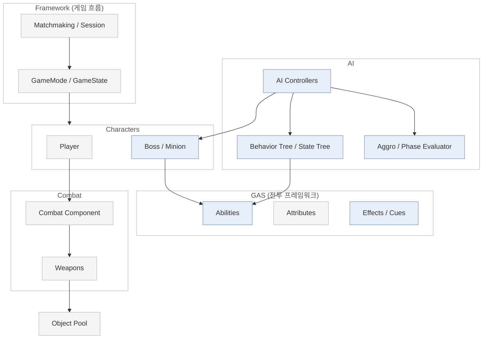
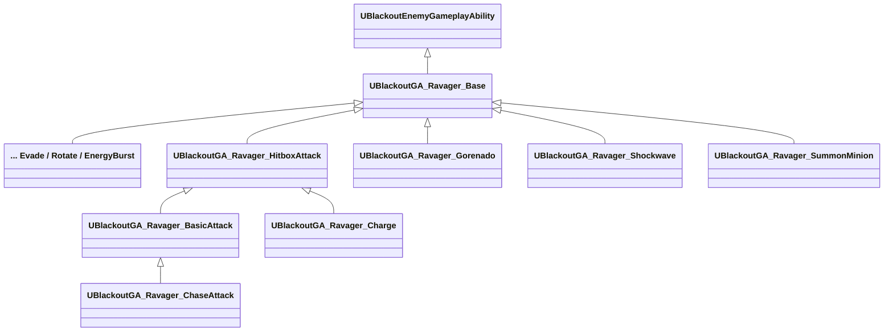
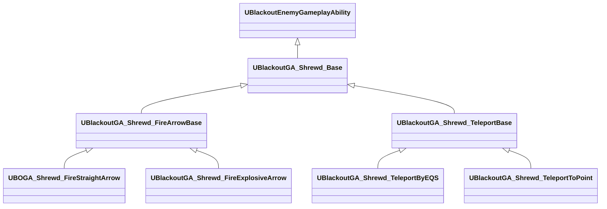
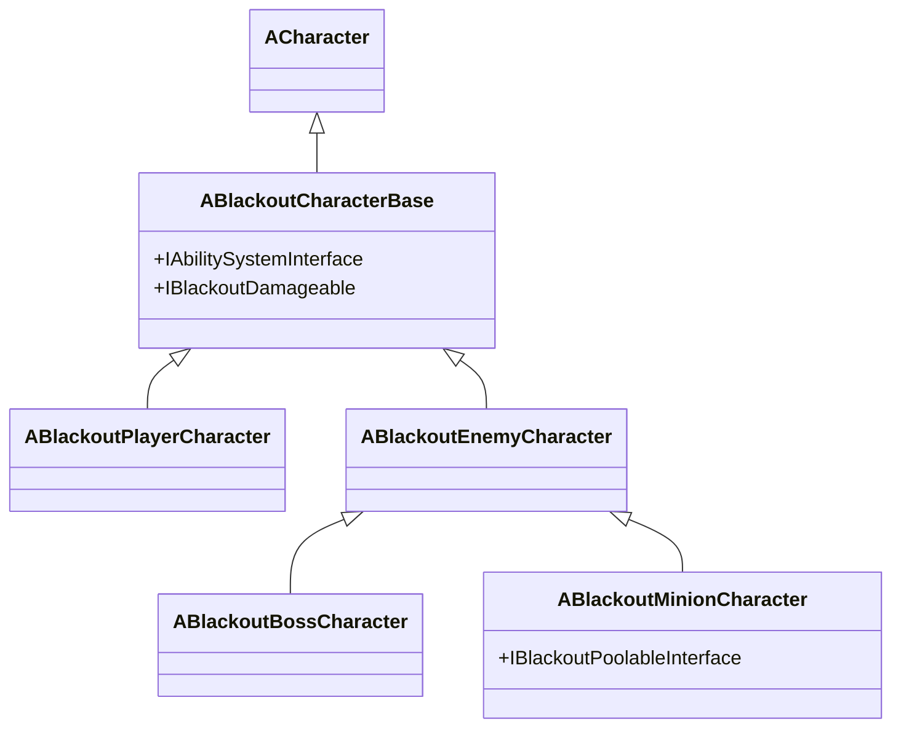
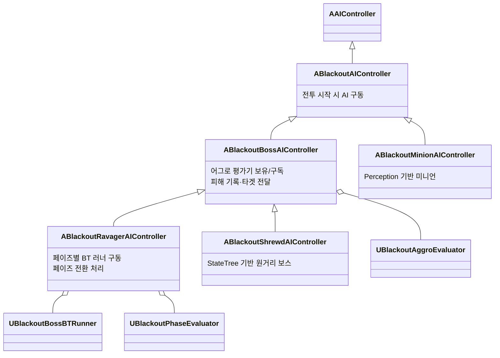
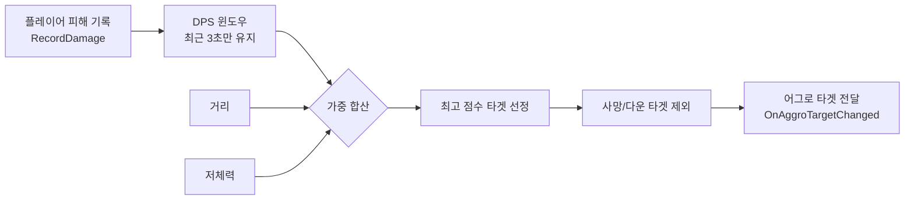
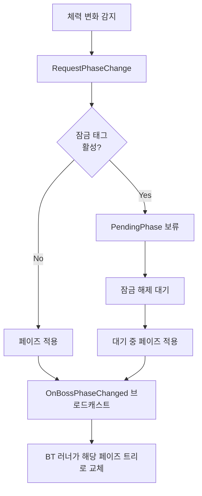
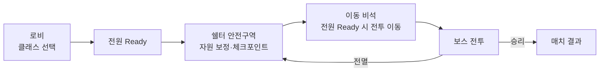

# ProjectBlackout

<!-- 
========================================================================
[ 메인 이미지 ]  ※ 클릭 시 플레이 영상으로 이동하도록 링크 연결 권장
아래 형식으로 교체하세요:
[](플레이영상_URL)
======================================================================== 
-->

> **3인칭 슈팅(TPS) 소울라이크 PvE 프로젝트**
> Unreal Engine 5.7 · GAS 기반 · 데디케이티드 서버 멀티플레이

<br>

## 목차

- [프로젝트 개요](#프로젝트-개요)
- [게임 소개](#게임-소개)
- [담당 파트 폴더 구조](#담당-파트-폴더-구조)
- [전체 아키텍처](#전체-아키텍처)
- [담당 파트: AI 시스템](#담당-파트-ai-시스템)
- [그 외 주요 시스템](#그-외-주요-시스템)

<br>

## 프로젝트 개요

| | |
|---|---|
| **프로젝트 이름** | ProjectBlackout |
| **장르** | 3인칭 슈팅(TPS) 소울라이크 PvE |
| **엔진** | Unreal Engine 5.7 (C++) |
| **인원** | 팀 프로젝트 (4인) |
| **담당** | **AI 시스템** (보스/미니언 행동 트리·스테이트 트리, 어그로·페이즈 평가) |

> 팀원별 기여는 각 소스 파일 상단의 `구현 내역` 주석으로 관리하고 있습니다.
> 본 문서는 **제가 담당한 AI 파트**를 중심으로 정리했습니다.

<br>

## 게임 소개

여러 플레이어가 협동하여 보스와 미니언을 상대하는 PvE 소울라이크입니다.
회피(I-Frame), 근접 콤보, 사격/조준, 무기 스왑 등 소울라이크 특유의 전투 감각을 3인칭 슈팅에 결합했습니다.

<!-- [ 게임플레이 이미지 / GIF 자리 ] -->


**주요 특징**

- **협동 PvE** — 데디케이티드 서버 기반 멀티플레이, 매치메이킹 및 자동 합방 지원
- **소울라이크 전투** — 회피 무적 프레임, 근접 콤보 윈도우, 다운/부활 시스템
- **다양한 적 AI** — 서로 다른 아키텍처로 설계된 보스 2종과 미니언들
- **페이즈 기반 보스전** — 체력 구간에 따라 행동 패턴이 전환되는 보스

<br>

## 담당 파트 폴더 구조

제가 작업한 **AI 시스템**, **보스 어빌리티**, **데이터 애셋**의 폴더 구조입니다. (`.h`/`.cpp`는 하나로 표기)

```
Source/ProjectBlackout/
│
├── 📁 AI/
│   ├── 📄 BlackoutAIController
│   ├── 📄 BlackoutBossAIController
│   ├── 📄 BlackoutRavagerAIController
│   ├── 📄 BlackoutShrewdAIController
│   ├── 📄 BlackoutMinionAIController
│   ├── 📄 BlackoutBossBTRunner
│   ├── 📄 BlackoutAggroEvaluator
│   ├── 📄 BlackoutAggroComponent
│   ├── 📄 BlackoutPhaseEvaluator
│   ├── 📄 BOAICalcHelper
│   │
│   ├── 📁 BehaviorTree/
│   │   ├── 📄 BTNodeHelper
│   │   ├── 📁 Decorators/
│   │   │   ├── 📄 BTD_CanEvade
│   │   │   ├── 📄 BTD_IsInRange
│   │   │   ├── 📄 BTD_NeedsRotation
│   │   │   └── 📄 BTD_RandomChance
│   │   ├── 📁 Services/
│   │   │   ├── 📄 BTS_CheckChaseDistance
│   │   │   ├── 📄 BTS_UpdateAngleToTarget
│   │   │   └── 📄 BTS_UpdateTargetData
│   │   ├── 📁 Tasks/
│   │   │   ├── 📄 BTT_ActivateAbility
│   │   │   ├── 📄 BTT_ActivateEvadeAbility
│   │   │   ├── 📄 BTT_ActivateRotateAbility
│   │   │   ├── 📄 BTT_PickNextPattern
│   │   │   └── 📄 BTT_SelectAbility
│   │   └── 📁 Enum/
│   │       └── 📄 EvadeDirection
│   │
│   ├── 📁 StateTree/
│   │   ├── 📄 BSTCond_HealthBelow
│   │   ├── 📄 BSTCond_TargetWithinRange
│   │   ├── 📄 BSTEval_HealthRatio
│   │   ├── 📄 BSTEval_ShrewdAggroTarget
│   │   ├── 📄 BSTEval_WraithAggroTarget
│   │   ├── 📄 BSTTask_ActivateAbility
│   │   ├── 📄 BSTTask_MoveTowardTarget
│   │   ├── 📄 BSTTask_RetreatFromTarget
│   │   ├── 📄 BSTTask_StrafeAroundTarget
│   │   ├── 📄 BSTTask_FlyKite
│   │   ├── 📄 BSTTask_FocusOnTarget
│   │   ├── 📄 BSTTask_Teleport
│   │   ├── 📄 BSTTask_Charge
│   │   ├── 📄 BSTTask_BowShove
│   │   ├── 📄 BSTTask_FireTwinArrows
│   │   └── 📄 BSTTask_RunSubBehaviorTree
│   │
│   ├── 📁 EQS/
│   │   ├── 📄 BOEnvQueryTest_IsHigher
│   │   └── 📄 EnvQueryContext_BlackoutPlayer
│   │
│   └── 📁 Enum/
│       └── 📄 BOBossPhase
│
├── 📁 Data/                       ← 데이터 애셋 (UDataAsset)
│   ├── 📄 BOShrewdData            Shrewd 스탯·어빌리티
│   ├── 📄 BORavagerPatternData    Ravager 패턴 설정
│   ├── 📄 BORavagerStatData       Ravager 스탯
│   └── 📄 BOBossChaseRanges       보스 추격 사거리
│
└── 📁 GAS/Abilities/Boss/
    ├── 📁 Ravager/
    │   ├── 📄 BlackoutGA_Ravager_Base
    │   ├── 📄 BlackoutGA_Ravager_HitboxAttack
    │   ├── 📄 BlackoutGA_Ravager_BasicAttack
    │   ├── 📄 BlackoutGA_Ravager_Charge
    │   ├── 📄 BlackoutGA_Ravager_ChaseAttack
    │   ├── 📄 BlackoutGA_Ravager_Gorenado
    │   ├── 📄 BlackoutGA_Ravager_Shockwave
    │   ├── 📄 BlackoutGA_Ravager_EnergyBurst
    │   ├── 📄 BlackoutGA_Ravager_SummonMinion
    │   ├── 📄 BlackoutGA_Ravager_Evade
    │   └── 📄 BlackoutGA_Ravager_Rotate
    │
    └── 📁 Shrewd/
        ├── 📄 BlackoutGA_Shrewd_Base
        ├── 📄 BlackoutGA_Shrewd_FireArrowBase
        ├── 📄 BOGA_Shrewd_FireStraightArrow
        ├── 📄 BlackoutGA_Shrewd_FireExplosiveArrow
        ├── 📄 BlackoutGA_Shrewd_TeleportBase
        ├── 📄 BlackoutGA_Shrewd_TeleportByEQS
        └── 📄 BlackoutGA_Shrewd_TeleportToPoint
```

<br>

## 전체 아키텍처

프로젝트는 기능별 모듈로 구성되어 있습니다. (제 담당은 **AI** 모듈)



**기술 스택**

- **엔진**: Unreal Engine 5.7 / C++
- **전투**: GAS (Gameplay Ability System)
- **AI**: Behavior Tree, State Tree, EQS, AI Perception
- **네트워크**: 데디케이티드 서버, HTTP/WebSocket 매치메이킹
- **그래픽**: DLSS / Reflex (NVIDIA Streamline)

---

# 담당 파트: AI 시스템

<!-- [ AI 시스템 대표 이미지 / 인게임 전투 장면 자리 ] -->

적 AI는 **컨트롤러 → 행동 로직(BT/ST) → 어빌리티(GAS)** 로 이어지는 구조로 설계했으며,
어그로·페이즈 판정 같은 공통 로직은 별도 평가기(Evaluator)로 분리해서 사용합니다.

## 두 가지 AI 아키텍처

적의 성격에 맞춰 **행동 트리(Behavior Tree)** 와 **스테이트 트리(State Tree)** 를 구분해 적용했습니다.

| 구분 | 아키텍처 | 설계 의도 |
|---|---|---|
| **Ravager (근접 보스)** | Behavior Tree | 페이즈별 트리 교체, 패턴 위주 전개 |
| **Shrewd (원거리 보스)** | State Tree | 카이팅·텔레포트 등 상태 전환 중심 |
| **미니언 (Hollow / Wraith)** | State Tree | 서브 BT 없이 가볍게 단독 구동 |

<br>

## 1. Behavior Tree — Ravager (근접 보스)

페이즈별로 서로 다른 Behavior Tree를 보관하고, 페이즈 전환 시 트리를 통째로 교체하는
**BT 러너(Runner)** 구조로 구현했습니다.

**구현한 커스텀 노드**

- **Decorators** — 회피 가능 방향 판정(라인 트레이스), 거리 범위 체크, 회전 필요 판정, 랜덤 확률
- **Services** — 타겟 거리/각도 갱신(변경 감지 기반 최소 갱신), 추격 사거리 판정
- **Tasks** — 태그 기반 어빌리티 실행(시작·종료 델리게이트 구독 후 완료 대기), 패턴 선택, 회피/회전 어빌리티 실행

> 어빌리티 실행 Task는 GAS 어빌리티의 시작·종료 델리게이트를 구독해
> **실제 어빌리티가 끝날 때까지 노드가 대기**하도록 만들어, BT와 GAS의 흐름을 동기화했습니다.

<!-- [ Ravager Behavior Tree 에디터 캡처 자리 ] -->

### 대표 어빌리티

Ravager는 근접 압박과 광역 패턴을 섞어 플레이어를 몰아붙입니다. GAS 어빌리티로 구현했으며, 대표 패턴은 다음과 같습니다.


**Gorenado (끌어당김)** — 시전 시 주변 플레이어를 보스 쪽으로 끌어당기는 광역기입니다. 플레이어의 `IBlackoutPullable` 인터페이스로 당김을 적용하고, 시전 중에는 태그를 부여해 플레이어의 회피 루트모션을 너프해 회피 난도를 높였습니다. 첫 데미지는 선판정으로 처리합니다.

<!-- [ Gorenado 패턴 GIF 자리 ] -->

**ChaseAttack (FlashKick)** — 거리를 순간적으로 좁히며 파고드는 추격 공격입니다. NotifyState 구간 동안 보스와 타겟 사이 거리를 보간(`VInterpTo` + `Lerp`)으로 이동시켜, 도망치는 플레이어에게 빠르게 접근합니다.

<!-- [ ChaseAttack 패턴 GIF 자리 ] -->

**SummonMinion (미니언 소환)** — 랜덤한 미니언을 소환하는 패턴으로, 보스 페이즈와 연동되어 페이즈가 오를수록 압박을 강화합니다.

<!-- [ SummonMinion 패턴 GIF 자리 ] -->

그 밖에 기본 공격, 차징 공격, 에너지 버스트, 충격파(Shockwave), 회피, 회전 등의 패턴이 있습니다.

### Ravager 어빌리티 클래스 구조 (UML)

`Ravager_Base`를 상속하는 패턴 어빌리티가 다수 있으며, 히트박스 계열은
`HitboxAttack`을 거쳐 한 단계 더 확장됩니다. (아래는 대표 어빌리티만 표기)



<br>

## 2. State Tree — Shrewd (원거리 보스) & 미니언


상태 전환이 잦은 원거리/비행 적은 State Tree로 구현했습니다.
(카이팅·텔레포트·스트레이프 등 일부 Task는 팀원과 분담)

**State Tree 요소**

- **Task** — 태그로 어빌리티를 실행하고 부여 대기(타임아웃)·핸들 추적까지 처리, 하위 BT 실행 Task
- **공용 헬퍼** — 컨트롤러/폰/블랙보드/ASC를 일관되게 가져오는 정적 헬퍼(`BTNodeHelper`), AI 거리·회전 계산 헬퍼(`BOAICalcHelper`)

<!-- [ Shrewd State Tree 에디터 캡처 자리 ] -->

### 대표 어빌리티

Shrewd는 거리를 유지하며 화살로 견제하고, 위험해지면 텔레포트로 위치를 재정비하는 원거리 보스입니다.


**FireExplosiveArrow (곡사 폭발 화살)** — 타겟 지점으로 곡사 궤도의 폭발 화살을 발사합니다. 화살이 타겟 지점까지 빠르게 낙하하도록 처리해, 원거리에서도 지점을 노린 압박이 가능합니다. (직선 화살 `FireStraightArrow`와 발사 로직을 `FireArrowBase`에서 공유)

<!-- [ 곡사 폭발 화살 패턴 GIF 자리 ] -->

**TeleportByEQS (EQS 기반 텔레포트)** — 플레이어에게 접근당하면 EQS 질의로 유리한 위치(주로 높은 지형)를 골라 순간이동합니다. Vanish/Appear 노티파이로 사라지고 나타나는 연출을 연동했습니다.

<!-- [ 텔레포트 패턴 GIF 자리 ] -->

그 밖에 직선 화살, 지정 지점 텔레포트(`TeleportToPoint`) 등의 패턴이 있습니다.

### Shrewd 어빌리티 클래스 구조 (UML)

`Shrewd_Base`에서 화살 발사 계열(`FireArrowBase`)과 텔레포트 계열(`TeleportBase`)로 갈라집니다.



<br>

## 3. 클래스 구조 (UML)

### 캐릭터 클래스 계층



<br>

### AI 컨트롤러 계층

컨트롤러를 계층화해, 공통 기능은 상위 클래스에 두고 적 특성별로 필요한 요소만 하위에서 추가했습니다.



> **설계 포인트** — `ABlackoutBossAIController`가 어그로 평가기를 공통으로 보유하고,
> Ravager만 BT 러너·페이즈 평가기를 추가로 소유해, **필요한 적에게만 필요한 시스템을 붙이는** 구조입니다.

<br>

## 4. 어그로 평가기 (Aggro Evaluator)


멀티플레이 PvE에서 "적이 누구를 노릴 것인가"를 결정하는 핵심 로직입니다.
단순 근접이 아니라 **거리 · DPS · 저체력** 을 가중 합산해 타겟을 산정합니다.



- **DPS 윈도우**: 최근 일정 시간(기본 3초) 내 데미지만 누적 → "지금 위협적인 플레이어" 반영
- **가중치 분리**: 거리·DPS·저체력 가중치를 에디터에서 조정 가능(`EditAnywhere`)
- **예외 처리**: 사망/다운 타겟은 후보에서 제외
- **BT / ST 공용**: 두 아키텍처 모두에서 동일한 평가기 재사용

```cpp
// 오래된 데미지 기록은 윈도우를 벗어나면 자동 제거 → 최근 DPS만 반영
float GetDamageInWindow(float CurrentTime, float WindowDuration)
{
    DamageRecords.RemoveAll([=](const FDamageRecord& Record)
    {
        return CurrentTime - Record.Timestamp > WindowDuration;
    });
    // ... 남은 기록 합산
}
```

<br>

## 5. 페이즈 평가기 (Phase Evaluator)


보스 체력 구간에 따라 **Phase 1 → 2 → 3** 으로 행동을 전환합니다.
연출·공격 중 페이즈가 바뀌면 어색하기 때문에, **잠금 태그(Lock Tag)** 로 전환을 보류했다가
잠금 해제 시 반영하도록 설계했습니다.



<br>

## 6. 설계에서 신경 쓴 점

- **공통 로직 중앙화** — 어그로/페이즈 평가, 거리·회전 계산, 노드 접근 헬퍼를 분리해 BT·ST 양쪽에서 재사용
- **BT/ST ↔ GAS 동기화** — 어빌리티 실행을 델리게이트로 추적해 행동 노드가 실제 어빌리티 종료까지 대기
- **디버그 편의** — 회피 가능 영역 등 판정을 에디터에서 시각화(디버그 드로우 토글)

<br>

---

# 게임 플로우 & 플레이어

> 아래는 저의 담당 파트는 아니지만, 게임 전체 흐름 이해를 돕기 위해 간략히 정리한 내용입니다.

## 전체 게임 흐름

로비에서 클래스를 고르고, 쉘터(안전구역)에서 준비를 마친 뒤 보스 전투로 이동하는 흐름입니다.



- **쉘터 존** — overlap 시 `InShelter` 태그로 자원 회복·체크포인트 등록
- **정원 기반 밸런스** — 참가 인원(정원)에 따라 보스 HP 배율 조정
- **재도전/관전** — 전멸 시 체크포인트 복귀, 사망 후 관전 대상 순환, 항복 투표

<br>

## 플레이어 개요

플레이어는 GAS 기반으로 사격·조준·회피·근접 콤보·소모품 등 다양한 어빌리티를 사용합니다.

- **전투** — 사격/정조준, 4타 순환 근접 콤보, 무기 스왑, 재장전
- **기동** — 방향 입력 기반 구르기 회피(체인 회피), 스태미나 기반 질주
- **생존** — 다운/부활 시스템, 소모품(블러드 루트·굴 세럼 등)·유물 사용
- **연출/카메라** — Remnant2 스타일 3인칭 카메라, 진영 구분 외곽선

> **AI 파트와의 접점** — 플레이어 캐릭터에 `IBlackoutPullable` 인터페이스를 적용해,
> Ravager 보스의 끌어당김 패턴(Gorenado)이 플레이어에게 작용하도록 연동한 부분을 제가 담당했습니다.

<!-- [ 플레이어 전투 / 어빌리티 이미지 자리 ] -->

<br>

---

## 그 외 주요 시스템

AI 외 시스템은 팀원들이 담당했으며, 참고용으로 간단히만 정리합니다.

- **GAS 전투** — 플레이어/적 어빌리티, 어트리뷰트 셋, 데미지·보상 계산(ExecCalc), 히트 큐
- **전투/무기** — 사격·조준·연사·반동, 무기 스왑, 근접 콤보 윈도우, 착탄 인디케이터
- **네트워크** — 데디케이티드 세션, WebSocket 로비·매치메이킹, 재접속, 정원별 보스 HP 배율
- **오브젝트 풀링** — 발사체 등 반복 스폰 액터의 풀 기반 재사용(GC 추적 포함)
- **UI/HUD** — 체력·탄약·소모품 HUD, 로비/파티/매치 결과, 다운/부활 표시
- **연출/그래픽** — 보스 인트로 시퀀스, 카메라 셰이크, DLSS/Reflex 지원

<br>

<!-- 
========================================================================
이미지 추가 안내
- docs/images/ 폴더를 만들어 이미지를 넣고 위 주석 자리의 경로를 교체하세요.
- Mermaid 다이어그램은 GitHub에서 자동 렌더링되므로 별도 이미지가 필요 없습니다.
- 게임플레이·에디터 캡처 등 실제 화면만 이미지로 넣으면 됩니다.
======================================================================== 
-->
